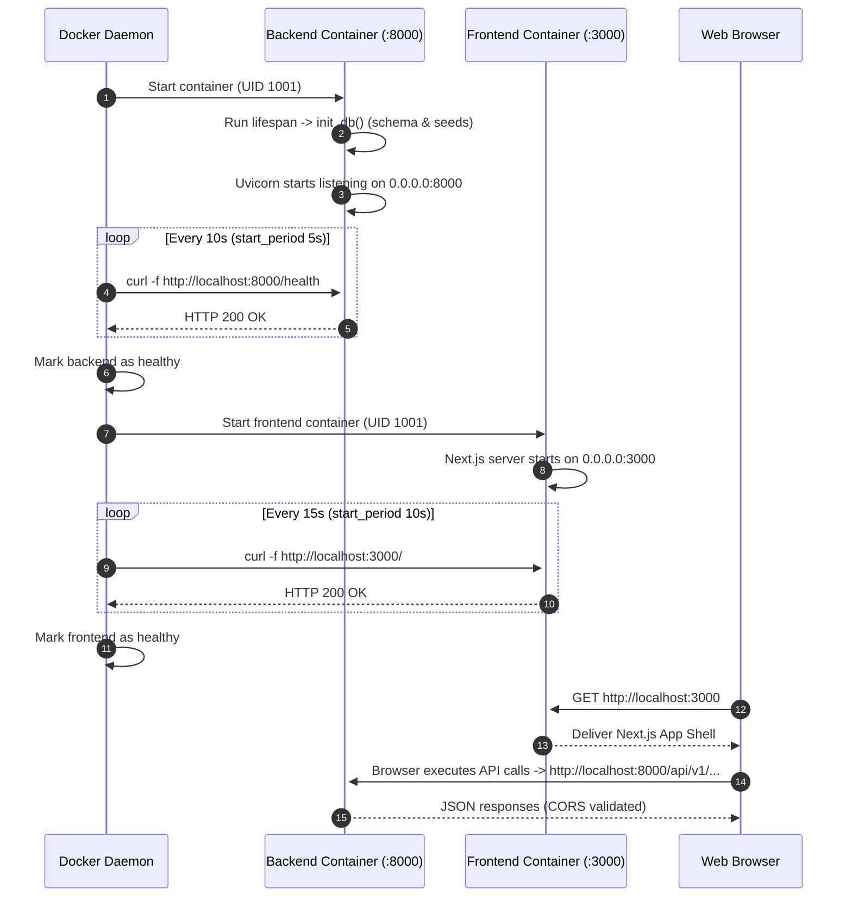

# Step-by-Step Containerization Plan

## Purpose

This document provides a comprehensive, production-grade implementation guide to make the EquiTest NSE Docker ecosystem fully self-contained, reproducible, and portable across any Linux/macOS/Windows host without requiring local data files, hardcoded host paths, or pre-seeded database binaries. 

It preserves all quantitative financial strategy invariants:
- **Zero Look-Ahead**: Session $T$ indicators computed strictly before $T+1$ execution.
- **Top 100 Exclusion**: Ranks 1–100 excluded from trade allocations; NIFTY 50 acts purely as an external regime filter.
- **Survivorship Bias Prevention**: Accurate point-in-time universe constituents tracked across rebalance snapshots.
- **Overnight Gap-Down Realism**: Unadjusted close and open prices used for stop-loss and fill execution.
- **Backtest Provenance**: Comprehensive tracking of Git commit SHA, dependencies, configuration, and data hashes.

---

## 1. Backend Dockerfile Architecture & Modifications

The backend image is defined in [Dockerfile](file:///home/shailender/projects/equitest-nse/backend/Dockerfile). It utilizes a multi-stage Debian-slim build (`python:3.11-slim`) to isolate build tools from the runtime container.

### 1.1 Key Deficiencies in Current Implementation
1. **Hardcoded Data Source**: Line 27 specifies `DATA_SOURCE=CSV`, forcing the backend to rely on local parquet fixtures even inside containers.
2. **Hardcoded Git Commit SHA**: Line 29 hardcodes a specific commit SHA (`45391fbd9b001161b500a4c5e92a22170daee4b9`), breaking build provenance on newer commits.
3. **Container Path Resolution Flaw**: The Dockerfile copies backend code via `COPY app/ ./app/` into `/app`, resulting in files residing at `/app/app/`. As documented in [source.py](file:///home/shailender/projects/equitest-nse/backend/app/data/source.py#L49), code traversing four parent directories (`Path(__file__).resolve().parent.parent.parent.parent`) resolves to `/` (the root filesystem) instead of `/app`, causing file operations to target non-existent paths like `/data/fixtures` or `/data/backtests`.
4. **Missing Storage Directories**: The image only creates `/app/data/backtests` and `/app/data/fixtures`, omitting `/app/data/reports` and `/app/data/cache`.

### 1.2 Required Modifications
- **Remove hardcoded `DATA_SOURCE=CSV`**: Default to `DATA_SOURCE=yfinance` in production or allow environment override from [config.py](file:///home/shailender/projects/equitest-nse/backend/app/core/config.py#L12).
- **Inject Environment Variables**: Add `REPO_ROOT=/app`, `FIXTURES_DIR=/app/data/fixtures`, and `BACKTEST_STORAGE_PATH=/app/data/backtests`.
- **Dynamic Git Metadata**: Support build-arg `ARG GIT_SHA="unknown"` with fallback.
- **Complete Directory Creation**: Create `/app/data/backtests`, `/app/data/reports`, `/app/data/cache`, and `/app/data/fixtures` before dropping root privileges.
- **Enforce Permissions**: Recursively set ownership `chown -R 1001:1001 /app`.

### 1.3 Updated Backend Dockerfile Specification

```dockerfile
# Stage 1: Dependency builder
FROM python:3.11-slim AS builder

WORKDIR /app

ENV PYTHONDONTWRITEBYTECODE=1 \
    PYTHONUNBUFFERED=1

RUN apt-get update && apt-get install -y --no-install-recommends \
    build-essential \
    && rm -rf /var/lib/apt/lists/*

COPY pyproject.toml .
RUN python -m venv /opt/venv && \
    /opt/venv/bin/pip install --no-cache-dir --upgrade pip && \
    /opt/venv/bin/pip install --no-cache-dir .

# Stage 2: Production runner
FROM python:3.11-slim AS runner

WORKDIR /app

ENV PYTHONDONTWRITEBYTECODE=1 \
    PYTHONUNBUFFERED=1 \
    PATH="/opt/venv/bin:$PATH" \
    APP_ENV=production \
    DATA_SOURCE=yfinance \
    REPO_ROOT=/app \
    FIXTURES_DIR=/app/data/fixtures \
    BACKTEST_STORAGE_PATH=/app/data/backtests \
    DATABASE_URL=sqlite:////app/data/dev.db

ARG GIT_SHA="unknown"
ENV GIT_SHA=${GIT_SHA}

# Install WeasyPrint and healthcheck system dependencies
RUN apt-get update && apt-get install -y --no-install-recommends \
    curl \
    libpango-1.0-0 \
    libpangoft2-1.0-0 \
    libcairo2 \
    libgdk-pixbuf-2.0-0 \
    libffi-dev \
    shared-mime-info \
    fonts-dejavu-core \
    && rm -rf /var/lib/apt/lists/*

COPY --from=builder /opt/venv /opt/venv

# Verify PDF compilation pipeline at build time
RUN python -c "from weasyprint import HTML; pdf = HTML(string='<h1>Smoke Test</h1>').write_pdf(); assert pdf.startswith(b'%PDF'), 'PDF generation smoke test failed'"

# Create non-root application user and group (UID/GID 1001)
RUN groupadd -g 1001 appgroup && \
    useradd -u 1001 -g appgroup -s /bin/bash -m appuser

# Copy application source
COPY app/ ./app/
COPY pyproject.toml .

# Create all persistence and cache mountpoints with non-root ownership
RUN mkdir -p /app/data/backtests \
             /app/data/reports \
             /app/data/cache \
             /app/data/fixtures && \
    chown -R appuser:appgroup /app

USER appuser

EXPOSE 8000

HEALTHCHECK --interval=15s --timeout=5s --start-period=5s --retries=3 \
    CMD curl -f http://localhost:8000/health || exit 1

CMD ["uvicorn", "app.main:app", "--host", "0.0.0.0", "--port", "8000"]
```

> [!TIP]
> Setting `REPO_ROOT=/app` allows Python modules like [source.py](file:///home/shailender/projects/equitest-nse/backend/app/data/source.py#L49) and [audit.py](file:///home/shailender/projects/equitest-nse/backend/app/validation/audit.py#L99) to resolve storage directories deterministically via:
> ```python
> repo_root = Path(os.environ.get("REPO_ROOT", Path(__file__).resolve().parents[3]))
> ```

---

## 2. Frontend Dockerfile Architecture & Modifications

The frontend application is built on Next.js 14 / React 18, defined in [Dockerfile](file:///home/shailender/projects/equitest-nse/frontend/Dockerfile).

### 2.1 Next.js Environment Variable Invariant
Next.js client-side bundles inline `NEXT_PUBLIC_*` environment variables at **build time**. If `NEXT_PUBLIC_API_URL` is omitted during `npm run build`, Next.js bakes in undefined or fallback values into static assets.

- **Client-Side Requests**: Initiated by the user's browser outside the Docker bridge network. Must point to `http://localhost:8000` (or the public domain/reverse proxy).
- **Server-Side Rendering (SSR)**: Initiated from within the Next.js Node container. Resolves via Docker DNS to `http://backend:8000`.

### 2.2 Client Fallback Handling
In `frontend/lib/api.ts`, API requests are resolved using:
```typescript
export const API_BASE_URL = 
  process.env.NEXT_PUBLIC_API_URL || 
  (typeof window !== 'undefined' ? 'http://localhost:8000' : 'http://backend:8000');
```
This guarantees that SSR runs reach the backend container directly over bridge networking, while browser hydration hits the exposed host port.

### 2.3 Updated Frontend Dockerfile Specification

```dockerfile
# Stage 1: Dependency resolution
FROM node:20-alpine AS deps
WORKDIR /app

COPY package.json package-lock.json* ./
RUN npm ci

# Stage 2: Production builder
FROM node:20-alpine AS builder
WORKDIR /app

COPY --from=deps /app/node_modules ./node_modules
COPY . .

# Build-time variable for Next.js static asset compilation
ARG NEXT_PUBLIC_API_URL=http://localhost:8000
ENV NEXT_PUBLIC_API_URL=${NEXT_PUBLIC_API_URL} \
    NEXT_TELEMETRY_DISABLED=1

RUN npm run build

# Stage 3: Minimal runner
FROM node:20-alpine AS runner
WORKDIR /app

ENV NODE_ENV=production \
    NEXT_TELEMETRY_DISABLED=1 \
    PORT=3000

# Install curl for container healthcheck
RUN apk add --no-cache curl

# Create unprivileged application user (UID/GID 1001)
RUN addgroup -g 1001 -S nodejs && \
    adduser -S nextjs -u 1001 -G nodejs

COPY --from=builder /app/public ./public 2>/dev/null || true
COPY --from=builder --chown=nextjs:nodejs /app/.next ./.next
COPY --from=builder --chown=nextjs:nodejs /app/node_modules ./node_modules
COPY --from=builder --chown=nextjs:nodejs /app/package.json ./package.json

USER nextjs

EXPOSE 3000

HEALTHCHECK --interval=15s --timeout=5s --start-period=10s --retries=3 \
    CMD curl -f http://localhost:3000 || exit 1

CMD ["npm", "start"]
```

---

## 3. Container Build Context & `.dockerignore` Files

Without proper `.dockerignore` configurations, large local SQLite files (`dev.db` ~415 MB), test artifacts, and host `node_modules` leak into build contexts, invalidating Docker layer caches and creating permission conflicts.

### 3.1 Backend `.dockerignore` (`backend/.dockerignore`)

```text
__pycache__/
*.py[cod]
*$py.class
*.egg-info/
.venv/
env/
venv/
*.db
*.db-shm
*.db-wal
.pytest_cache/
.ruff_cache/
.coverage
htmlcov/
tests/
.git/
.gitignore
.env
.env.*
data/
```

### 3.2 Frontend `.dockerignore` (`frontend/.dockerignore`)

```text
node_modules/
.next/
out/
build/
dist/
test-results/
playwright-report/
*.tsbuildinfo
.git/
.gitignore
.env.local
.env.development.local
.env.test.local
.env.production.local
coverage/
npm-debug.log*
yarn-debug.log*
yarn-error.log*
```

---

## 4. Development Compose Configuration (`docker-compose.yml`)

The development compose configuration enables active development with host volume mounts for hot-reloading backend Python files while persisting database state and reports across container rebuilds.

```yaml
version: "3.8"

services:
  backend:
    build:
      context: ./backend
      dockerfile: Dockerfile
      args:
        GIT_SHA: "${GIT_SHA:-dev}"
    container_name: equitest-backend-dev
    ports:
      - "8000:8000"
    environment:
      - APP_ENV=development
      - DATA_SOURCE=yfinance
      - DATABASE_URL=sqlite:////app/data/dev.db
      - LOG_LEVEL=INFO
      - MAX_BACKTEST_RUNS=10
      - YFINANCE_ENABLED=true
      - CORS_ORIGINS=http://localhost:3000,http://127.0.0.1:3000
      - BACKTEST_STORAGE_PATH=/app/data/backtests
      - FIXTURES_DIR=/app/data/fixtures
      - REPO_ROOT=/app
    volumes:
      # Code live-mount for hot-reloading
      - ./backend/app:/app/app:ro
      # Named volume for SQLite DB and metadata persistence
      - equitest_db:/app/data
      # Isolated named volume for backtest run provenance
      - equitest_backtests:/app/data/backtests
      # Isolated named volume for generated reports
      - equitest_reports:/app/data/reports
    restart: unless-stopped
    healthcheck:
      test: ["CMD", "curl", "-f", "http://localhost:8000/health"]
      interval: 10s
      timeout: 5s
      retries: 3
      start_period: 5s
    networks:
      - equitest-network

  frontend:
    build:
      context: ./frontend
      dockerfile: Dockerfile
      args:
        NEXT_PUBLIC_API_URL: "http://localhost:8000"
    container_name: equitest-frontend-dev
    ports:
      - "3000:3000"
    environment:
      - NEXT_PUBLIC_API_URL=http://localhost:8000
    depends_on:
      backend:
        condition: service_healthy
    restart: unless-stopped
    healthcheck:
      test: ["CMD", "curl", "-f", "http://localhost:3000"]
      interval: 15s
      timeout: 5s
      retries: 3
      start_period: 10s
    networks:
      - equitest-network

volumes:
  equitest_db:
    name: equitest_dev_db
  equitest_backtests:
    name: equitest_dev_backtests
  equitest_reports:
    name: equitest_dev_reports

networks:
  equitest-network:
    name: equitest-dev-net
    driver: bridge
```

---

## 5. Production Compose Configuration (`docker-compose.prod.yml`)

The production compose configuration achieves **true portability** by eliminating the host `./data/fixtures` bind mount, setting `DATA_SOURCE=yfinance`, and using isolated named volumes.

```yaml
version: "3.8"

services:
  backend:
    build:
      context: ./backend
      dockerfile: Dockerfile
      args:
        GIT_SHA: "${GIT_SHA:-unknown}"
    container_name: equitest-backend-prod
    ports:
      - "8000:8000"
    environment:
      - APP_ENV=production
      - DATA_SOURCE=yfinance
      - DATABASE_URL=sqlite:////app/data/prod.db
      - LOG_LEVEL=INFO
      - MAX_BACKTEST_RUNS=5
      - YFINANCE_ENABLED=true
      - CORS_ORIGINS=http://localhost:3000,http://127.0.0.1:3000
      - BACKTEST_STORAGE_PATH=/app/data/backtests
      - FIXTURES_DIR=/app/data/fixtures
      - REPO_ROOT=/app
    volumes:
      - db_data:/app/data
      - backtests_data:/app/data/backtests
      - reports_data:/app/data/reports
    restart: unless-stopped
    healthcheck:
      test: ["CMD", "curl", "-f", "http://localhost:8000/health"]
      interval: 10s
      timeout: 5s
      retries: 3
      start_period: 5s
    networks:
      - equitest-network

  frontend:
    build:
      context: ./frontend
      dockerfile: Dockerfile
      args:
        NEXT_PUBLIC_API_URL: "http://localhost:8000"
    container_name: equitest-frontend-prod
    ports:
      - "3000:3000"
    environment:
      - NEXT_PUBLIC_API_URL=http://localhost:8000
    depends_on:
      backend:
        condition: service_healthy
    restart: unless-stopped
    healthcheck:
      test: ["CMD", "curl", "-f", "http://localhost:3000"]
      interval: 15s
      timeout: 5s
      retries: 3
      start_period: 10s
    networks:
      - equitest-network

volumes:
  db_data:
    name: equitest_prod_db
    driver: local
  backtests_data:
    name: equitest_prod_backtests
    driver: local
  reports_data:
    name: equitest_prod_reports
    driver: local

networks:
  equitest-network:
    name: equitest-prod-net
    driver: bridge
```

> [!IMPORTANT]
> The production configuration completely removes `./data/fixtures:/app/data/fixtures:ro`. A fresh machine can run `docker compose -f docker-compose.prod.yml up` immediately without cloning fixture parquets.

---

## 6. Named Volumes Definition & Storage Topology

To eliminate disk I/O collisions and preserve clean backup targets, the container filesystem maps state into three decoupled volumes:

| Compose Alias | Production Volume Name | Container Path | Purpose | Lifecycle & Retention Policy |
|---|---|---|---|---|
| `equitest_db` / `db_data` | `equitest_prod_db` | `/app/data` | SQLite database (`prod.db`), schema migrations, and cache indices. | Persistent across releases; backed up before version upgrades. |
| `equitest_backtests` / `backtests_data` | `equitest_prod_backtests` | `/app/data/backtests` | Backtest run artifacts, parameter configs, execution trade logs, and SHA-256 provenance records. | Subject to retention policy capped by `MAX_BACKTEST_RUNS` (default: 5 runs). |
| `equitest_reports` / `reports_data` | `equitest_prod_reports` | `/app/data/reports` | Exported WeasyPrint PDF reports, Excel analytics workbooks, and zipped run bundles. | Retained on disk until user requests export cleanup via UI or API. |

```
/app (Container Root)
├── app/ (Source code, read-only)
└── data/
    ├── dev.db / prod.db   <-- Mounted via equitest_db / db_data
    ├── backtests/         <-- Mounted via equitest_backtests / backtests_data
    │   └── <run_id>.json
    └── reports/           <-- Mounted via equitest_reports / reports_data
        └── <report_id>.pdf
```

> [!CAUTION]
> In Docker Compose, mounting sub-paths over a parent mount (e.g. `/app/data/backtests` over `/app/data`) requires Docker to initialize the sub-volume after the parent. By declaring `mkdir -p /app/data/backtests /app/data/reports` in the base image, Docker automatically respects directory boundaries without overwriting metadata.

---

## 7. Environment Variables Reference Table

The following environment variables govern service configuration, persistence, network access, and financial calculation invariants:

| Variable | Scope | Type | Default Value | Required? | Purpose & Impact on Quantitative Invariants |
|---|---|---|---|---|---|
| `DATA_SOURCE` | Backend | `str` | `yfinance` | No | Primary data acquisition backend. Accepts `yfinance` (remote Yahoo Finance), or `CSV`/`PARQUET` (local test fixtures). |
| `DATABASE_URL` | Backend | `str` | `sqlite:////app/data/dev.db` | No | SQLAlchemy/SQLModel connection string. Controls target SQLite or PostgreSQL instance. |
| `MAX_BACKTEST_RUNS` | Backend | `int` | `5` | No | Caps the total number of retained historical backtest runs on disk to prevent storage exhaustion. |
| `YFINANCE_ENABLED` | Backend | `bool` | `true` | No | Feature flag controlling whether outbound calls to Yahoo Finance are permitted. |
| `CORS_ORIGINS` | Backend | `str` | `http://localhost:3000` | No | Comma-separated list of allowed cross-origin HTTP origins for FastAPI [main.py](file:///home/shailender/projects/equitest-nse/backend/app/main.py#L34-L44). |
| `BACKTEST_STORAGE_PATH`| Backend | `str` | `/app/data/backtests` | No | Filesystem destination for backtest result JSONs and SHA-256 audit records. Resolves pathing issues. |
| `FIXTURES_DIR` | Backend | `str` | `/app/data/fixtures` | No | Directory path searched by `CSVSource` when running offline regression suites. |
| `REPO_ROOT` | Backend | `str` | `/app` | No | Root path used by backend utilities to eliminate relative traversal errors (`parents[4]`). |
| `APP_ENV` | Backend | `str` | `development` | No | Environment tag: `development`, `testing`, or `production`. Controls logging and reloaders. |
| `LOG_LEVEL` | Backend | `str` | `INFO` | No | Python logging verbosity (`DEBUG`, `INFO`, `WARNING`, `ERROR`). |
| `GIT_SHA` | Backend | `str` | `unknown` | No | Commit hash injected at build time, embedded in [audit.py](file:///home/shailender/projects/equitest-nse/backend/app/validation/audit.py#L170) for backtest provenance. |
| `NEXT_PUBLIC_API_URL` | Frontend | `str` | `http://localhost:8000` | Yes (Build) | Base URL for API calls. Baked into client bundles at build time and used for SSR fallback. |

---

## 8. Startup Order, Dependency Orchestration & Healthchecks

Docker Compose coordinates startup ordering using health checks to ensure the frontend never serves client requests before the backend database is ready.

### 8.1 Backend Lifecycle & Healthcheck
1. **Container Start**: The Python container initializes under UID 1001.
2. **Lifespan Initialization**: In [main.py](file:///home/shailender/projects/equitest-nse/backend/app/main.py#L16-L21), the `lifespan` handler calls `init_db()` in [session.py](file:///home/shailender/projects/equitest-nse/backend/app/db/session.py#L19-L72).
   - SQLModel creates missing SQLite tables.
   - Schema migrations dynamically append missing columns (`config_version`, `sweep_id`, `cagr`, `max_drawdown_pct`).
   - If universe constituents are unpopulated, it executes `seed_universe_constituents()`.
3. **Healthcheck Probe**: Docker invokes:
   ```bash
   curl -f http://localhost:8000/health
   ```
   Upon returning HTTP 200 with `{"status": "ok", "version": "0.1.0"}`, Docker marks `equitest-backend` as `healthy`.

### 8.2 Frontend Dependency Condition
The frontend container defines:
```yaml
depends_on:
  backend:
    condition: service_healthy
```
This guarantees that Next.js does not attempt server-side fetches against an uninitialized backend during cold boots.



---

## 9. Non-Root User Verification & Security Invariants

In accordance with container security best practices, both backend and frontend images drop privileges to an unprivileged user with UID 1001.

### 9.1 User & Group Mapping

| Container | User Name | Group Name | UID | GID | Home Directory |
|---|---|---|---|---|---|
| Backend | `appuser` | `appgroup` | `1001` | `1001` | `/home/appuser` |
| Frontend | `nextjs` | `nodejs` | `1001` | `1001` | `/home/nextjs` |

### 9.2 Named Volume Permission Handling
When Docker creates a new named volume on the host, root owns the newly initialized mount point unless the container directory already has non-root permissions before volume attachment.

In the Backend Dockerfile, the command:
```dockerfile
RUN mkdir -p /app/data/backtests /app/data/reports /app/data/cache /app/data/fixtures && \
    chown -R appuser:appgroup /app
```
ensures that when Docker initializes `equitest_db`, `equitest_backtests`, and `equitest_reports`, it inherits UID/GID 1001 ownership.

### 9.3 Verification Procedures
Verify non-root execution and storage writability with the following commands:

```bash
# 1. Verify Backend User ID
docker exec equitest-backend-dev id
# Expected output: uid=1001(appuser) gid=1001(appgroup) groups=1001(appgroup)

# 2. Verify Backend Volume Write Permissions
docker exec equitest-backend-dev touch /app/data/backtests/test_perm.tmp
docker exec equitest-backend-dev rm /app/data/backtests/test_perm.tmp

# 3. Verify Frontend User ID
docker exec equitest-frontend-dev id
# Expected output: uid=1001(nextjs) gid=1001(nodejs) groups=1001(nodejs)
```

> [!WARNING]
> Never run containers as root in production. Running as non-root mitigates container escape vulnerabilities and ensures files created in volumes match unprivileged host access.

---

## 10. Step-by-Step Migration & Validation Runbook

Execute this runbook to validate the containerization changes:

```bash
# 1. Clean up legacy or stopped containers and volumes
docker compose down -v

# 2. Validate .dockerignore files are present
ls -la backend/.dockerignore frontend/.dockerignore

# 3. Build containers cleanly without host cache
docker compose -f docker-compose.prod.yml build --no-cache

# 4. Spin up the production stack in detached mode
docker compose -f docker-compose.prod.yml up -d

# 5. Monitor service health status
docker compose -f docker-compose.prod.yml ps

# 6. Verify backend health endpoint
curl -s http://localhost:8000/health | jq .
# Expected: {"status":"ok","version":"0.1.0"}

# 7. Verify frontend serves landing page
curl -s -I http://localhost:3000 | head -n 1
# Expected: HTTP/1.1 200 OK

# 8. Test live ingestion via Yahoo Finance
curl -X POST http://localhost:8000/api/v1/data/ingest \
  -H "Content-Type: application/json" \
  -d '{"start": "2023-01-01", "end": "2023-01-31"}' | jq .
# Expected: "status":"completed", "rows_ingested": >0

# 9. Verify volume persistence across container restarts
docker compose -f docker-compose.prod.yml restart backend
curl -s http://localhost:8000/api/v1/data/coverage | jq .
```
