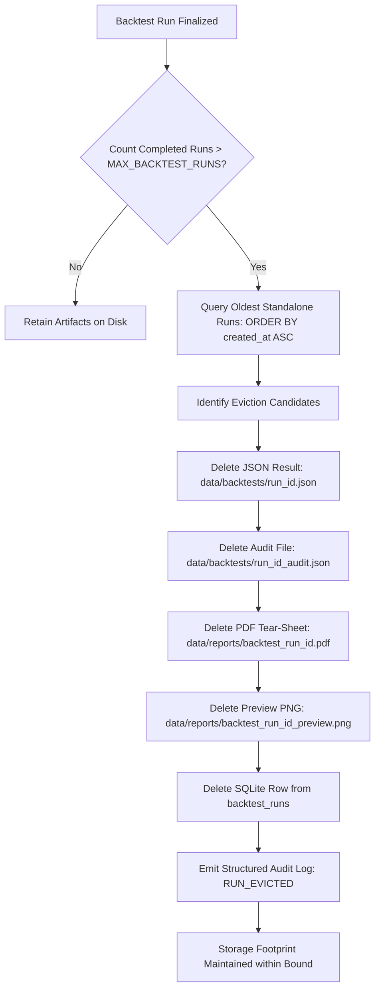

# Stale Data Cleanup & Artifact Retention Policy

## Purpose
This document defines the data cleanup and retention lifecycle for the EquiTest NSE backtesting system. It establishes policies, automated cascade purge mechanisms, database reconciliation steps, and administrative controls to prevent unbounded disk growth while strictly preserving backtest auditability, provenance integrity, and reproducible quantitative research standards.

> [!NOTE]
> This specification is an integral part of the EquiTest NSE Containerization Suite. For related architecture and deployment specifications, consult:
> - [01-current-state-assessment.md](file:///home/shailender/projects/equitest-nse/data/containerization/01-current-state-assessment.md) — Dependency audit and infrastructure blockers
> - [02-containerization-plan.md](file:///home/shailender/projects/equitest-nse/data/containerization/02-containerization-plan.md) — Docker container topology and volume mounts
> - [03-remote-data-ingestion-plan.md](file:///home/shailender/projects/equitest-nse/data/containerization/03-remote-data-ingestion-plan.md) — Remote data acquisition via Yahoo Finance
> - [05-run-local-container-first-plan.md](file:///home/shailender/projects/equitest-nse/data/containerization/05-run-local-container-first-plan.md) — Container-first developer runner
> - [README.md](file:///home/shailender/projects/equitest-nse/data/containerization/README.md) — Master index and execution blueprint

---

## 1. Current State Assessment & Storage Audit

A comprehensive inspection of the repository's data and database directories reveals significant unmanaged disk accumulation, orphaned execution artifacts, and split-state database files.

### 1.1 Storage Footprint Metrics

| Artifact Category | File Location / Entity | Count / Size | Status & Problem Description |
|-------------------|------------------------|--------------|------------------------------|
| **Backtest Result Blobs** | `data/backtests/*.json` | 2,683 files (~385 MB) | Full JSON execution outputs containing equity curves, trade logs, and metrics. Persisted indefinitely with no deletion lifecycle. |
| **Audit Provenance Records** | `data/backtests/*_audit.json` | 2,684 files (~2.3 MB) | Cryptographic snapshots, Git commit SHAs, and library version manifests. Accumulated alongside raw result blobs without eviction. |
| **PDF Tear-Sheets** | `data/reports/*.pdf` | 5 files (~1.3 MB) | Multi-page print-ready WeasyPrint report files. Retained on disk even after temporary job manager expiration. |
| **Root SQLite Database** | `dev.db` (repository root) | 203 run rows (~396 MB) | Accumulated SQLite database resulting from commands executed from the repository root. Contains prices, members, and runs. |
| **Backend SQLite Database** | `backend/dev.db` | 2,660 run rows (~389 MB) | Accumulated SQLite database created when commands/tests execute from within the `backend/` directory. |
| **Total Stale Accumulation** | **5,367 files in `data/backtests/`** | **~775 MB disk space** | **Zero automated purge mechanism exists** in the platform for persisted disk artifacts or database records. |

### 1.2 Root-Cause Analysis: The Dual Database Phenomenon

The presence of two separate multi-hundred-megabyte databases (`dev.db` and `backend/dev.db`) is caused by relative connection URI configuration in [`backend/app/core/config.py`](file:///home/shailender/projects/equitest-nse/backend/app/core/config.py#L9):

```python
class Settings(BaseSettings):
    DATABASE_URL: str = "sqlite:///./dev.db"
```

1. **Root Directory Execution**: When developers execute `./run-local` or run scripts from the project root (`/home/shailender/projects/equitest-nse`), SQLite resolves `./dev.db` to the root path.
2. **Subdirectory Execution**: When running backend unit tests (`pytest`) or running `uvicorn` directly from within `backend/`, SQLite resolves `./dev.db` to `/home/shailender/projects/equitest-nse/backend/dev.db`.
3. **State Divergence & Orphaned Artifacts**: Over months of development, `backend/dev.db` accumulated 2,660 runs, while the root `dev.db` accumulated 203 runs. Concurrently, 5,367 JSON files accumulated on the shared filesystem in `data/backtests/`. More than 2,400 JSON files on disk are completely unreferenced by the root `dev.db`.

### 1.3 In-Memory vs. Disk Retention Gap

In [`backend/app/reports/jobs.py`](file:///home/shailender/projects/equitest-nse/backend/app/reports/jobs.py#L99-L118), an in-memory expiration routine exists within [`PdfJobManager`](file:///home/shailender/projects/equitest-nse/backend/app/reports/jobs.py#L62):

```python
def _cleanup_locked(self, max_age_seconds: int = 3600):
    """Purges jobs older than 1 hour (REQ-9.4)."""
    now = time.time()
    expired_ids = [
        jid for jid, rec in self._jobs.items()
        if (now - rec.created_timestamp) > max_age_seconds
    ]
    for jid in expired_ids:
        rec = self._jobs.pop(jid, None)
        if rec and rec.file_path:
            p = Path(rec.file_path)
            if p.exists() and "job" in p.name.lower():
                p.unlink(missing_ok=True)
```

> [!WARNING]
> **CRITICAL RETENTION DEFECT**:
> 1. The in-memory cleanup only evicts the `PdfJobRecord` dictionary from Python process memory after 3600 seconds.
> 2. The deletion check `if "job" in p.name.lower()` only deletes transient files with `"job"` in their filenames.
> 3. Permanent reports generated via [`generate_pdf()`](file:///home/shailender/projects/equitest-nse/backend/app/reports/pdf.py#L186) are named `backtest_{clean_run_id}.pdf` in `data/reports/`. Because they do not match `"job"`, **they are never unlinked from disk**.
> 4. No cleanup routine exists anywhere in the codebase for `data/backtests/*.json`, `data/backtests/*_audit.json`, or the [`BacktestRun`](file:///home/shailender/projects/equitest-nse/backend/app/db/models.py#L35) / [`BacktestSweep`](file:///home/shailender/projects/equitest-nse/backend/app/db/models.py#L57) database tables.

---

## 2. Quantitative Integrity & Audit Invariants

A retention policy in a quantitative trading research environment cannot simply delete data indiscriminately. It must respect quantitative audit requirements and research repeatability:

> [!IMPORTANT]
> ### Governance Rules for Artifact Purging
> 1. **Active Run Protection**: Runs currently in `pending` or `running` state must never be purged or interrupted by retention routines.
> 2. **Complete Cascade Atomicity**: Purging an execution must delete all associated artifacts together:
>    - The result blob JSON (`data/backtests/{run_id}.json`)
>    - The audit provenance JSON (`data/backtests/{run_id}_audit.json`)
>    - Any generated PDF tear-sheets (`data/reports/backtest_{run_id}.pdf`)
>    - Any rendered chart previews (`data/reports/backtest_{run_id}_preview.png`)
>    - The database record in `backtest_runs`
> 3. **Audit Log Trail**: When runs are evicted, a lightweight tombstoning or structured log event (`RUN_EVICTED`) must record the evicted `run_id`, `created_at`, and final return metrics to maintain long-term execution tracking.
> 4. **No Degradation of Market Data**: Price data in the `prices` and `universe_members` tables must **NEVER** be touched by backtest artifact retention policies. Market OHLCV and constituent data are shared foundation tables.

---

## 3. Proposed Retention Policy Specification

### 3.1 Retention Limits & Environment Variables

The retention engine is governed by two configurable environment variables:

| Environment Variable | Default Value (Dev/Container) | Production Value | Description |
|----------------------|-------------------------------|------------------|-------------|
| `MAX_BACKTEST_RUNS` | `5` | `50` | Maximum number of standalone backtest runs retained in storage. |
| `MAX_BACKTEST_SWEEPS` | `2` | `10` | Maximum number of parameter sweep batches retained in storage. |
| `BACKTEST_RETENTION_ENABLED` | `true` | `true` | Master toggle for automated background eviction. |

### 3.2 Eviction Algorithm: FIFO by `created_at`

When the count of completed or failed runs exceeds `MAX_BACKTEST_RUNS`:
1. The retention manager queries candidates for eviction sorted chronologically:
   $$\text{candidates} = \text{select}(BacktestRun).where(status \in \{'completed', 'failed'\}).order\_by(created\_at.asc())$$
2. Standalone runs (where `sweep_id IS NULL`) are evaluated against `MAX_BACKTEST_RUNS`.
3. The oldest $N - \text{MAX\_BACKTEST\_RUNS}$ runs are scheduled for cascade eviction.



---

## 4. Parameter Sweep Handling: Child Runs vs. Logical Units

A critical design challenge in EquiTest NSE is how parameter sweeps interact with run quotas.

### 4.1 The Conflict
A single parameter sweep (e.g. testing 5 SMA lookbacks $\times$ 5 stop-loss thresholds) generates **25 child backtest runs** linked by a common `sweep_id` to a single [`BacktestSweep`](file:///home/shailender/projects/equitest-nse/backend/app/db/models.py#L57) parent.

- **Naive Approach (Count Each Child Run)**:
  If `MAX_BACKTEST_RUNS=5`, running a 25-run sweep would cause the retention engine to immediately evict the first 20 runs of the sweep *while it is still completing*, or immediately wipe all standalone runs.
- **Architectural Approach (Treat Sweep as One Logical Unit)**:
  Parameter sweeps are treated as atomic, logical units governed by their own quota: `MAX_BACKTEST_SWEEPS`.

### 4.2 Sweep Retention Architecture

| Execution Type | Quota Variable | Default Quota | Accounting Unit |
|----------------|----------------|---------------|-----------------|
| **Standalone Backtest** | `MAX_BACKTEST_RUNS` | `5` | Single `BacktestRun` record + its files (`sweep_id IS NULL`). |
| **Parameter Sweep** | `MAX_BACKTEST_SWEEPS` | `2` | Single `BacktestSweep` record + all its associated child `BacktestRun` records and files. |

When a sweep is evicted:
1. All child [`BacktestRun`](file:///home/shailender/projects/equitest-nse/backend/app/db/models.py#L35) records with matching `sweep_id` are fetched.
2. For every child run, its JSON blob, audit JSON, and PDF reports are unlinked from disk.
3. The child rows are deleted from `backtest_runs`.
4. The parent row is deleted from `backtest_sweeps`.
5. The transaction is committed atomically.

---

## 5. Automated Cascade Purge Implementation Blueprint

The following clean, modular Python service encapsulates the entire cascade purge lifecycle. It is designed to be placed at `backend/app/engine/retention.py`:

```python
"""Automated artifact retention and cascade purge manager for EquiTest NSE."""

from __future__ import annotations

import logging
import os
from pathlib import Path
from typing import Any

from sqlalchemy import col, delete, func, select
from sqlmodel import Session

from app.core.config import settings
from app.db.models import BacktestRun, BacktestSweep

logger = logging.getLogger(__name__)

# Configurable limits with defaults
MAX_BACKTEST_RUNS = int(os.environ.get("MAX_BACKTEST_RUNS", "5"))
MAX_BACKTEST_SWEEPS = int(os.environ.get("MAX_BACKTEST_SWEEPS", "2"))


def _resolve_repo_root() -> Path:
    """Safely resolves repository root directory across environments."""
    if "REPO_ROOT" in os.environ:
        return Path(os.environ["REPO_ROOT"])
    return Path(__file__).resolve().parents[3]


def _safe_unlink(path: Path) -> bool:
    """Unlinks a file if it exists, logging outcome without throwing."""
    try:
        if path.is_file():
            path.unlink(missing_ok=True)
            logger.debug("Deleted artifact file: %s", path)
            return True
    except OSError as exc:
        logger.warning("Failed to delete artifact file %s: %s", path, exc)
    return False


def purge_single_run_artifacts(run_id: str, repo_root: Path | None = None) -> dict[str, bool]:
    """Purges all disk artifacts associated with a single backtest run."""
    root = repo_root or _resolve_repo_root()
    clean_id = "".join(c if c.isalnum() or c in ("_", "-") else "_" for c in run_id)
    
    deleted_status = {
        "result_json": _safe_unlink(root / "data" / "backtests" / f"{run_id}.json"),
        "audit_json": _safe_unlink(root / "data" / "backtests" / f"{run_id}_audit.json"),
        "report_pdf": _safe_unlink(root / "data" / "reports" / f"backtest_{clean_id}.pdf"),
        "preview_png": _safe_unlink(root / "data" / "reports" / f"backtest_{clean_id}_preview.png"),
    }
    return deleted_status


def enforce_backtest_retention(session: Session) -> dict[str, Any]:
    """Enforces MAX_BACKTEST_RUNS and MAX_BACKTEST_SWEEPS retention policies.
    
    Performs atomic cascading eviction of stale records and associated disk blobs.
    """
    repo_root = _resolve_repo_root()
    evicted_runs: list[str] = []
    evicted_sweeps: list[str] = []

    # 1. Enforce Standalone Backtest Runs (sweep_id IS NULL)
    standalone_stmt = (
        select(BacktestRun)
        .where(BacktestRun.sweep_id.is_(None))
        .where(BacktestRun.status.in_(["completed", "failed"]))
        .order_by(col(BacktestRun.created_at).desc())
    )
    standalone_runs = session.exec(standalone_stmt).all()

    if len(standalone_runs) > MAX_BACKTEST_RUNS:
        excess_runs = standalone_runs[MAX_BACKTEST_RUNS:]
        for run in excess_runs:
            purge_single_run_artifacts(run.id, repo_root)
            session.delete(run)
            evicted_runs.append(run.id)
            logger.info("Evicted stale backtest run: %s (created_at=%s)", run.id, run.created_at)

    # 2. Enforce Parameter Sweeps
    sweep_stmt = (
        select(BacktestSweep)
        .where(BacktestSweep.status.in_(["completed", "failed", "partial"]))
        .order_by(col(BacktestSweep.created_at).desc())
    )
    sweeps = session.exec(sweep_stmt).all()

    if len(sweeps) > MAX_BACKTEST_SWEEPS:
        excess_sweeps = sweeps[MAX_BACKTEST_SWEEPS:]
        for sweep in excess_sweeps:
            # Fetch all child runs of this sweep
            children_stmt = select(BacktestRun).where(BacktestRun.sweep_id == sweep.id)
            child_runs = session.exec(children_stmt).all()
            for child in child_runs:
                purge_single_run_artifacts(child.id, repo_root)
                session.delete(child)
                evicted_runs.append(child.id)
            
            session.delete(sweep)
            evicted_sweeps.append(sweep.id)
            logger.info("Evicted stale parameter sweep: %s with %d child runs", sweep.id, len(child_runs))

    session.commit()
    return {
        "status": "success",
        "evicted_run_count": len(evicted_runs),
        "evicted_sweep_count": len(evicted_sweeps),
        "evicted_runs": evicted_runs,
        "evicted_sweeps": evicted_sweeps,
    }
```

---

## 6. Execution Trigger Points

The retention enforcement logic can be invoked through three configurable trigger points:

### 6.1 Trigger A: Post-Run Execution Hook (Recommended)
Automatically invoked upon completion of any backtest or sweep in [`backend/app/api/v1/backtest.py`](file:///home/shailender/projects/equitest-nse/backend/app/api/v1/backtest.py):

```python
# At the end of _execute_backtest_task:
with Session(engine) as session:
    enforce_backtest_retention(session)
```

**Pros**: Continuous zero-maintenance bounding of storage; guarantees that storage never exceeds quota + 1.

### 6.2 Trigger B: Application Lifespan Startup Hook
Invoked in [`backend/app/main.py`](file:///home/shailender/projects/equitest-nse/backend/app/main.py) during FastAPI container startup:

```python
@asynccontextmanager
async def lifespan(app: FastAPI):
    init_db()
    with Session(engine) as session:
        enforce_backtest_retention(session)
    yield
```

**Pros**: Automatically prunes accumulated artifacts whenever containers are restarted or redeployed.

### 6.3 Trigger C: Dedicated Admin API Endpoint
Exposes an explicit administrative REST route for manual or cron-driven pruning:

`POST /api/v1/admin/retention/cleanup`

**Response Payload**:
```json
{
  "status": "success",
  "max_runs_threshold": 5,
  "max_sweeps_threshold": 2,
  "evicted_run_count": 18,
  "evicted_sweep_count": 1,
  "evicted_runs": ["run_01a4bdb5e3a9", "run_019f1b99232c", "..."],
  "evicted_sweeps": ["sweep_8a12f94b"],
  "freed_disk_bytes_estimate": 2450000
}
```

---

## 7. Immediate One-Time Cleanup Runbook

To recover the current ~775 MB of bloated stale files and reconcile the split `dev.db` states immediately on the host or inside a container, execute the following verified scripts.

### 7.1 Orphaned File Pruning Script (Shell + Python)

This script scans `data/backtests/`, queries active run IDs from the primary SQLite database, and removes all orphaned JSON and audit files:

```bash
#!/usr/bin/env bash
# scripts/cleanup_orphaned_backtests.sh
set -euo pipefail

REPO_ROOT="$(cd "$(dirname "${BASH_SOURCE[0]}")/.." && pwd)"
DB_PATH="${1:-$REPO_ROOT/dev.db}"

echo "==> Auditing backtest storage using database: $DB_PATH"

python3 - <<EOF
import sqlite3
import os
from pathlib import Path

repo_root = Path("$REPO_ROOT")
db_path = Path("$DB_PATH")
backtests_dir = repo_root / "data" / "backtests"
reports_dir = repo_root / "data" / "reports"

if not db_path.exists():
    print(f"Error: Database {db_path} does not exist.")
    exit(1)

conn = sqlite3.connect(db_path)
cur = conn.cursor()

# 1. Fetch valid IDs
cur.execute("SELECT id FROM backtest_runs")
valid_ids = {row[0] for row in cur.fetchall()}
print(f"Found {len(valid_ids)} registered run IDs in database.")

# 2. Scan data/backtests
deleted_json = 0
deleted_audit = 0
retained_json = 0

for file_path in backtests_dir.glob("*.json"):
    filename = file_path.name
    if filename.endswith("_audit.json"):
        run_id = filename[:-11]
        if run_id not in valid_ids:
            file_path.unlink()
            deleted_audit += 1
    else:
        run_id = filename[:-5]
        if run_id not in valid_ids:
            file_path.unlink()
            deleted_json += 1
        else:
            retained_json += 1

# 3. Scan data/reports
deleted_pdf = 0
for pdf_path in reports_dir.glob("backtest_*.pdf"):
    run_id = pdf_path.stem.replace("backtest_", "")
    if run_id not in valid_ids:
        pdf_path.unlink()
        deleted_pdf += 1

print(f"Cleanup Completed:")
print(f"  - Deleted {deleted_json} orphaned result JSON files")
print(f"  - Deleted {deleted_audit} orphaned audit JSON files")
print(f"  - Deleted {deleted_pdf} orphaned PDF reports")
print(f"  - Retained {retained_json} valid run artifacts")
EOF
```

### 7.2 Database Reconciliation & Reclaim (dev.db vs. backend/dev.db)

To eliminate the split database confusion, consolidate the run history, and vacuum SQLite to shrink the database file from ~400 MB to its optimal ~15 MB footprint:

```bash
#!/usr/bin/env bash
# scripts/reconcile_databases.sh
set -euo pipefail

REPO_ROOT="$(cd "$(dirname "${BASH_SOURCE[0]}")/.." && pwd)"
ROOT_DB="$REPO_ROOT/dev.db"
BACKEND_DB="$REPO_ROOT/backend/dev.db"

echo "==> Reconciling root dev.db and backend/dev.db..."

python3 - <<EOF
import sqlite3
from pathlib import Path

root_db = Path("$ROOT_DB")
backend_db = Path("$BACKEND_DB")

# If both exist, merge backend/dev.db runs into root dev.db if missing
if backend_db.exists() and root_db.exists():
    print("Both databases exist. Checking for unique runs in backend/dev.db...")
    conn_root = sqlite3.connect(root_db)
    conn_backend = sqlite3.connect(backend_db)
    
    cur_b = conn_backend.cursor()
    cur_r = conn_root.cursor()
    
    cur_r.execute("SELECT id FROM backtest_runs")
    root_ids = {row[0] for row in cur_r.fetchall()}
    
    cur_b.execute("SELECT * FROM backtest_runs")
    backend_rows = cur_b.fetchall()
    
    # Get column names
    col_names = [d[0] for d in cur_b.description]
    placeholders = ",".join(["?"] * len(col_names))
    
    inserted = 0
    for row in backend_rows:
        run_id = row[0]
        if run_id not in root_ids:
            try:
                cur_r.execute(f"INSERT OR IGNORE INTO backtest_runs ({','.join(col_names)}) VALUES ({placeholders})", row)
                inserted += 1
            except Exception as e:
                pass
    
    conn_root.commit()
    conn_root.close()
    conn_backend.close()
    print(f"Merged {inserted} additional run records from backend/dev.db into dev.db.")
    
    # Remove backend/dev.db to prevent future divergence
    backend_db.unlink()
    print("Removed duplicate backend/dev.db.")

# Vacuum and shrink root_db
conn = sqlite3.connect(root_db)
print("Vacuuming dev.db to reclaim free disk pages...")
conn.execute("VACUUM;")
conn.close()
print("Database compacted successfully.")
EOF
```

---

## 8. Verification & Test Plan

To verify that the retention policy behaves deterministically without corrupting quantitative invariants:

### Test Case RET-01: Standalone Run Eviction
1. Set `MAX_BACKTEST_RUNS=3`.
2. Execute 5 consecutive standalone backtests via API: `POST /api/v1/backtest/run`.
3. Verify that exactly 3 records remain in `backtest_runs`.
4. Verify that exactly 3 `*.json` and 3 `*_audit.json` files remain in `data/backtests/`.
5. Verify that the 3 remaining runs correspond to the 3 newest `created_at` timestamps.

### Test Case RET-02: Sweep Atomic Retention
1. Set `MAX_BACKTEST_SWEEPS=1`.
2. Execute Sweep A (4 child runs).
3. Execute Sweep B (4 child runs).
4. Verify that Sweep A is evicted, along with all 4 of its child run records and disk JSON files.
5. Verify that Sweep B remains completely intact (1 `BacktestSweep` record, 4 child `BacktestRun` records, 4 JSON result files).

### Test Case RET-03: Active Run Safety
1. While a backtest or sweep is in `running` status, invoke the retention manager.
2. Confirm that running tasks are never selected as eviction candidates.
3. Confirm that no files belonging to active runs are deleted.
