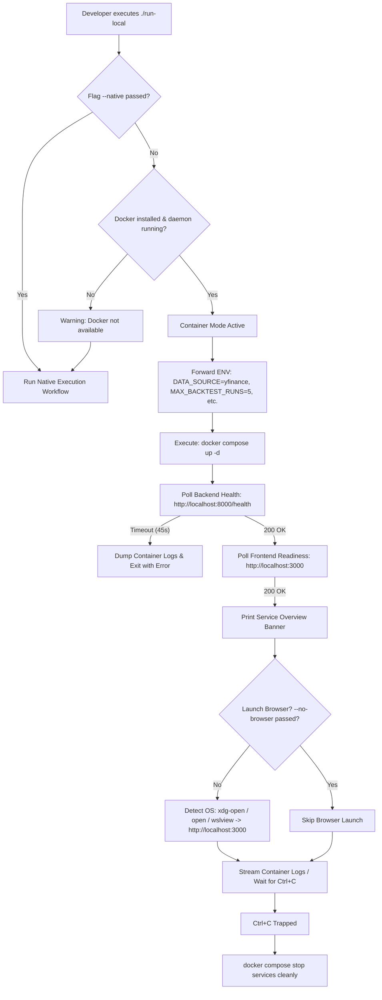

# Container-First Local Development Runner Plan

## Purpose
This document provides the architectural analysis, design specification, and complete reference implementation for upgrading the repository's local execution runner ([run-local](file:///home/shailender/projects/equitest-nse/run-local)) to a **Container-First** orchestration workflow. 

The upgraded runner guarantees that any fresh developer machine with Docker installed can launch the entire EquiTest NSE backtesting stack with a single invocation of `./run-local`, while maintaining robust healthcheck polling, browser auto-launching, environment variable forwarding, and seamless native execution fallback.

> [!NOTE]
> This document is part of the EquiTest NSE Containerization Suite:
> - [01-current-state-assessment.md](file:///home/shailender/projects/equitest-nse/data/containerization/01-current-state-assessment.md) — Dependency audit and infrastructure blockers
> - [02-containerization-plan.md](file:///home/shailender/projects/equitest-nse/data/containerization/02-containerization-plan.md) — Dockerfile and compose topology
> - [03-remote-data-ingestion-plan.md](file:///home/shailender/projects/equitest-nse/data/containerization/03-remote-data-ingestion-plan.md) — Remote data acquisition via Yahoo Finance
> - [04-cleanup-and-retention-plan.md](file:///home/shailender/projects/equitest-nse/data/containerization/04-cleanup-and-retention-plan.md) — Artifact cleanup and retention policy
> - [README.md](file:///home/shailender/projects/equitest-nse/data/containerization/README.md) — Master index and execution blueprint

---

## 1. Analysis of Existing `run-local` Script

The existing runner script at [run-local](file:///home/shailender/projects/equitest-nse/run-local) is 122 lines of Bash focused entirely on native host execution.

```bash
# Existing run-local excerpt (lines 22-23)
# Default data source for local testing (CSV loads offline fixtures; override with DATA_SOURCE=yfinance)
export DATA_SOURCE="${DATA_SOURCE:-CSV}"
```

### 1.1 Structural Limitations & Deficiencies

| Feature Area | Current Behavior | Problem & Containerization Impact |
|--------------|------------------|-----------------------------------|
| **Orchestration Model** | Pure native host execution. Runs Python venv setup, `pip install`, `npm install`, and spawns native background processes (`uvicorn &`, `npm run dev &`). | Requires host-level Python 3.11, Node.js 20, WeasyPrint system C libraries (`libpango`, `libcairo`), and compiler toolchains. Fails on a pristine machine lacking these tools. |
| **Data Source Default** | Line 23 hardcodes `export DATA_SOURCE="${DATA_SOURCE:-CSV}"`. | Violates portability by coupling execution to local Parquet fixtures in `data/fixtures/*.parquet`. Pristine machines without fixtures encounter missing-data errors. |
| **Docker Awareness** | **Zero Docker awareness**. Script never checks for `docker`, `docker compose`, or container state. | Completely ignores the multi-stage Docker infrastructure built for backend and frontend. |
| **Readiness Detection** | Line 101 uses a static `sleep 1.5` before printing the service banner. | Naive and brittle. Neither Uvicorn nor Next.js can finish compiling and binding ports within 1.5 seconds. Users see "Running" banners while endpoints are still failing. |
| **Browser Interaction** | None. Prints URLs to stdout; requires developer to manually copy/click links. | Friction in onboarding experience; no automated dashboard launch. |
| **Environment Forwarding** | Environment variables are set only in the local subshell, without propagating into Docker Compose services. | Cannot easily configure `DATABASE_URL`, `MAX_BACKTEST_RUNS`, or logging levels for container runs. |
| **Cleanup on Exit** | Process-based trap handler killing `$BACKEND_PID` and `$FRONTEND_PID`. | Leaves dangling processes if SIGKILL is received; has no awareness of stopping Docker containers. |

---

## 2. Proposed Container-First Architecture

The container-first runner redesign transforms `./run-local` into an intelligent orchestrator that prioritizes containerized execution by default while gracefully handling native development.



### 2.1 Core Architectural Principles

1. **Container by Default**: `docker compose up -d` is the default execution vehicle. No Python, Node.js, Cairo, or WeasyPrint libraries are required on the host system.
2. **Autonomous Remote Data Default**: Sets `DATA_SOURCE=yfinance` in container mode so pristine clones immediately fetch live Yahoo Finance OHLCV market data without requiring local fixture files.
3. **Active Health Polling (No Arbitrary Sleeps)**: The script actively queries HTTP health probes until services are genuinely ready to accept traffic.
4. **Automated Browser Launch**: Detects the host operating system (Linux, macOS, Windows/WSL) and automatically launches the web interface at `http://localhost:3000` once healthchecks pass.
5. **Native Fallback Preservation**: Preserves the existing host-level toolchain execution behind `./run-local --native` or when Docker Engine is not running, ensuring existing local debugging workflows remain completely intact.
6. **Graceful Teardown**: Intercepts `SIGINT` (Ctrl+C) and `SIGTERM` to issue `docker compose stop` or process kills, leaving no dangling containers or bound ports.

---

## 3. Detailed Component Specifications

### 3.1 Environment Passthrough & Configuration Forwarding

The container-first runner forwards key runtime configurations into the Docker Compose context. The following environment variables are recognized and passed through:

| Environment Variable | Container Default | Native Default | Purpose |
|----------------------|-------------------|----------------|---------|
| `DATA_SOURCE` | `yfinance` | `CSV` (or existing env) | Configures whether market data is downloaded via Yahoo Finance or read from local fixtures. |
| `DATABASE_URL` | `sqlite:////app/data/equitest.db` | `sqlite:///./dev.db` | SQLite database URI. In container mode, mapped to persistent volume `equitest_db`. |
| `MAX_BACKTEST_RUNS` | `5` | `5` | Governs automated cascade retention of backtest JSON and PDF artifacts. |
| `MAX_BACKTEST_SWEEPS` | `2` | `2` | Governs parameter sweep retention quota. |
| `APP_ENV` | `development` | `development` | Application lifecycle mode. |
| `LOG_LEVEL` | `INFO` | `DEBUG` | Logging verbosity for FastAPI backend and Celery/engine. |
| `NEXT_PUBLIC_API_URL` | `http://localhost:8000` | `http://localhost:8000` | Browser-accessible backend API URL for client-side JavaScript. |

### 3.2 Health Check Polling Algorithm

Rather than a fragile `sleep` timer, the runner implements a robust polling loop with exponential diagnostic output:

1. **Backend Health Probe**:
   - URL: `http://localhost:8000/health`
   - Success Condition: HTTP response code `200` and body containing `"status":"ok"` or `"status": "ok"`.
   - Polling Interval: 1.0 second.
   - Max Timeout: 45 seconds.
2. **Frontend Readiness Probe**:
   - URL: `http://localhost:3000`
   - Success Condition: HTTP response code `200` or `304`.
   - Polling Interval: 1.0 second.
   - Max Timeout: 45 seconds.
3. **Failure Handling**:
   - If either probe exceeds the 45-second deadline, the runner terminates the loop, prints an error banner, and automatically outputs the last 50 lines of container logs (`docker compose logs --tail=50 backend`) to give the developer immediate visibility into Python startup errors or database lockouts.

### 3.3 Operating System Detection & Browser Auto-Launch

Once both backend and frontend health probes pass, the runner invokes the platform-appropriate URL opener:

```bash
launch_browser() {
    local url="$1"
    if [ "${NO_BROWSER:-0}" -eq 1 ] || [ "${CI:-false}" = "true" ]; then
        return 0
    fi

    # Headless Linux detection (no X11 / Wayland)
    if [ "$(uname -s)" = "Linux" ] && [ -z "${DISPLAY:-}" ] && [ -z "${WAYLAND_DISPLAY:-}" ]; then
        return 0
    fi

    echo -e "${CYAN}==> Opening $url in default browser...${NC}"
    if command -v xdg-open >/dev/null 2>&1; then
        xdg-open "$url" >/dev/null 2>&1 &
    elif command -v open >/dev/null 2>&1; then
        open "$url" >/dev/null 2>&1 &
    elif command -v wslview >/dev/null 2>&1; then
        wslview "$url" >/dev/null 2>&1 &
    elif [ -n "${COMSPEC:-}" ]; then
        cmd.exe /c start "$url" >/dev/null 2>&1 &
    fi
}
```

### 3.4 CLI Command-Line Interface (Flags & Options)

The new runner supports comprehensive CLI options:

```text
Usage: ./run-local [OPTIONS]

EquiTest NSE — Container-First Local Development Runner

Options:
  --native        Force native host execution using local Python venv and Node.js
  --build         Force Docker image rebuild before launching (docker compose up --build)
  --no-browser    Suppress automatic browser dashboard launch
  --clean         Run stale backtest retention cleanup before starting services
  --down          Stop and remove running containers, then exit
  --logs          Attach to live container logs after startup (follows logs)
  -h, --help      Display this help message and exit

Environment Variables:
  DATA_SOURCE            Market data provider: 'yfinance' (default) or 'CSV'
  MAX_BACKTEST_RUNS      Backtest retention quota (default: 5)
  DATABASE_URL           SQLModel database connection URI
  NO_BROWSER             Set to 1 to disable automatic browser launching
```

---

## 4. Complete Upgraded `run-local` Implementation

The following complete Bash script implements the full container-first specification and is ready to replace [run-local](file:///home/shailender/projects/equitest-nse/run-local):

```bash
#!/usr/bin/env bash
# ====================================================================
# EquiTest NSE — Container-First Local Development Runner
# Coordinates Dockerized execution (default) with native fallback.
# ====================================================================
set -euo pipefail

ROOT_DIR="$(cd "$(dirname "${BASH_SOURCE[0]}")" && pwd)"
cd "$ROOT_DIR"

# Visual styles
BOLD='\033[1m'
CYAN='\033[0;36m'
GREEN='\033[0;32m'
YELLOW='\033[0;33m'
RED='\033[0;31m'
NC='\033[0m'

# Default Options
MODE="container"
FORCE_BUILD=0
AUTO_BROWSER=1
ATTACH_LOGS=0
EXECUTE_DOWN=0
PRE_CLEAN=0

# Parse Command-Line Flags
while [[ $# -gt 0 ]]; do
    case "$1" in
        --native)
            MODE="native"
            shift
            ;;
        --build)
            FORCE_BUILD=1
            shift
            ;;
        --no-browser)
            AUTO_BROWSER=0
            shift
            ;;
        --clean)
            PRE_CLEAN=1
            shift
            ;;
        --down)
            EXECUTE_DOWN=1
            shift
            ;;
        --logs)
            ATTACH_LOGS=1
            shift
            ;;
        -h|--help)
            echo -e "${BOLD}EquiTest NSE Local Development Runner${NC}"
            echo "Usage: ./run-local [OPTIONS]"
            echo ""
            echo "Options:"
            echo "  --native        Force native host execution (uvicorn + next.js dev)"
            echo "  --build         Rebuild Docker container images before launch"
            echo "  --no-browser    Do not auto-open browser on startup"
            echo "  --clean         Execute stale data retention purge prior to launch"
            echo "  --down          Stop and remove running container stack"
            echo "  --logs          Attach to live container logs after launching"
            echo "  -h, --help      Show this help documentation"
            exit 0
            ;;
        *)
            echo -e "${RED}Unknown argument: $1${NC}"
            echo "Run ./run-local --help for usage details."
            exit 1
            ;;
    esac
done

# Handle --down command
if [ "$EXECUTE_DOWN" -eq 1 ]; then
    echo -e "${YELLOW}==> Stopping and tearing down EquiTest containers...${NC}"
    if docker compose version >/dev/null 2>&1; then
        docker compose down
    elif command -v docker-compose >/dev/null 2>&1; then
        docker-compose down
    fi
    echo -e "${GREEN}==> Container stack halted cleanly.${NC}"
    exit 0
fi

# Detect Docker Availability
check_docker_available() {
    if ! command -v docker >/dev/null 2>&1; then
        return 1
    fi
    if ! docker info >/dev/null 2>&1; then
        return 1
    fi
    return 0
}

# Resolve Compose Command
get_compose_cmd() {
    if docker compose version >/dev/null 2>&1; then
        echo "docker compose"
    elif command -v docker-compose >/dev/null 2>&1; then
        echo "docker-compose"
    else
        echo ""
    fi
}

COMPOSE_CMD=$(get_compose_cmd)

# Decide execution mode based on environment
if [ "$MODE" = "container" ]; then
    if ! check_docker_available || [ -z "$COMPOSE_CMD" ]; then
        echo -e "${YELLOW}[NOTICE] Docker daemon or Docker Compose is unavailable on this host.${NC}"
        echo -e "${YELLOW}==> Falling back to Native Host Development Mode...${NC}"
        MODE="native"
    fi
fi

# Pre-startup Cleanup if requested
if [ "$PRE_CLEAN" -eq 1 ]; then
    echo -e "${CYAN}==> Running artifact cleanup and retention enforcement...${NC}"
    if [ -f "$ROOT_DIR/scripts/cleanup_orphaned_backtests.sh" ]; then
        bash "$ROOT_DIR/scripts/cleanup_orphaned_backtests.sh" || true
    fi
fi

# ====================================================================
# MODE A: CONTAINER-FIRST WORKFLOW (DEFAULT)
# ====================================================================
if [ "$MODE" = "container" ]; then
    echo -e "${BOLD}${CYAN}====================================================================${NC}"
    echo -e "${BOLD}${CYAN}   EquiTest NSE — Containerized Development Runner (Docker)${NC}"
    echo -e "${BOLD}${CYAN}====================================================================${NC}"

    # Default container data source is live remote yfinance
    export DATA_SOURCE="${DATA_SOURCE:-yfinance}"
    export MAX_BACKTEST_RUNS="${MAX_BACKTEST_RUNS:-5}"
    export DATABASE_URL="${DATABASE_URL:-sqlite:////app/data/equitest.db}"

    # Verify ports are not occupied by host processes
    check_port_conflict() {
        local port=$1
        local service=$2
        if command -v lsof >/dev/null 2>&1; then
            if lsof -i :"$port" -sTCP:LISTEN -t >/dev/null 2>&1; then
                local pid
                pid=$(lsof -i :"$port" -sTCP:LISTEN -t | head -n 1)
                echo -e "${YELLOW}[WARNING] Host port $port ($service) is already bound by PID $pid.${NC}"
            fi
        fi
    }
    check_port_conflict 8000 "Backend"
    check_port_conflict 3000 "Frontend"

    # Trap Ctrl+C to halt containers gracefully
    cleanup_containers() {
        trap - SIGINT SIGTERM EXIT
        echo ""
        echo -e "${YELLOW}==> Halting EquiTest container services...${NC}"
        $COMPOSE_CMD stop backend frontend >/dev/null 2>&1 || true
        echo -e "${GREEN}==> Services stopped cleanly.${NC}"
        exit 0
    }
    trap cleanup_containers SIGINT SIGTERM EXIT

    # Build or start container stack
    COMPOSE_ARGS="up -d"
    if [ "$FORCE_BUILD" -eq 1 ]; then
        COMPOSE_ARGS="up --build -d"
    fi

    echo -e "${CYAN}==> Launching container stack ($COMPOSE_CMD $COMPOSE_ARGS)...${NC}"
    $COMPOSE_CMD $COMPOSE_ARGS

    # Active Healthcheck Polling: Backend
    echo -n -e "${CYAN}==> Awaiting Backend API readiness (http://localhost:8000/health)...${NC}"
    BACKEND_READY=0
    for i in {1..45}; do
        if curl -s -f http://localhost:8000/health | grep -q '"status"' 2>/dev/null; then
            BACKEND_READY=1
            echo -e " ${GREEN}[OK]${NC}"
            break
        fi
        echo -n "."
        sleep 1
    done

    if [ "$BACKEND_READY" -ne 1 ]; then
        echo -e " ${RED}[FAILED]${NC}"
        echo -e "${RED}[ERROR] Backend failed to pass healthcheck within 45 seconds.${NC}"
        echo -e "${YELLOW}==> Dumping recent backend container logs:${NC}"
        $COMPOSE_CMD logs --tail=40 backend
        exit 1
    fi

    # Active Readiness Polling: Frontend
    echo -n -e "${CYAN}==> Awaiting Frontend readiness (http://localhost:3000)...${NC}"
    FRONTEND_READY=0
    for i in {1..45}; do
        if curl -s -I http://localhost:3000 2>&1 | grep -qE "200 OK|304 Not Modified"; then
            FRONTEND_READY=1
            echo -e " ${GREEN}[OK]${NC}"
            break
        fi
        echo -n "."
        sleep 1
    done

    if [ "$FRONTEND_READY" -ne 1 ]; then
        echo -e " ${YELLOW}[WARNING: Frontend still compiling, continuing...]${NC}"
    fi

    # Display Service Information
    echo ""
    echo -e "${BOLD}${GREEN}====================================================================${NC}"
    echo -e "${BOLD}${GREEN}   EquiTest NSE — All Container Services Running & Healthy${NC}"
    echo -e "${BOLD}${GREEN}====================================================================${NC}"
    echo -e "   ${BOLD}Frontend Application:${NC}  http://localhost:3000"
    echo -e "     - Market Data UI:     http://localhost:3000/data"
    echo -e "     - Backtesting Studio: http://localhost:3000/backtest"
    echo -e "     - Health Status:      http://localhost:3000/api-health"
    echo ""
    echo -e "   ${BOLD}Backend API Engine:${NC}    http://localhost:8000"
    echo -e "     - Interactive Docs:   http://localhost:8000/docs"
    echo -e "     - Health Endpoint:    http://localhost:8000/health"
    echo ""
    echo -e "   ${BOLD}Data Provider:${NC}         ${CYAN}$DATA_SOURCE${NC}"
    echo -e "   ${BOLD}Retention Limit:${NC}       ${CYAN}Keep last $MAX_BACKTEST_RUNS runs${NC}"
    echo -e "   ${BOLD}Press [Ctrl+C] to stop all services.${NC}"
    echo -e "${BOLD}${GREEN}====================================================================${NC}"
    echo ""

    # Browser Auto-Launch
    if [ "$AUTO_BROWSER" -eq 1 ] && [ "${CI:-false}" != "true" ]; then
        if [ "$(uname -s)" = "Linux" ] && [ -n "${DISPLAY:-}" ]; then
            xdg-open "http://localhost:3000" >/dev/null 2>&1 || true
        elif [ "$(uname -s)" = "Darwin" ]; then
            open "http://localhost:3000" >/dev/null 2>&1 || true
        elif command -v wslview >/dev/null 2>&1; then
            wslview "http://localhost:3000" >/dev/null 2>&1 || true
        fi
    fi

    # Follow logs if requested, otherwise wait
    if [ "$ATTACH_LOGS" -eq 1 ]; then
        $COMPOSE_CMD logs -f
    else
        echo -e "${CYAN}Streaming container logs (press Ctrl+C to stop)...${NC}"
        $COMPOSE_CMD logs -f --tail=0
    fi
    exit 0
fi

# ====================================================================
# MODE B: NATIVE HOST FALLBACK WORKFLOW
# ====================================================================
echo -e "${BOLD}${YELLOW}====================================================================${NC}"
echo -e "${BOLD}${YELLOW}   EquiTest NSE — Native Host Development Mode${NC}"
echo -e "${BOLD}${YELLOW}====================================================================${NC}"

# Ensure PATH has node/npm and python tools
for nvm_path in "$HOME/.nvm/versions/node"/*/bin; do
    if [ -d "$nvm_path" ]; then
        export PATH="$nvm_path:$PATH"
    fi
done
export PATH="$ROOT_DIR/bin:$HOME/.local/bin:$PATH"
export NODE_PATH="$ROOT_DIR/frontend/node_modules"
export DATA_SOURCE="${DATA_SOURCE:-CSV}"

# 1. Setup virtual environment
VENV="$ROOT_DIR/backend/.venv"
if [ ! -d "$VENV" ] || [ ! -f "$VENV/bin/python" ]; then
    echo -e "${YELLOW}==> Python virtual environment not found. Setting up backend/.venv...${NC}"
    python3 -m venv "$VENV"
    "$VENV/bin/pip" install --upgrade pip
    "$VENV/bin/pip" install -e "$ROOT_DIR/backend[dev]"
fi

# 2. Setup node modules
if [ ! -d "$ROOT_DIR/frontend/node_modules" ]; then
    echo -e "${YELLOW}==> Installing frontend dependencies...${NC}"
    (cd "$ROOT_DIR/frontend" && npm install)
    ln -sfn "$ROOT_DIR/frontend/node_modules" "$ROOT_DIR/node_modules"
fi

# 3. Synchronize OpenAPI contracts
if [ ! -f "$ROOT_DIR/frontend/openapi.json" ] || [ ! -f "$ROOT_DIR/frontend/lib/schema.d.ts" ]; then
    echo -e "${CYAN}==> Synchronizing OpenAPI contract schemas...${NC}"
    "$VENV/bin/python" "$ROOT_DIR/backend/app/main.py" --export-openapi "$ROOT_DIR/frontend/openapi.json"
    (cd "$ROOT_DIR/frontend" && npx openapi-typescript ./openapi.json -o ./lib/schema.d.ts)
fi

# 4. Check port availability
check_port() {
    local port=$1
    local name=$2
    if lsof -i :"$port" -sTCP:LISTEN -t >/dev/null 2>&1; then
        local pid
        pid=$(lsof -i :"$port" -sTCP:LISTEN -t | head -n 1)
        echo -e "${RED}[WARNING] Port $port ($name) is in use by PID $pid.${NC}"
        echo -e "${RED}Terminate conflicting process or run: kill -9 $pid${NC}"
    fi
}
check_port 8000 "Backend"
check_port 3000 "Frontend"

# 5. Trap cleanup on exit
cleanup_native() {
    trap - SIGINT SIGTERM EXIT
    echo ""
    echo -e "${YELLOW}==> Shutting down native EquiTest services...${NC}"
    if [ -n "${FRONTEND_PID:-}" ]; then
        pkill -P "$FRONTEND_PID" 2>/dev/null || true
        kill "$FRONTEND_PID" 2>/dev/null || true
    fi
    if [ -n "${BACKEND_PID:-}" ]; then
        pkill -P "$BACKEND_PID" 2>/dev/null || true
        kill "$BACKEND_PID" 2>/dev/null || true
    fi
    echo -e "${GREEN}==> All native processes terminated.${NC}"
    exit 0
}
trap cleanup_native SIGINT SIGTERM EXIT

# 6. Start Native Backend & Frontend
echo -e "${CYAN}==> Starting FastAPI Backend on http://127.0.0.1:8000...${NC}"
"$VENV/bin/uvicorn" app.main:app --app-dir "$ROOT_DIR/backend" --host 0.0.0.0 --port 8000 --reload &
BACKEND_PID=$!

echo -e "${CYAN}==> Starting Next.js Frontend on http://localhost:3000...${NC}"
(cd "$ROOT_DIR/frontend" && npm run dev) &
FRONTEND_PID=$!

# Native Service Banner
sleep 2
echo ""
echo -e "${BOLD}${GREEN}====================================================================${NC}"
echo -e "${BOLD}${GREEN}   EquiTest NSE — Native Services Running${NC}"
echo -e "${BOLD}${GREEN}====================================================================${NC}"
echo -e "   ${BOLD}Frontend:${NC}    http://localhost:3000"
echo -e "   ${BOLD}Backend API:${NC} http://localhost:8000"
echo -e "   ${BOLD}Data Source:${NC} $DATA_SOURCE"
echo -e "   ${BOLD}Press [Ctrl+C] to stop all services.${NC}"
echo -e "${BOLD}${GREEN}====================================================================${NC}"

if [ "$AUTO_BROWSER" -eq 1 ] && [ "${CI:-false}" != "true" ]; then
    if [ "$(uname -s)" = "Linux" ] && [ -n "${DISPLAY:-}" ]; then
        xdg-open "http://localhost:3000" >/dev/null 2>&1 || true
    elif [ "$(uname -s)" = "Darwin" ]; then
        open "http://localhost:3000" >/dev/null 2>&1 || true
    fi
fi

wait
```

---

## 5. Verification Matrix & Failure Mode Handling

To ensure reliability across diverse developer workstations and CI runners, the container-first runner must be verified against the following matrix:

| Workstation Scenario | Expected Behavior | Verification Command |
|----------------------|-------------------|----------------------|
| **Fresh Machine with Docker** | Launches container mode, compiles images if missing, polls health probes, and opens browser to `http://localhost:3000`. | `./run-local` |
| **Developer requesting Native Mode** | Executes Python venv and Next.js dev server on the host OS; ignores Docker. | `./run-local --native` |
| **Docker Daemon Stopped** | Emits yellow warning that Docker is down, automatically falls back to native execution. | Stop Docker service (`systemctl stop docker`) and run `./run-local` |
| **Backend Startup Failure** | Detects healthcheck timeout at 45s, stops polling, prints red error banner, and dumps last 40 lines of container logs. | Inject intentional syntax error in `backend/app/main.py` and run `./run-local` |
| **Headless Linux / SSH Session** | Detects missing `DISPLAY` variable; suppresses `xdg-open` without throwing command errors. | `DISPLAY= ./run-local --no-browser` |
| **Stack Teardown** | Issues `docker compose down` and cleans up network bindings. | `./run-local --down` |
| **Rebuild Container Cache** | Passes `--build` argument to compose to force fresh image layer build. | `./run-local --build` |

---

## 6. Migration & Deployment Plan

1. **Step 1: Save Upgraded Runner**: Replace [run-local](file:///home/shailender/projects/equitest-nse/run-local) with the container-first script. Ensure `chmod +x run-local`.
2. **Step 2: Update Makefile Wrapper**: Modify the `run-local` target in [Makefile](file:///home/shailender/projects/equitest-nse/Makefile) to delegate directly to `./run-local`:
   ```makefile
   run-local:
   	./run-local
   ```
3. **Step 3: Update Developer Documentation**: Update [README.md](file:///home/shailender/projects/equitest-nse/README.md) and [docs/RUNBOOK.md](file:///home/shailender/projects/equitest-nse/docs/RUNBOOK.md) to document `./run-local` as the unified zero-configuration entry point for both Docker and native developers.
