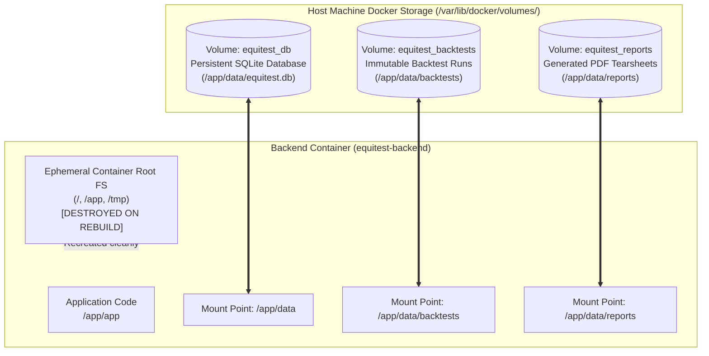
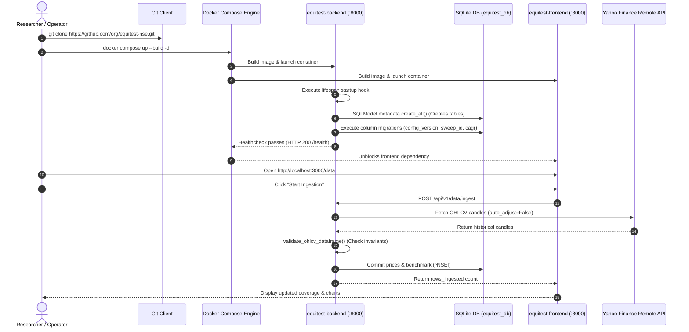

# Pristine State Checklist: Fresh Machine Deployment & Lifecycle Architecture

## Purpose
This document provides a comprehensive, production-grade specification and operational checklist for establishing, provisioning, and maintaining the **EquiTest NSE** backtesting platform on a completely fresh host machine or cloud instance. It defines exact hardware and software prerequisites, repository cleanliness requirements, `.dockerignore` / `.gitignore` filtering boundaries, Docker named volume persistence topologies, and an automated zero-to-running bootstrap sequence.

By adhering to this specification, any developer, quantitative researcher, or automated continuous integration (CI) worker can initialize the platform from a bare Git clone to a fully operational, quantitative backtesting environment with zero manual fixture copying and zero host-level dependency installation.

---

## 1. Pristine Machine Prerequisites

Before deploying EquiTest NSE, the host machine must satisfy the following baseline hardware, operating system, and software requirements.

### 1.1 Operating System Compatibility
The containerized deployment is cross-platform and verified on:
- **Linux (Recommended)**: Ubuntu 22.04 LTS / 24.04 LTS, Debian 12 (Bookworm), RHEL / Rocky Linux 9, Arch Linux.
- **macOS**: macOS 13 (Ventura), 14 (Sonoma), or 15 (Sequoia) running on Apple Silicon (M1/M2/M3/M4) or Intel x86_64 via Docker Desktop or OrbStack.
- **Windows**: Windows 10/11 Pro, Enterprise, or Education with WSL2 (Windows Subsystem for Linux 2) running Ubuntu 22.04 LTS. Direct Windows container hosting is not supported; Docker Desktop with WSL2 backend is required.

### 1.2 Hardware Specifications

| Resource | Minimum Requirement | Recommended Specification | Rationale |
| :--- | :--- | :--- | :--- |
| **CPU Architecture** | x86_64 or arm64 (aarch64) | x86_64 or Apple Silicon (arm64) | Python wheels and Node.js binaries build natively on both architectures. |
| **CPU Cores** | 2 Physical Cores | 4–8 Physical Cores | Parallel Pandas backtesting, indicator rolling windows, and WeasyPrint PDF rendering. |
| **RAM** | 4 GB | 8 GB – 16 GB | SQLite in-memory caching, universe data aggregation (650+ equities $\times$ 15 years), and Next.js SSR build memory overhead. |
| **Storage** | 10 GB Free Disk Space | 30+ GB SSD Free Space | Docker image layers, SQLite persistent volumes, raw market data cache, and historical PDF tear sheets. |

### 1.3 Toolchain & CLI Requirements

Verify that the following tools are installed and accessible in the system `$PATH`:

```bash
# 1. Verify Git installation (v2.30.0+)
git --version

# 2. Verify Docker Engine (v24.0.0+)
docker --version

# 3. Verify Docker Compose plugin (v2.20.0+)
docker compose version

# 4. Verify user permissions for Docker daemon (non-root access)
docker info > /dev/null 2>&1 || { echo "ERROR: Current user cannot access Docker daemon without sudo."; exit 1; }
```

> [!NOTE]
> EquiTest NSE strictly utilizes the Docker CLI Compose plugin syntax (`docker compose`, space-separated). Legacy standalone Python-based `docker-compose` (hyphenated v1.x) is end-of-life and unsupported.

### 1.4 Network Connectivity & Egress Matrix
The container build and runtime processes require uninterrupted outbound HTTPS access over port `443`. Firewalls, corporate proxies, or VPNs must whitelist the following endpoints:

| Endpoint Domain | Protocol / Port | Lifecycle Phase | Required Purpose |
| :--- | :--- | :--- | :--- |
| `registry-1.docker.io`, `auth.docker.io` | HTTPS / 443 | Build | Pulling base images (`python:3.11-slim`, `node:20-alpine`, `postgres:16-alpine`) |
| `pypi.org`, `files.pythonhosted.org` | HTTPS / 443 | Build | Python package resolution and wheel installation via `pip` |
| `registry.npmjs.org` | HTTPS / 443 | Build | Node.js frontend package installation via `npm` |
| `deb.debian.org`, `security.debian.org` | HTTPS / 443 | Build | Debian system library updates (`curl`, `libpango`, `libcairo`, `fonts-dejavu`) |
| `query1.finance.yahoo.com`, `query2.finance.yahoo.com` | HTTPS / 443 | Runtime | Real-time and historical OHLCV equity and index price ingestion via `yfinance` |
| `archives.nseindia.com`, `www.nseindia.com` | HTTPS / 443 | Runtime | Historical index composition archives and corporate action disclosures |

---

## 2. Repository Hygiene: Pre-Build State Cleanup

When transferring a repository between machines, cloning a repository, or migrating from a local bare-metal environment to Docker containers, host-generated artifacts frequently contaminate the build context or corrupt container runtime state.

### 2.1 Dangerous Host Artifacts & Failure Modes

The following artifacts must never be copied into Docker images or mounted over persistent container volumes:

1. **SQLite Database Files (`dev.db`, `backend/dev.db`)**:
   - *Failure Mode*: If an existing 400MB+ host SQLite database is copied into the backend image during `COPY app/ ./app/`, it bakes a stale, static database into the image layer. Furthermore, if a host process holds a write lock, copying the `.db` file without its corresponding journal/WAL files results in database corruption (`sqlite3.DatabaseError: file is not a database` or `database disk image is malformed`).
2. **SQLite Write-Ahead Logs (`*.db-wal`, `*.db-shm`)**:
   - *Failure Mode*: SQLite WAL mode splits writes into a separate log file and memory map index. Orphaned WAL files copied across OS or container boundaries cause immediate concurrency deadlocks and `database is locked` errors.
3. **Host Virtual Environments (`.venv/`, `backend/.venv/`)**:
   - *Failure Mode*: Host Python virtual environments contain architecture-specific and OS-specific C extensions (e.g., compiled Pandas, NumPy, or Cython shared libraries). If a macOS or Windows virtual environment is mounted or copied into a Debian Linux container, Python crashes immediately with `ELF header invalid` or `ImportError: cannot import name ... from dynamically linked library`.
4. **Host Node Modules (`node_modules/`, `frontend/node_modules/`)**:
   - *Failure Mode*: Contains native binary bindings for Next.js compiler SWC (`@next/swc-*`). Copying host `node_modules` into the Alpine Linux container causes segmentation faults or build errors such as `Error: Cannot find module '@next/swc-linux-x64-musl'`.
5. **Stale Backtest & Report Artifacts (`data/backtests/*.json`, `data/reports/*`)**:
   - *Failure Mode*: Host-generated JSON backtest runs may contain stale run identifiers, obsolete strategy parameter schemas, or absolute host file paths, violating Strategy Invariant 5 (audit provenance).

### 2.2 Pristine State Purge Script

Before initiating container builds on a development workstation that previously ran native Python or Node.js processes, execute the following state-clearing command sequence:

```bash
# Remove all local database files, WAL logs, and shared memory files
find . -maxdepth 3 -type f \( -name "*.db" -o -name "*.db-wal" -o -name "*.db-shm" -o -name "*.sqlite3" \) -delete

# Remove host Python virtualenvs, bytecode, and test caches
rm -rf .venv backend/.venv
find . -type d -name "__pycache__" -exec rm -rf {} +
find . -type d -name ".pytest_cache" -exec rm -rf {} +
find . -type d -name ".ruff_cache" -exec rm -rf {} +
rm -rf .coverage htmlcov coverage.xml

# Remove host Node.js build outputs and dependency caches
rm -rf node_modules frontend/node_modules frontend/.next frontend/out

# Remove local report teardowns (preserving git directory structure)
mkdir -p data/reports data/backtests
rm -rf data/reports/*
find data/backtests -type f -name "*.json" ! -name ".gitkeep" -delete
```

---

## 3. Exact `.dockerignore` Specifications

To ensure minimal Docker build contexts, instant build caching, and complete isolation from host state, dedicated `.dockerignore` files must be established at the repository root, within [`backend/.dockerignore`](file:///home/shailender/projects/equitest-nse/backend/.dockerignore), and within [`frontend/.dockerignore`](file:///home/shailender/projects/equitest-nse/frontend/.dockerignore).

### 3.1 Backend `.dockerignore` ([`backend/.dockerignore`](file:///home/shailender/projects/equitest-nse/backend/.dockerignore))

This file governs the build context when `docker compose` builds the backend service (`context: ./backend` or `context: .`):

```text
# ==============================================================================
# EquiTest NSE — Backend Dockerignore Specification
# ==============================================================================

# Python bytecode and compilation caches
__pycache__/
*.py[cod]
*$py.class
*.so
.Python

# Local virtual environments
.venv/
backend/.venv/
env/
venv/
ENV/

# Testing, profiling, and coverage artifacts
.pytest_cache/
.ruff_cache/
.coverage
htmlcov/
coverage.xml
.hypothesis/

# Host database files and locks (PREVENTS CORRUPTION & BLOAT)
*.db
*.db-journal
*.db-wal
*.db-shm
*.sqlite
*.sqlite3
*.sqlite3-wal
*.sqlite3-shm
dev.db
prod.db

# Backtest run logs and generated PDF tear sheets
data/backtests/*.json
data/reports/*.pdf
data/reports/*.html
data/cache/

# Git metadata and repository configuration
.git/
.gitignore
.gitattributes
.github/

# IDE and OS metadata
.idea/
.vscode/
*.swp
*.swo
.DS_Store
Thumbs.db

# Documentation and scratch files
docs/
scratch/
*.md
!README.md
```

### 3.2 Frontend `.dockerignore` ([`frontend/.dockerignore`](file:///home/shailender/projects/equitest-nse/frontend/.dockerignore))

This file governs the build context for the Next.js frontend container (`context: ./frontend`):

```text
# ==============================================================================
# EquiTest NSE — Frontend Dockerignore Specification
# ==============================================================================

# Node dependencies (MUST be installed natively inside the container)
node_modules/
npm-debug.log*
yarn-debug.log*
yarn-error.log*
.pnpm-debug.log*

# Next.js build cache and static outputs
.next/
out/
build/
dist/

# TypeScript cache
*.tsbuildinfo
next-env.d.ts

# Test outputs and Playwright artifacts
test-results/
playwright-report/
blob-report/
playwright/.cache/
coverage/

# Environment files with secrets
.env*.local

# Git metadata
.git/
.github/

# IDE and OS metadata
.vscode/
.idea/
.DS_Store
Thumbs.db
```

---

## 4. Repository `.gitignore` Additions & Audit

An audit of the existing root [`.gitignore`](file:///home/shailender/projects/equitest-nse/.gitignore) reveals critical omissions that risk committing database write-ahead logs, generated reports, or container environment overrides to the Git history.

### 4.1 Comparison & Required Additions

| Category | Missing Pattern | Hazard if Committed | Required Action |
| :--- | :--- | :--- | :--- |
| **SQLite WAL Mode** | `*.db-wal`, `*.db-shm` | Commits uncommitted transactions, causing locked database states for other collaborators. | Add to Database section |
| **Nested DB Paths** | `backend/*.db*` | SQLite files created inside `backend/` during ad hoc test runs bypass root `*.db`. | Add explicit wildcard |
| **Generated Reports** | `data/reports/`, `*.pdf` | Generated tear-sheets (multi-megabyte binary PDFs) permanently bloat Git history. | Add `data/reports/` ignore |
| **Runtime Data Cache** | `.yfinance_cache/`, `data/cache/` | Yahoo Finance metadata and cookie stores pollute version control. | Add cache patterns |
| **Compose Overrides** | `docker-compose.override.yml` | Developer-specific host port or bind-mount overrides leak to team members. | Add Docker section |

### 4.2 Updated `.gitignore` Configuration

The following lines must be appended to the root [`.gitignore`](file:///home/shailender/projects/equitest-nse/.gitignore):

```gitignore
# ==============================================================================
# Containerization & SQLite WAL Runtime Additions (EQT-DOC-06)
# ==============================================================================

# SQLite Write-Ahead Logging & Shared Memory Maps
*.db-wal
*.db-shm
*.db-journal
*.sqlite3-wal
*.sqlite3-shm
backend/*.db*
data/*.db*

# Report Generator Outputs
data/reports/*
!data/reports/.gitkeep

# Ingestion & Market Data Caches
.yfinance_cache/
data/cache/

# Local Container Overrides
docker-compose.override.yml
docker-compose.*.local.yml
.env.docker
```

---

## 5. Named Volumes Lifecycle Architecture

A foundational architectural requirement of container portability is the separation of **ephemeral container execution state** from **persistent quantitative state**.



### 5.1 Ephemeral Container Root vs Persistent Volumes

1. **Ephemeral Container Root (`/app`, `/`, `/tmp`)**:
   - Contains Python binaries, Debian libraries, static code, and runtime temporary files.
   - When a container is recreated (`docker compose up --build` or `docker compose down && docker compose up`), the ephemeral filesystem is completely discarded.
   - *Design Invariant*: Code must never write critical financial data, backtest logs, or user reports directly to the container root filesystem.
2. **Persistent Named Volumes**:
   - Managed directly by the Docker storage driver on the host machine.
   - Data written to a named volume survives container restarts, container crashes, image rebuilds, and operating system reboots.
   - Named volumes isolate container permissions, avoiding host file-ownership permission conflicts across Linux/macOS/Windows.

### 5.2 Named Volumes Directory & Permission Matrix

The backend container executes under a non-root security context (`appuser:appgroup`, UID `1001`, GID `1001`) defined in [backend/Dockerfile](file:///home/shailender/projects/equitest-nse/backend/Dockerfile#L49-L59). Persistent volumes must map cleanly to this user:

| Named Volume Name | Container Mount Path | Target Content | Persistence Policy | Purge Command |
| :--- | :--- | :--- | :--- | :--- |
| `equitest_db` | `/app/data` | `equitest.db`, `equitest.db-wal`, `equitest.db-shm` (SQLite tables for prices, coverage, universe) | **Persistent across rebuilds**. Retains all downloaded market data and universe cache. | `docker volume rm equitest_equitest_db` |
| `equitest_backtests` | `/app/data/backtests` | `run_*.json`, audit provenance manifests, trade execution series | **Persistent & Auditable**. Preserves Strategy Invariant 5 (backtest provenance). | `docker volume rm equitest_equitest_backtests` |
| `equitest_reports` | `/app/data/reports` | `tear_sheet_*.pdf`, HTML rendering templates | **Persistent Archive**. Stores exportable PDF performance sheets. | `docker volume rm equitest_equitest_reports` |

### 5.3 Volume Lifecycle Operations

```bash
# 1. Normal restart: Preserves all volume data
docker compose restart

# 2. Application code update / image rebuild: Preserves all volume data
docker compose up -d --build

# 3. Stop containers without deleting volumes: Preserves all volume data
docker compose down

# 4. Total pristine machine reset (Destroys all databases, runs, and reports):
docker compose down -v
```

> [!CAUTION]
> The `-v` (or `--volumes`) flag in `docker compose down -v` permanently deletes all named volumes associated with the project. This wipes the SQLite database, stored market candles, and past backtest runs. Use only when intentional complete data resets are required.

---

## 6. First Startup Sequence (Step-by-Step)

The following sequence details every operation executed on a pristine machine from repository checkout to running backtests:



### Step 1: Clone Repository & Enter Directory
```bash
git clone https://github.com/shailender/equitest-nse.git
cd equitest-nse
```

### Step 2: Environment Configuration
Copy the provided environment template to establish baseline container configuration:
```bash
cp .env.example .env
```
Ensure `.env` contains:
```ini
APP_ENV=production
DATA_SOURCE=yfinance
DATABASE_URL=sqlite:////app/data/equitest.db
NEXT_PUBLIC_API_URL=http://localhost:8000
LOG_LEVEL=INFO
```

### Step 3: Build & Launch Container Stack
```bash
docker compose up --build -d
```
Docker Compose builds the multi-stage images, allocates the bridge network (`equitest-network`), creates named volumes, and launches the services.

### Step 4: Verify Container Health & Automatic Database Initialization
During backend startup, the FastAPI lifespan context manager in [`backend/app/main.py`](file:///home/shailender/projects/equitest-nse/backend/app/main.py#L15-L22) executes [`init_db()`](file:///home/shailender/projects/equitest-nse/backend/app/db/session.py#L19-L51):
1. Calls `SQLModel.metadata.create_all(engine)`: Generates tables for `Price`, `IndexPrice`, `UniverseMembership`, `BacktestRun`, `Position`, and `Trade` if they do not exist.
2. Applies non-destructive schema migrations: Ensures `config_version`, `sweep_id`, `cagr`, and `max_drawdown_pct` columns exist in `backtest_runs`.
3. Verifies readiness: Responds to `/health` with HTTP 200.

Check container status:
```bash
docker compose ps
curl -s http://localhost:8000/health | jq .
```
Expected output:
```json
{
  "status": "ok",
  "version": "0.1.0"
}
```

### Step 5: Execute Initial Market Data Ingestion
Navigate to `http://localhost:3000/data` in your browser and click **"Start Ingestion"**, or execute via CLI curl:
```bash
curl -X POST "http://localhost:8000/api/v1/data/ingest" \
     -H "Content-Type: application/json" \
     -d '{
       "start": "2020-01-01",
       "end": "2023-12-31",
       "symbols": ["RELIANCE", "HDFCBANK", "INFY", "TATAMOTORS"]
     }' | jq .
```
Expected response:
```json
{
  "job_id": "c7f999f8-8a8f-4cf6-9bd9-44585e13589b",
  "status": "completed",
  "symbols_ingested": 4,
  "rows_ingested": 3984,
  "errors": []
}
```

### Step 6: Verify Data Coverage & Run First Backtest
Verify that stored prices are reflected in the database:
```bash
curl -s http://localhost:8000/api/v1/data/coverage | jq .
```
Run a validation backtest:
```bash
curl -X POST "http://localhost:8000/api/v1/backtest/run" \
     -H "Content-Type: application/json" \
     -d '{
       "strategy_name": "momentum_high_52w",
       "start_date": "2022-01-01",
       "end_date": "2023-12-31",
       "initial_capital": 1000000.0,
       "max_positions": 5
     }' | jq '{run_id: .run_id, cagr: .cagr, max_drawdown: .max_drawdown}'
```

---

## 7. Fixture Strategy: CI Testing vs Production Autonomy

A frequent point of confusion in quantitative containerization is whether fixture files (`data/fixtures/*.parquet`) should be eliminated completely. EquiTest NSE adopts a strict **dual-path strategy**:

```mermaid
flowchart LR
    subgraph TestingPath["CI / Test Suite Pipeline"]
        direction TB
        Pytest["pytest backend/tests/"]
        Vitest["npm test frontend/"]
        Fixtures[("Local Parquet Fixtures\ndata/fixtures/*.parquet")]
        Pytest -->|Deterministic, Offline, Zero-Cost| Fixtures
    end

    subgraph RuntimePath["Containerized Production / Research"]
        direction TB
        DockerRun["docker compose up"]
        YF["Yahoo Finance Live Remote API"]
        SQLiteDB[("Persistent SQLite DB\n(/app/data/equitest.db)")]
        DockerRun -->|Runtime Ingestion (DATA_SOURCE=yfinance)| YF
        YF -->|Idempotent Upsert| SQLiteDB
    end
```

### 7.1 CI Pipeline Invariant: Retain Fixtures for Tests
- **Why Fixtures Must Remain in Repository**:
  1. **Determinism**: Unit and regression tests (e.g., verifying 52-week high calculations, stop-loss gap-downs, and corporate split adjustments) require mathematically exact, unvarying price series.
  2. **Zero Network Dependence**: CI runners (GitHub Actions, GitLab CI) must be able to run hundreds of test suites without hitting external API rate limits or network flakes.
  3. **Execution Speed**: Loading local Parquet files into memory takes milliseconds, compared to multi-second HTTP round trips.
- **Scope**: Local fixtures in `data/fixtures/*.parquet` and `data/fixtures/tiny_universe/` are retained exclusively for `pytest` and `vitest`.

### 7.2 Containerized Runtime Invariant: Remote Data Autonomy
- **Zero Fixture Dependency in Production**:
  1. The container environment runs with `DATA_SOURCE=yfinance`.
  2. Containers do NOT bind-mount or require the host `./data/fixtures` directory.
  3. Market data is ingested dynamically from Yahoo Finance and stored in the persistent volume database.

### 7.3 Point-in-Time Universe & Survivorship Bias Invariant
- **Strategy Invariant 2 (Survivorship Bias Prevention)**: The strategy trades equities ranked 101–750.
- When `data/fixtures/constituents.parquet` is copied into the container or seeded via [`AUTHENTIC_NSE_CONSTITUENTS`](file:///home/shailender/projects/equitest-nse/backend/app/data/constituents.py), the universe dynamically tracks authentic point-in-time membership.
- If point-in-time constituent history is unavailable in a remote-only environment, the platform automatically falls back to static membership while explicitly enforcing the `survivorship_bias: true` audit flag across all API responses, reports, and frontend UI alerts.

---

## 8. Verification Checklist for Fresh Machine Deployment

Use this checklist to confirm that a fresh deployment complies with all architectural and quantitative standards:

- [ ] **Docker Engine & Compose**: Verified `docker compose version` $\ge$ 2.20.0.
- [ ] **Clean Repository Tree**: No host `.db`, `.venv`, or `node_modules` present before container build.
- [ ] **`.dockerignore` Deployed**: Verified `.dockerignore` files present in root, `backend/`, and `frontend/`.
- [ ] **Container Build**: Containers build without errors via `docker compose build --no-cache`.
- [ ] **Non-Root Execution**: Verified backend container runs as UID `1001` (`appuser`).
- [ ] **Volume Persistence**: Verified SQLite database file resides on `/app/data` mounted to named volume `equitest_db`.
- [ ] **Database Auto-Initialization**: Backend startup logs confirm `SQLModel.metadata.create_all()` succeeded.
- [ ] **Remote Market Ingestion**: Ingested test symbols (`RELIANCE`, `INFY`) via Yahoo Finance with HTTP 200.
- [ ] **Invariants Preserved**:
  - [ ] Zero look-ahead bias maintained (signals generated at close $T$, traded at open $T+1$).
  - [ ] Top-100 exclusion enforced (no trades executed for ranks 1–100).
  - [ ] Overnight gap-down realism validated (stop-loss fills at actual open price).
  - [ ] Backtest run provenance preserved in `equitest_backtests` volume with cryptographic input hash.
