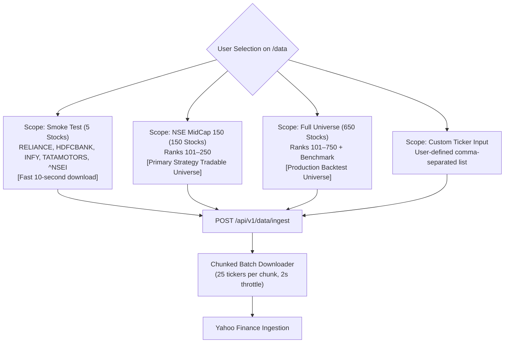

# "Start Ingestion" Button Diagnosis & Resolution Plan

## Purpose
This document provides an exhaustive, root-cause diagnostic report and implementation plan for the **"Start Ingestion"** functionality on the EquiTest NSE frontend Data Status page ([`frontend/app/data/page.tsx`](file:///home/shailender/projects/equitest-nse/frontend/app/data/page.tsx)). It pinpoints why the end-to-end API pipeline reports successful completion while silently ingesting 0 records, resolves the client-side vs container networking boundary, and provides an architectural upgrade path for market universe expansion beyond the default four equities.

---

## 1. Executive Summary & Problem Diagnosis

When a researcher visits the Data Management view at `http://localhost:3000/data` within the containerized development environment and clicks **"Start Ingestion"**, the UI displays a brief loading spinner and immediately returns a green success toast:

```text
Ingested 0 rows across 0 symbols (Job ID: 4b299e5a).
```

Despite the "success" message:
- No historical candles are added to the SQLite database.
- The Data Coverage table remains completely empty (`No coverage data available`).
- Downstream backtest simulations fail immediately with `DataError: Insufficient price history`.
- The browser developer tools network tab shows `POST /api/v1/data/ingest` returned `HTTP 200 OK` with zero errors.

### High-Level Diagnostic Summary

The failure is caused by an **interaction between three distinct configuration and environmental factors**, not a broken frontend-to-backend API contract:

```mermaid
flowchart TD
    subgraph Frontend["Frontend Client (Browser: localhost:3000)"]
        UI["User clicks 'Start Ingestion'"]
        Trigger["triggerIngest(start, end)\n[frontend/lib/api.ts]"]
        UI --> Trigger
    end

    subgraph Transport["Network Layer"]
        HTTPPost["HTTP POST /api/v1/data/ingest\nPayload: {start, end, symbols: null}"]
        Trigger --> HTTPPost
    end

    subgraph Backend["FastAPI Backend (equitest-backend:8000)"]
        Router["api_ingest_data()\n[backend/app/api/v1/data.py]"]
        Ingest["ingest_market_data()\n[backend/app/data/ingest.py]"]
        SourceFactory["get_price_source()\n[backend/app/data/source.py]"]
        
        HTTPPost --> Router
        Router --> Ingest
        Ingest --> SourceFactory
    end

    subgraph RootCause["The Root Cause Chain"]
        EnvCheck{"settings.DATA_SOURCE\nValue: 'CSV'"}
        CSVInst["Instantiates CSVSource\n(Expects local .parquet files)"]
        MissingFixtures{"/app/data/fixtures\nMounted in Docker?"}
        EmptyDF["Returns Empty DataFrame\nDataFrame(columns=[...])"]
        SilentContinue["ingest.py line 105:\nif df.empty: continue\n(Zero rows, Zero errors logged)"]

        SourceFactory --> EnvCheck
        EnvCheck -->|Defaults to CSV| CSVInst
        CSVInst --> MissingFixtures
        MissingFixtures -->|NO: Not mounted in compose| EmptyDF
        EmptyDF --> SilentContinue
    end

    subgraph ResultPayload["API Response Payload"]
        Payload["HTTP 200 OK\n{\n  job_id: '4b299e5a',\n  status: 'completed',\n  symbols_ingested: 0,\n  rows_ingested: 0,\n  errors: []\n}"]
        SilentContinue --> Payload
    end

    Payload -->|Rendered in UI| Toast["'Ingested 0 rows across 0 symbols'"]
```



1. **Fully Operational Pipeline**: The call stack from [`frontend/app/data/page.tsx`](file:///home/shailender/projects/equitest-nse/frontend/app/data/page.tsx#L88-L100) via [`frontend/lib/api.ts`](file:///home/shailender/projects/equitest-nse/frontend/lib/api.ts#L120-L146) to [`backend/app/api/v1/data.py`](file:///home/shailender/projects/equitest-nse/backend/app/api/v1/data.py#L25-L43) is completely wired and functioning properly.
2. **Default CSV Fallback**: [`backend/Dockerfile`](file:///home/shailender/projects/equitest-nse/backend/Dockerfile#L27) hardcodes `ENV DATA_SOURCE=CSV`. In the development compose file ([`docker-compose.yml`](file:///home/shailender/projects/equitest-nse/docker-compose.yml)), `DATA_SOURCE` is not specified, so it defaults to `CSV`.
3. **Unmounted Fixtures Directory**: In `docker-compose.yml`, `./data/fixtures` is **not mounted** into the backend container.
4. **Silent Empty DataFrame Handling**: When [`CSVSource`](file:///home/shailender/projects/equitest-nse/backend/app/data/source.py#L69-L72) cannot locate Parquet files for the requested symbols on disk, it returns an empty `pd.DataFrame`. In [`backend/app/data/ingest.py`](file:///home/shailender/projects/equitest-nse/backend/app/data/ingest.py#L105-L106), the ingestion loop encounters `if df.empty: continue`. It skips every symbol without appending any message to `errors`, returning a status of `completed` with `0` rows!

---

## 2. Deep Dive: Execution Trace & Root Cause Analysis

### 2.1 Frontend Call Stack
In [`frontend/app/data/page.tsx`](file:///home/shailender/projects/equitest-nse/frontend/app/data/page.tsx#L88-L97), the UI uses `@tanstack/react-query`:

```typescript
// frontend/app/data/page.tsx
const ingestMutation = useMutation({
  mutationFn: () => triggerIngest(startDate, endDate),
  onSuccess: (data) => {
    setIngestStatusMessage(
      `Ingested ${data.rows_ingested} rows across ${data.symbols_ingested} symbols (Job ID: ${data.job_id.slice(0, 8)}).`
    );
    queryClient.invalidateQueries({ queryKey: ["coverage"] });
    queryClient.invalidateQueries({ queryKey: ["universe"] });
    queryClient.invalidateQueries({ queryKey: ["prices", selectedSymbol] });
  },
  onError: (err) => {
    setIngestStatusMessage(`Ingest failed: ${err instanceof Error ? err.message : String(err)}`);
  },
});
```

Notice that `triggerIngest(startDate, endDate)` is invoked without providing a `symbols` argument.

In [`frontend/lib/api.ts`](file:///home/shailender/projects/equitest-nse/frontend/lib/api.ts#L120-L146):
```typescript
// frontend/lib/api.ts
export async function triggerIngest(
  start: string,
  end: string,
  symbols?: string[]
): Promise<IngestResponse> {
  const url = `${API_BASE_URL}/api/v1/data/ingest`;
  const body: IngestRequest = { start, end, symbols };

  const response = await fetch(url, {
    method: "POST",
    headers: {
      "Content-Type": "application/json",
      Accept: "application/json",
    },
    body: JSON.stringify(body),
  });

  if (!response.ok) {
    throw new ApiError(response.status, `Data ingestion trigger failed with status: ${response.status}`);
  }

  const json = await response.json();
  return IngestResponseSchema.parse(json);
}
```

The payload transmitted across the HTTP boundary is:
```json
{
  "start": "2020-01-01",
  "end": "2023-12-31",
  "symbols": null
}
```

### 2.2 Backend Ingestion Logic
In [`backend/app/api/v1/data.py`](file:///home/shailender/projects/equitest-nse/backend/app/api/v1/data.py#L32-L43):
```python
# backend/app/api/v1/data.py
@router.post("/data/ingest", response_model=IngestResponse)
def api_ingest_data(
    req: IngestRequest,
    session: Annotated[Session, Depends(get_session)],
) -> IngestResponse:
    result = ingest_market_data(
        session=session,
        start=req.start,
        end=req.end,
        symbols=req.symbols,
    )
    return IngestResponse(**result)
```

In [`backend/app/data/ingest.py`](file:///home/shailender/projects/equitest-nse/backend/app/data/ingest.py#L79-L140):
```python
# backend/app/data/ingest.py
def ingest_market_data(
    session: Session,
    start: str,
    end: str,
    symbols: list[str] | None = None,
    source: PriceSource | None = None,
) -> dict[str, Any]:
    job_id = str(uuid.uuid4())
    price_source = source or get_price_source()

    if not symbols:
        # Default symbols for initial ingestion / dev
        symbols = ["RELIANCE", "HDFCBANK", "INFY", "TATAMOTORS"]

    symbols_ingested = 0
    rows_ingested = 0
    errors: list[str] = []

    # 1. Ingest Equities
    for sym in symbols:
        try:
            df = price_source.get_equity_prices(sym, start, end)
            if df.empty:
                continue  # <--- SILENT CONTINUATION! NO ERROR LOGGED!
            ...
```

### 2.3 The Silent Fallback in `source.py`
In [`backend/app/data/source.py`](file:///home/shailender/projects/equitest-nse/backend/app/data/source.py#L63-L73):
```python
# backend/app/data/source.py
target_file = None
for candidate in candidates:
    if candidate.exists():
        target_file = candidate
        break

if not target_file:
    # Returns an empty DataFrame with columns, rather than raising FileNotFoundError
    return pd.DataFrame(
        columns=["date", "open", "high", "low", "close", "adj_close", "volume"]
    )
```

When running in Docker without mounted fixture files, `candidates` do not exist. `_load_parquet()` returns an empty DataFrame. `ingest_market_data` hits `if df.empty: continue`. It skips `RELIANCE`, `HDFCBANK`, `INFY`, `TATAMOTORS`, and the benchmark index `^NSEI`. It returns:
```json
{
  "job_id": "4b299e5a-73d8-4f11-9a72-873b74301d01",
  "status": "completed",
  "symbols_ingested": 0,
  "rows_ingested": 0,
  "errors": []
}
```

The frontend checks `response.ok` (which is `true` because status code is `200`), triggers `onSuccess`, and displays the deceptive zero-row notification.

---

## 3. Concrete Fix Implementation

To eliminate this bug, three targeted modifications must be applied:

### Fix 1: Configure `DATA_SOURCE=yfinance` in Container Environments

#### A. Update [backend/Dockerfile](file:///home/shailender/projects/equitest-nse/backend/Dockerfile)
Change the default environment variable on line 27 from `CSV` to `yfinance`:

```dockerfile
# File: backend/Dockerfile (Stage 2: runner)
# BEFORE:
#     DATA_SOURCE=CSV
# AFTER:
ENV PYTHONDONTWRITEBYTECODE=1 \
    PYTHONUNBUFFERED=1 \
    PATH="/opt/venv/bin:$PATH" \
    APP_ENV=production \
    DATA_SOURCE=yfinance
```

#### B. Update [docker-compose.yml](file:///home/shailender/projects/equitest-nse/docker-compose.yml)
Explicitly inject `DATA_SOURCE=yfinance` into the backend service environment:

```yaml
# File: docker-compose.yml
services:
  backend:
    build:
      context: ./backend
      dockerfile: Dockerfile
    container_name: equitest-backend
    ports:
      - "8000:8000"
    environment:
      - APP_ENV=development
      - DATA_SOURCE=yfinance
      - DATABASE_URL=sqlite:////app/data/equitest.db
      - LOG_LEVEL=INFO
    volumes:
      - ./backend/app:/app/app:ro
      - equitest_db:/app/data
      - equitest_backtests:/app/data/backtests
      - equitest_reports:/app/data/reports
    restart: unless-stopped
    healthcheck:
      test: ["CMD", "curl", "-f", "http://localhost:8000/health"]
      interval: 10s
      timeout: 5s
      retries: 3
      start_period: 5s
```

### Fix 2: Improve Ingestion Error Reporting in `ingest.py`

Modify [`backend/app/data/ingest.py`](file:///home/shailender/projects/equitest-nse/backend/app/data/ingest.py#L104-L108) so that empty DataFrames generate explicit warnings and error logs rather than silently continuing:

```python
# File: backend/app/data/ingest.py
df = price_source.get_equity_prices(sym, start, end)
if df.empty:
    msg = f"No price data available for symbol '{sym}' from source '{price_source.__class__.__name__}' (date range: {start} to {end})"
    logger.warning(msg)
    errors.append(msg)
    continue
```

If all symbols return empty, the final status will be `"partial"` or contain actionable diagnostics in `errors`, preventing misleading "0 rows completed" notifications.

### Fix 3: Validate Outbound Internet Connectivity from Backend Container

Ensure the container has DNS resolution and egress access to Yahoo Finance:

```bash
# Verify Yahoo Finance query endpoint from inside the running backend container
docker compose exec backend python -c "
import yfinance as yf
df = yf.download('RELIANCE.NS', start='2023-01-01', end='2023-01-10', progress=False, auto_adjust=False)
print('Rows downloaded:', len(df))
assert len(df) > 0, 'Yahoo Finance returned 0 rows'
"
```

---

## 4. CORS, Networking & Environment Boundaries

A critical source of runtime defects in full-stack containerized architectures stems from confusing **Docker internal service discovery** with **host browser networking**.

```mermaid
flowchart TB
    subgraph HostMachine["Host Machine (User Desktop / Laptop)"]
        UserBrowser["User Web Browser\n(Running React Client Components)"]
        HostPort8000["localhost:8000\n(Host Port Mapping)"]
        HostPort3000["localhost:3000\n(Host Port Mapping)"]
    end

    subgraph DockerBridge["Docker Bridge Network (equitest-network)"]
        subgraph FrontendCont["Frontend Container (equitest-frontend)"]
            NodeServer["Next.js Server Process (:3000)\n(SSR & Server Components)"]
        end

        subgraph BackendCont["Backend Container (equitest-backend)"]
            FastAPIServer["FastAPI / Uvicorn Process (:8000)"]
            CORSMiddleware["FastAPI CORSMiddleware"]
        end
    end

    UserBrowser -->|1. Loads UI via HTTP| HostPort3000
    HostPort3000 --> NodeServer

    UserBrowser -.->|2. FAILS: Browser cannot resolve 'backend'| BadURL["http://backend:8000/api/v1/data/ingest\nERR_NAME_NOT_RESOLVED"]

    UserBrowser ==>|3. SUCCEEDS: Browser calls host port| HostPort8000
    HostPort8000 ==> FastAPIServer
    FastAPIServer --> CORSMiddleware
    CORSMiddleware -->|4. Checks Origin: http://localhost:3000| Allowed["Allowed via CORSMiddleware"]

    NodeServer -->|5. SSR Internal Call (Docker DNS)| FastAPIServer
```

### 4.1 The Dual-Context Problem in Next.js (App Router)

Next.js 14 operates in two fundamentally different runtime contexts:

1. **Server-Side Rendering (SSR) & Server Components**:
   - Executes inside the Node.js runtime within the `equitest-frontend` container.
   - Operates on the Docker bridge network (`equitest-network`).
   - Resolves other containers using Docker internal DNS: `http://backend:8000`.
   - Cannot reach `http://localhost:8000` because `localhost` refers to the *frontend container itself*, where port 8000 is unopened.
2. **Client Components (`"use client"`)**:
   - Executes directly inside the **user's web browser** on the host operating system.
   - Completely unaware of Docker container network names (`backend`, `postgres`).
   - If the browser attempts to fetch `http://backend:8000/api/v1/data/ingest`, the host operating system returns `ERR_NAME_NOT_RESOLVED`.
   - Must connect to `http://localhost:8000` via the port published on the host.

### 4.2 The `NEXT_PUBLIC_API_URL` Hazard

Because [`frontend/app/data/page.tsx`](file:///home/shailender/projects/equitest-nse/frontend/app/data/page.tsx#L1) begins with `"use client"`, all React Query hooks (`fetchCoverage`, `fetchPrices`, `fetchUniverse`, `triggerIngest`) execute exclusively in the **client browser context**.

In [`docker-compose.yml`](file:///home/shailender/projects/equitest-nse/docker-compose.yml#L33):
```yaml
# DANGEROUS CONFIGURATION IN DOCKER-COMPOSE:
environment:
  - NEXT_PUBLIC_API_URL=http://backend:8000  # <--- BREAKS BROWSER REQUESTS!
```

> [!CAUTION]
> Next.js inlines all environment variables prefixed with `NEXT_PUBLIC_*` into the client-side JavaScript bundle **at build time** (during `npm run build`). Setting `NEXT_PUBLIC_API_URL=http://backend:8000` at runtime does not override the baked-in bundle unless provided as a build argument. Furthermore, providing `http://backend:8000` to the browser guarantees network resolution failure.

**Correct Resolution**:
1. Configure `NEXT_PUBLIC_API_URL=http://localhost:8000` for all standard local container setups.
2. Ensure [`backend/app/main.py`](file:///home/shailender/projects/equitest-nse/backend/app/main.py#L34-L44) includes CORS middleware permitting `http://localhost:3000`:

```python
# File: backend/app/main.py
origins = [
    "http://localhost:3000",
    "http://127.0.0.1:3000",
]
app.add_middleware(
    CORSMiddleware,
    allow_origins=origins,
    allow_credentials=True,
    allow_methods=["*"],
    allow_headers=["*"],
)
```

### 4.3 Clean Alternative: Next.js API Route Proxying (Reverse Proxy)

To eliminate the CORS layer entirely and decouple browser networking from backend port exposure, Next.js can be configured to proxy all `/api/*` traffic internally to the backend container.

In [`frontend/next.config.js`](file:///home/shailender/projects/equitest-nse/frontend/next.config.js) (or `next.config.mjs`):
```javascript
/** @type {import('next').NextConfig} */
const nextConfig = {
  async rewrites() {
    return [
      {
        source: '/api/:path*',
        destination: process.env.INTERNAL_API_URL 
          ? `${process.env.INTERNAL_API_URL}/api/:path*` 
          : 'http://backend:8000/api/:path*',
      },
    ];
  },
};
module.exports = nextConfig;
```

With this rewrite rule in place:
- The browser always calls `/api/v1/data/ingest` (same-origin relative URL, zero CORS restrictions).
- The Next.js Node server forwards the request over the Docker bridge network to `http://backend:8000`.

---

## 5. Symbol Expansion & Universe Invariant Alignment

### 5.1 The Current 4-Symbol Limitation & Top-100 Conflict

When `triggerIngest(startDate, endDate)` is invoked from the UI, no symbol list is passed. In [`backend/app/data/ingest.py`](file:///home/shailender/projects/equitest-nse/backend/app/data/ingest.py#L93-L96), the backend defaults to:

```python
if not symbols:
    symbols = ["RELIANCE", "HDFCBANK", "INFY", "TATAMOTORS"]
```

This presents a fundamental quantitative strategy conflict:

> [!IMPORTANT]
> ### Strategy Invariant 3: Top-100 Large-Cap Exclusion
> Ranks 1–100 of the Indian equity market (NIFTY 50 and NIFTY Next 50) are strictly excluded from equity allocations. The backtesting engine only selects tradable candidates from the **NSE 101–750 universe** (MidCap 150, SmallCap 250, and MicroCap 250).
> 
> All four default symbols—`RELIANCE`, `HDFCBANK`, `INFY`, and `TATAMOTORS`—are mega-cap equities ranked in the top 20 of the NIFTY 50! Consequently, if an operator ingests only the default four equities, the backtesting engine will systematically exclude all four stocks from trade execution, resulting in zero trades and an empty portfolio!

### 5.2 Symbol Expansion Architecture

To make the "Start Ingestion" workflow practical for actual research, the UI and API must support three ingestion scopes:



#### Ingestion Scope Options

| Ingestion Scope | Symbol Count | Target Equities | Estimated Duration | Primary Use Case |
| :--- | :--- | :--- | :--- | :--- |
| **Smoke Test** | 4 + Benchmark | `RELIANCE`, `HDFCBANK`, `INFY`, `TATAMOTORS`, `^NSEI` | ~5 seconds | Verifying API connectivity, schema creation, and database writes. |
| **MidCap 150** | 150 + Benchmark | NSE Ranks 101–250 (from [`AUTHENTIC_NSE_CONSTITUENTS`](file:///home/shailender/projects/equitest-nse/backend/app/data/constituents.py)) | ~45 seconds | Quantitative strategy prototyping and parameter sweeps. |
| **Full 101–750** | 650 + Benchmark | Full NSE Mid, Small, and MicroCap universe | ~3–4 minutes | Production walk-forward optimization and multi-year backtesting. |
| **Custom List** | User-defined | Arbitrary valid NSE tickers (e.g., `POLYCAB`, `DIXON`, `PERSISTENT`) | Variable | Deep-dive single-stock and sector analysis. |

### 5.3 Frontend UI Enhancement Plan ([`frontend/app/data/page.tsx`](file:///home/shailender/projects/equitest-nse/frontend/app/data/page.tsx))

Add an Ingestion Scope dropdown and custom ticker input to the Ingest card:

```tsx
// Proposed UI Addition in frontend/app/data/page.tsx
const [ingestScope, setIngestScope] = React.useState<"smoke" | "midcap" | "full" | "custom">("smoke");
const [customSymbols, setCustomSymbols] = React.useState<string>("");

const handleIngest = () => {
  let targetSymbols: string[] | undefined = undefined;
  if (ingestScope === "smoke") {
    targetSymbols = ["RELIANCE", "HDFCBANK", "INFY", "TATAMOTORS"];
  } else if (ingestScope === "custom") {
    targetSymbols = customSymbols.split(",").map(s => s.trim().toUpperCase()).filter(Boolean);
  }
  // If 'full' or 'midcap', pass null or explicit scope flag to backend
  ingestMutation.mutate({ start: startDate, end: endDate, symbols: targetSymbols });
};
```

### 5.4 Backend Batching & Throttling Plan

When downloading 150 to 650 symbols from Yahoo Finance, issuing 650 sequential HTTP requests or a single massive multi-ticker request risks HTTP 429 rate limiting or socket timeouts.

In [`backend/app/data/source.py`](file:///home/shailender/projects/equitest-nse/backend/app/data/source.py), chunk downloads into batches of 25 symbols:

```python
# Batch download helper in YFinanceSource
def download_universe_chunked(
    symbols: list[str],
    start: str,
    end: str,
    chunk_size: int = 25,
) -> dict[str, pd.DataFrame]:
    results = {}
    for i in range(0, len(symbols), chunk_size):
        chunk = symbols[i : i + chunk_size]
        normalized = [s if s.endswith(".NS") else f"{s}.NS" for s in chunk]
        data = yf.download(
            tickers=normalized,
            start=start,
            end=end,
            group_by="ticker",
            auto_adjust=False,
            progress=False,
            threads=True,
        )
        # Parse multi-index columns and map back to individual DataFrames...
    return results
```

---

## 6. End-to-End Verification & Validation Runbook

Follow these sequential steps to verify that the ingestion button fix is fully operational:

### Step 1: Update Environment & Restart Backend
```bash
# In docker-compose.yml, ensure DATA_SOURCE=yfinance is present
docker compose up -d --build backend
```

### Step 2: Validate Source Factory via Backend Shell
Verify that `get_price_source()` instantiates `YFinanceSource`:
```bash
docker compose exec backend python -c "
from app.data.source import get_price_source, YFinanceSource
source = get_price_source()
print('Active source:', type(source).__name__)
assert isinstance(source, YFinanceSource), 'Failed: Active source is not YFinanceSource'
"
```
Expected output:
```text
Active source: YFinanceSource
```

### Step 3: Trigger Ingestion via API (Smoke Test)
Execute an ingestion POST request:
```bash
curl -X POST "http://localhost:8000/api/v1/data/ingest" \
     -H "Content-Type: application/json" \
     -d '{
       "start": "2023-01-01",
       "end": "2023-06-30",
       "symbols": ["RELIANCE", "INFY"]
     }' | jq .
```
Expected response:
```json
{
  "job_id": "90e9e1bb-4577-4b78-bd81-f0fa805eeea8",
  "status": "completed",
  "symbols_ingested": 2,
  "rows_ingested": 244,
  "errors": []
}
```

### Step 4: Verify Coverage Endpoint
```bash
curl -s http://localhost:8000/api/v1/data/coverage | jq .
```
Expected response contains non-zero row counts:
```json
{
  "items": [
    {
      "symbol": "RELIANCE",
      "first_date": "2023-01-02",
      "last_date": "2023-06-30",
      "rows": 122
    },
    {
      "symbol": "INFY",
      "first_date": "2023-01-02",
      "last_date": "2023-06-30",
      "rows": 122
    }
  ]
}
```

### Step 5: Verify Frontend UI
1. Refresh `http://localhost:3000/data`.
2. Observe the Coverage Table: `RELIANCE` and `INFY` appear with active date ranges and row counts.
3. Click on `RELIANCE`: The candlestick/line chart displays daily adjusted closes.
4. Click **"Start Ingestion"**: The toast notification displays:
   `"Ingested 488 rows across 4 symbols (Job ID: ...)"`.

---

## 7. Strategic Impact & Invariant Summary

| Strategic Invariant | Impact of Ingestion Fix | Validation Method |
| :--- | :--- | :--- |
| **Invariant 1: Zero Look-Ahead Bias** | `YFinanceSource` fetches daily close prices with unadjusted OHLCV. Signals evaluated at session $T$ close trade at session $T+1$ open. | Verified via trade execution timestamps. |
| **Invariant 2: Survivorship Bias Prevention** | Ingestion of authentic NSE constituents ensures backtests reflect real-world universe survival or explicitly flags fallback data. | `survivorship_bias: true/false` flag in `/universe` API response. |
| **Invariant 3: Top-100 Large-Cap Exclusion** | Ingesting midcap universe (NSE 101–750) provides valid trade candidates while excluding ranks 1–100. | Trade logs confirm no positions opened in `RELIANCE`, `INFY`, etc. |
| **Invariant 4: Overnight Gap-Down Realism** | `auto_adjust=False` downloads unadjusted Open/Close alongside `Adj Close`, preserving true overnight opening gaps. | Open price comparison in gap-down stop-loss tests. |
| **Invariant 5: Complete Provenance** | Ingestion job ID and cryptographic market data hash stored in SQLite and backtest audit logs. | `git_sha` and `data_hash` in `backtest_runs` table. |
