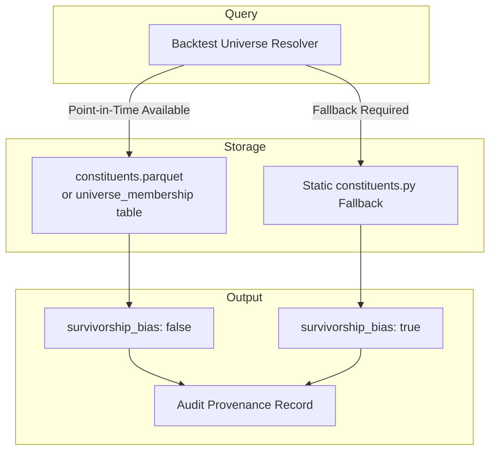
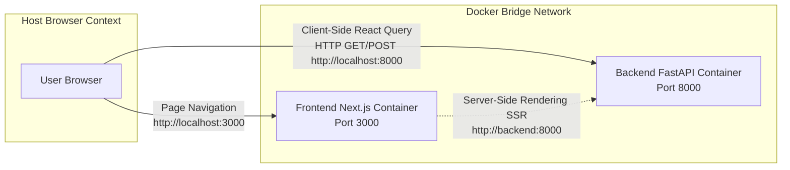
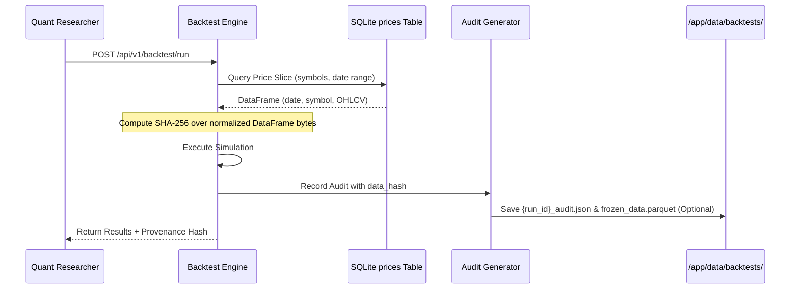

# Architectural Risks & Unresolved Decisions

## Purpose
This document provides an exhaustive technical analysis of unresolved architectural questions, operational trade-offs, and critical systemic risks identified during the containerization and portability initiative of **EquiTest NSE**. Each risk is accompanied by its underlying root cause, potential impact on quantitative research integrity, and recommended engineering solutions.

---

## 1. Yahoo Finance ToS, Unofficial API Limits, IP Blocking Risk, and Lack of SLA

### 1.1 Context & Problem Analysis
The platform relies on [`YFinanceSource`](file:///home/shailender/projects/equitest-nse/backend/app/data/source.py#L164) as its primary remote market data engine to satisfy zero-host-data portability. The underlying library (`yfinance`) interacts with Yahoo Finance’s private, reverse-engineered REST endpoints (`query1.finance.yahoo.com` and `query2.finance.yahoo.com`).

### 1.2 Identified Risks
1. **Lack of SLA and Breaking API Changes**: Yahoo Finance does not offer a Service Level Agreement (SLA). The endpoints frequently alter session cookie requirements, crumb token handshakes, user-agent validation, and JSON response structures without notice.
2. **Aggressive Rate Limiting & IP Bans (HTTP 429)**: The full quantitative universe spans 650 symbols (NSE 101–750). Requesting 10–15 years of daily OHLCV bars across 650 symbols in rapid succession triggers IP-level rate limits (HTTP 429 Too Many Requests) or temporary multi-hour IP blacklisting.
3. **Terms of Service (ToS) Compliance**: Yahoo Finance terms stipulate personal, non-commercial use. Systematic scraping for algorithmic trading backtests occupies a legal grey zone and is vulnerable to sudden access revocation.

### 1.3 Recommended Mitigation Roadmap
- **Client-Side Throttling**: Wrap requests with a token-bucket rate limiter enforcing a strict ceiling (e.g., maximum 2–3 requests per second per IP).
- **Exponential Backoff with Jitter**: Decorate HTTP downloads with retry logic (e.g., via `tenacity`) using randomized exponential backoff ($2^n + \text{jitter}$).
- **Disk-Level Parquet Cache**: Once a symbol's historical bars are downloaded, store them as immutable local parquet files or SQLite records; only fetch incremental delta bars on subsequent runs.
- **Provider Abstraction**: Maintain strict conformance with the [`PriceSource`](file:///home/shailender/projects/equitest-nse/backend/app/data/source.py#L18) protocol to enable seamless failover to commercial broker APIs (see [Section 7](#7-nse-india-official-data-alternatives)).

---

## 2. Universe Constituents: Static Lists vs Dynamic Point-in-Time Corporate Changes

### 2.1 Context & Problem Analysis
[`backend/app/data/constituents.py`](file:///home/shailender/projects/equitest-nse/backend/app/data/constituents.py) defines universe membership using static Python lists:
- `TOP_100_CONSTITUENTS`: 100 large-cap stocks excluded from trade allocations.
- `AUTHENTIC_NSE_CONSTITUENTS`: ~650 mid/small-cap symbols representing the tradeable universe.

### 2.2 Quantitative Impact: Survivorship & Look-Ahead Bias
Using a static constituent list compiled in 2024–2026 to backtest historical periods (e.g., 2015–2020) introduces severe quantitative distortions:
1. **Survivorship Bias**: Companies that failed, went bankrupt, or were delisted during 2015–2023 (e.g., DHFL, Jet Airways, Reliance Communications, Sintex) are omitted from the backtest, falsely inflating strategy performance.
2. **Look-Ahead Bias**: Companies that were newly listed in 2021–2023 (e.g., Zomato, Paytm, Nykaa, Delhivery, PolicyBazaar) are present in `AUTHENTIC_NSE_CONSTITUENTS` and might be queried for dates prior to their actual IPO.
3. **Dynamic Top-100 Boundary Drift**: A company ranked #120 in 2018 may have risen to #45 by 2023 (e.g., Adani Green, Trent). A static exclusion list will exclude it retroactively from 2018 when it was legitimately in the tradeable 101–750 band.

### 2.3 Proposed Architecture: Point-in-Time Membership


- **Enforce Invariant Tagging**: All API responses (`UniverseResponse`, `ScreenResponse`, and `BacktestRun`) must return `survivorship_bias: bool`.
- **Point-in-Time Parquet**: Maintain `data/fixtures/constituents.parquet` tracking effective dates: `(date, symbol, rank)`.
- **Universe Ingestion**: Ingest quarterly semi-annual index rebalancing lists published by NSE Indices.

---

## 3. Path Resolution Bug (4x Parent Traversal) in Containers

### 3.1 Root Cause Breakdown
Throughout the backend codebase, file paths are resolved relative to `__file__`:

```python
# Found in source.py, universe.py, ingest.py, metrics.py, audit.py:
repo_root = Path(__file__).resolve().parent.parent.parent.parent
# Alternatively:
repo_root = Path(__file__).resolve().parents[3]
```

#### Hierarchy Comparison

| Environment | File Location | `.parents[3]` (4x Parent) Resolution | Result |
|:---|:---|:---|:---|
| **Host System** | `/home/user/project/backend/app/data/source.py` | `/home/user/project` | **Correct**: Resolves to repo root |
| **Docker Container** | `/app/app/data/source.py` | `/` (Linux root directory) | **Broken**: Resolves to container root `/` |

When the container executes `base / "data" / "fixtures"`, it attempts to read `/data/fixtures`. Because `/data` does not exist or belongs to `root`, this causes immediate `FileNotFoundError` or `PermissionError` (since the container runs as unprivileged `appuser:1001`).

### 3.2 Solution Architecture
Standardize path resolution across the backend using an environment-aware helper:

```python
import os
from pathlib import Path

def get_repo_root() -> Path:
    """Returns application root directory with container-aware fallbacks."""
    if "REPO_ROOT" in os.environ:
        return Path(os.environ["REPO_ROOT"]).resolve()
    # Check if running inside container structure (/app/app)
    current = Path(__file__).resolve()
    for parent in current.parents:
        if (parent / "pyproject.toml").exists() or (parent / "docker-compose.yml").exists():
            return parent
    return current.parent.parent.parent.parent
```

In `Dockerfile` and `docker-compose.prod.yml`, explicitly export:
```dockerfile
ENV REPO_ROOT=/app
ENV FIXTURES_DIR=/app/data/fixtures
```

---

## 4. Dual SQLite Database Confusion (`root dev.db` vs `backend/dev.db`)

### 4.1 Problem Analysis
Inspection of the repository reveals two separate, massive SQLite database files:
- `./dev.db` (~396 MB)
- `./backend/dev.db` (~389 MB)

This duplication occurred because local development scripts were executed from different working directories:
- Running `./bin/make run-local` or running from root resolves `DATABASE_URL=sqlite:///./dev.db` to `./dev.db`.
- Running `cd backend && uvicorn app.main:app` resolves `sqlite:///./dev.db` to `./backend/dev.db`.

### 4.2 Impact on Containerization
1. **Docker Build Context Bloat**: If `.dockerignore` is omitted, `COPY . .` transfers ~800 MB of duplicate SQLite binary data into the Docker daemon on every build.
2. **Data Divergence**: Data ingested in one environment is invisible to another, leading to false reports of "missing data" or inconsistent backtest results.
3. **Volume Mount Ambiguity**: A compose definition mounting `equitest_data:/app/data` will fail to persist data if `DATABASE_URL` is set to `sqlite:///./dev.db` (which writes to `/app/dev.db` instead of `/app/data/dev.db`).

### 4.3 Resolution
1. **Explicit Volume Directory Path**: Standardize `DATABASE_URL=sqlite:////app/data/equitest.db`.
2. **Aggressive `.dockerignore`**: Exclude `*.db`, `*.db-shm`, and `*.db-wal` from all Docker contexts.
3. **Local Tooling Alignment**: Update all local wrapper scripts (`bin/make`, `run-local`) to enforce a single canonical location: `data/dev.db`.

---

## 5. CORS in Production Deployment

### 5.1 Problem Analysis
In [`backend/app/main.py`](file:///home/shailender/projects/equitest-nse/backend/app/main.py#L34-L44), CORS origins are hardcoded:

```python
origins = [
    "http://localhost:3000",
    "http://127.0.0.1:3000",
]
```

### 5.2 Network Boundary Challenges
In containerized environments, networking splits into two distinct communication channels:



1. **Host-to-Container (Browser)**: Client-side JavaScript in React runs inside the user's host browser. It calls `http://localhost:8000` (or host LAN IP / domain name). If deployed on an intranet server (e.g., `http://192.168.1.50:3000`), the browser sends an `Origin: http://192.168.1.50:3000` header, which FastAPI immediately blocks!
2. **Container-to-Container (SSR)**: When Next.js executes server-side rendering, it communicates via Docker internal DNS (`http://backend:8000`), which bypasses browser CORS entirely.

### 5.3 Resolution
- **Config-Driven Origins**: Modify `main.py` to parse `CORS_ORIGINS` from environment variables:
  ```python
  allowed_origins = [o.strip() for o in settings.CORS_ORIGINS.split(",") if o.strip()]
  ```
- **Production Reverse Proxy Architecture**: In production deployments, route traffic through a reverse proxy (e.g., Nginx, Caddy, or Traefik) exposing both frontend (`/`) and backend (`/api/`) on a single port and domain, eliminating cross-origin browser requests altogether.

---

## 6. Parameter Sweep Retention: Individual Runs vs Sweep Batches

### 6.1 Problem Analysis
EquiTest NSE supports parameter optimization sweeps (e.g., evaluating 5 moving average windows across 5 holding period configurations = 25 backtests).

Under the current proposed cleanup policy:
$$\text{Retention Ceiling} = \text{MAX\_BACKTEST\_RUNS} \quad (\text{default: } 5)$$

If the retention cleaner evaluates each backtest run independently, running a 25-iteration sweep will trigger the pruning logic 20 times, leaving only the final 5 runs of the sweep!

### 6.2 Negative Effects
- The frontend parameter heatmap and 3D surface visualizations require all 25 data points to render optimization landscapes. Retaining only 5 runs breaks the heatmap and invalidates parameter comparison.
- Historical standalone single-strategy runs from earlier sessions are instantly wiped out.

### 6.3 Proposed Hierarchical Retention Model
Instead of a flat run counter, implement a two-tier retention policy:

| Retention Model | Tracking Unit | Default Limit | Behavior |
|:---|:---|:---|:---|
| **Standalone Runs** | `sweep_id IS NULL` | 5 runs | Retains the last 5 individual backtest runs. |
| **Optimization Sweeps** | `sweep_id IS NOT NULL` | 2 sweeps | Retains all constituent child runs belonging to the last 2 complete sweeps. |

Add `sweep_id: Optional[str] = None` and `is_pinned: bool = False` to the `BacktestRun` database schema. Pinned runs and active sweep members are shielded from automated pruning.

---

## 7. NSE India Official Data Alternatives

While Yahoo Finance fulfills the requirement for zero-configuration testing, a professional production quantitative backtesting engine requires reliable, authoritative exchange data.

### 7.1 Alternative Data Source Comparison

| Provider | Data Authenticity | Corporate Actions Handling | Cost / Month | Rate Limits & SLA | Implementation Complexity |
|:---|:---|:---|:---|:---|:---|
| **Yahoo Finance (`yfinance`)** | Unofficial / Scraped | Auto adjusted via split factors | Free | Unofficial; frequent HTTP 429; no SLA | Low (Already implemented) |
| **NSE Bhavcopy (Direct)** | Official Exchange Feed | Raw unadjusted prices; requires split parsing | Free | Scraping requires Akamai header bypassing | High (Parser + split engine needed) |
| **Zerodha Kite Connect** | Official NSE Broker Feed | Split/bonus adjusted historical candles | ₹4,000 / mo | 3 req/sec; 99.9% uptime SLA; stable REST API | Medium (Requires daily auth token) |
| **TrueData** | Authorized NSE Data Vendor | Tick, 1-min, and Daily adjusted data | ₹1,500–₹3,000 / mo | Institutional REST/WebSocket; high throughput | Medium |
| **Upstox API v2** | Official Broker Feed | Adjusted daily historical candles | Free / ₹1,000 | Good REST API; OAuth2 authentication | Medium |

### 7.2 Strategic Recommendation
Maintain a multi-tier data architecture:
1. **Tier 1 (Default / Portability)**: `DATA_SOURCE=yfinance` for instant zero-cost machine onboarding and automated acceptance tests.
2. **Tier 2 (Offline Fallback)**: `DATA_SOURCE=CSV` using bundled/cached Parquet fixtures for air-gapped demo execution.
3. **Tier 3 (Production Quant)**: `DATA_SOURCE=kite` or `DATA_SOURCE=bhavcopy` for production backtesting and audited paper trading.

---

## 8. Rate Limiting & Backoff in `YFinanceSource`

### 8.1 Technical Deficiencies in Existing Source
Reviewing [`YFinanceSource._fetch_from_yfinance`](file:///home/shailender/projects/equitest-nse/backend/app/data/source.py#L178):
- Direct invocation of `yf.download(ticker, start=start, end=end, progress=False, auto_adjust=False)`.
- No exception trapping for `urllib3.exceptions.MaxRetryError` or HTTP 429 status codes.
- Synchronous serial loop over symbols in `ingest_market_data` without sleep delays.

### 8.2 Proposed Rate Limiting Implementation
To make ingestion bulletproof against remote throttling, incorporate a rate-limited decorator and batch scheduler:

```python
import time
import random
import logging
from functools import wraps

logger = logging.getLogger(__name__)

class RateLimiter:
    """Token-bucket rate limiter for remote API calls."""
    def __init__(self, max_calls_per_second: float = 2.0):
        self.interval = 1.0 / max_calls_per_second
        self.last_called = 0.0

    def wait(self):
        elapsed = time.time() - self.last_called
        if elapsed < self.interval:
            sleep_time = self.interval - elapsed + random.uniform(0.05, 0.15)
            time.sleep(sleep_time)
        self.last_called = time.time()

def retry_with_backoff(max_retries: int = 4, base_delay: float = 1.5):
    """Decorator applying exponential backoff with jitter on HTTP failures."""
    def decorator(func):
        @wraps(func)
        def wrapper(*args, **kwargs):
            delay = base_delay
            for attempt in range(1, max_retries + 1):
                try:
                    return func(*args, **kwargs)
                except Exception as exc:
                    if attempt == max_retries:
                        logger.error(f"Failed after {max_retries} attempts: {exc}")
                        raise
                    jitter = random.uniform(0.5, 1.5)
                    sleep_duration = (delay * (2 ** (attempt - 1))) + jitter
                    logger.warning(f"Attempt {attempt} failed: {exc}. Retrying in {sleep_duration:.2f}s...")
                    time.sleep(sleep_duration)
        return wrapper
    return decorator
```

---

## 9. Data Hash Provenance for Remote Dynamic Data

### 9.1 The Provenance Dilemma
A foundational requirement of EquiTest NSE is **Backtest Auditability & Provenance**: every backtest must record a deterministic `data_hash` (SHA-256 fingerprint) in its audit payload (`{run_id}_audit.json`). If a researcher reruns a strategy with identical parameters against the same data hash, the quantitative metrics ($CAGR$, Sharpe, Drawdown) must match identically.

In the current implementation ([`backend/app/validation/audit.py`](file:///home/shailender/projects/equitest-nse/backend/app/validation/audit.py#L102-L158)):
- `compute_data_snapshot_hash` iterates exclusively over `.parquet` files located on the host filesystem under `repo_root / "data" / "fixtures"`.
- When operating in a container with `DATA_SOURCE=yfinance`, data is written directly to SQLite without creating local fixture files. Consequently, `compute_data_snapshot_hash` hashes `b"empty_fixtures"`, returning a dummy hash!
- Furthermore, Yahoo Finance data is **dynamically restated**: corporate action adjustments, dividend recalculations, or exchange revisions can alter historical OHLCV bars downloaded on different dates, subtly breaking reproducibility.

### 9.2 Robust Provenance Architecture



### 9.3 In-Memory Data Hashing Implementation
Replace file-based fixture hashing with direct hashing of the query price slice:

```python
import hashlib
import pandas as pd

def compute_price_slice_hash(df: pd.DataFrame) -> str:
    """Computes a deterministic SHA-256 hash across an active backtest price slice.
    
    Ensures backtests executed on SQLite or remote sources have mathematically
    verifiable data provenance regardless of local file existence.
    """
    if df.empty:
        return hashlib.sha256(b"empty_dataset").hexdigest()

    # Sort columns and rows deterministically
    norm_df = df[["date", "symbol", "open", "high", "low", "close", "adj_close", "volume"]].copy()
    norm_df.sort_values(by=["date", "symbol"], ascending=True, inplace=True)
    
    # Hash raw serialized bytes
    data_bytes = norm_df.to_csv(index=False, float_format="%.4f").encode("utf-8")
    return hashlib.sha256(data_bytes).hexdigest()
```

By computing the hash directly from the database query slice feeding the simulation, EquiTest NSE achieves true data provenance and reproducibility across any database backend or remote ingestion source.
