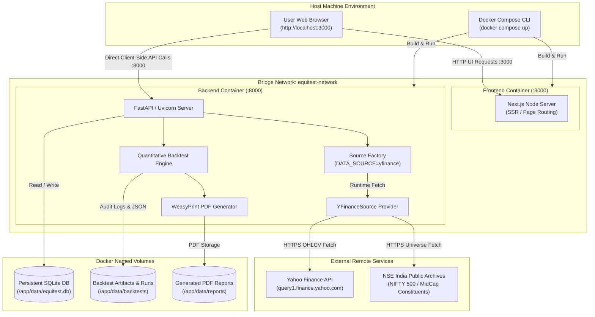

# EquiTest NSE — Containerization & Portability Guide

## Purpose
This document serves as the master index, executive summary, and architectural blueprint for the EquiTest NSE containerization and portability documentation suite. It outlines the strategy, technical findings, migration roadmap, and operational guidelines required to transform EquiTest NSE from a host-dependent development setup into a fully containerized, single-command deployable quantitative backtesting platform.

---

## Executive Summary

The EquiTest NSE containerization strategy transforms the platform from a host-coupled development environment—dependent on local Parquet fixtures, untracked SQLite files, and host-bound Python/Node.js runtimes—into a self-contained, single-command deployable quantitative research engine (`docker compose up --build`) operable on any pristine machine equipped with Docker Engine and internet access. By transitioning the runtime default from static CSV fixtures to the pre-existing [`YFinanceSource`](file:///home/shailender/projects/equitest-nse/backend/app/data/source.py#L164-L250) remote data provider, isolating state into dedicated Docker named volumes (`equitest_db`, `equitest_backtests`, `equitest_reports`), eliminating relative path traversal bugs, and fixing container-to-browser networking boundaries, the platform achieves complete environmental independence while strictly preserving all quantitative finance invariants: zero look-ahead bias, point-in-time survivorship bias tracking, strict exclusion of top-100 large caps from trade allocations, realistic overnight gap-down stop-loss fills, and cryptographic provenance fingerprinting for backtest reproducibility.

---

## Quick-Start Command Reference (Fresh Machine Workflow)

Any developer or quantitative researcher on a pristine machine (Linux, macOS, or Windows WSL2) equipped with Git and Docker Compose can initialize and verify the complete application stack with the following sequence:

```bash
# 1. Clone the repository and enter the project directory
git clone <repo-url>
cd equitest-nse

# 2. Build and launch all containerized services in detached mode
docker compose up --build -d

# 3. Monitor container health, initialization, and database migrations
docker compose ps
docker compose logs -f backend

# 4. Access the user interfaces and documentation
# Web UI:       http://localhost:3000
# API Docs:     http://localhost:8000/docs
# Healthcheck:  http://localhost:8000/health

# 5. Populate initial market data via the web UI or API
# In your browser, navigate to http://localhost:3000/data and click "Start Ingestion"
# Or run this curl command directly from your terminal:
curl -X POST "http://localhost:8000/api/v1/data/ingest" \
     -H "Content-Type: application/json" \
     -d '{
       "start": "2020-01-01",
       "end": "2023-12-31",
       "symbols": ["RELIANCE", "TCS", "INFY", "HDFCBANK", "ICICIBANK"]
     }'

# 6. Execute a validation backtest run
curl -X POST "http://localhost:8000/api/v1/backtest/run" \
     -H "Content-Type: application/json" \
     -d '{
       "strategy_name": "momentum_high_52w",
       "start_date": "2023-01-01",
       "end_date": "2023-12-31",
       "initial_capital": 1000000.0,
       "max_positions": 10
     }'
```

---

## Table of Contents: Complete Documentation Suite

The containerization initiative is documented across 10 numbered technical specifications, each targeting a specific architectural or operational domain:

| # | Document | Primary Scope & Contents |
|---|----------|--------------------------|
| **01** | [01-current-state-assessment.md](./01-current-state-assessment.md) | Exhaustive codebase inspection: Dockerfiles, Compose files, volumes, env vars, healthchecks, 4x parent path traversal bug, 415MB context bloat, dual SQLite files, and data inventory. |
| **02** | [02-containerization-plan.md](./02-containerization-plan.md) | Target container topology, multi-stage production Dockerfiles, Compose orchestration, volume mounts, non-root security, WeasyPrint PDF dependencies, and network port mappings. |
| **03** | [03-remote-data-ingestion-plan.md](./03-remote-data-ingestion-plan.md) | Transitioning from static Parquet fixtures to remote feeds via `YFinanceSource` and NSE India index feeds, caching policies, ticker normalization, corporate actions, and schema alignment. |
| **04** | [04-cleanup-and-retention-plan.md](./04-cleanup-and-retention-plan.md) | Policy and scripts for pruning ephemeral backtest JSON runs, disk quotas, automated audit archiving, WAL vacuuming, and SQLite maintenance. |
| **05** | [05-run-local-container-first-plan.md](./05-run-local-container-first-plan.md) | Modernizing `run-local` script to default to Docker Compose while preserving optional native fallback flags (`--native`) for developers. |
| **06** | [06-pristine-state-checklist.md](./06-pristine-state-checklist.md) | System requirements for a bare-metal or cloud VM, zero-fixture bootstrap checklist, database auto-initialization, and first-run verification. |
| **07** | [07-ingestion-button-fix-plan.md](./07-ingestion-button-fix-plan.md) | Root cause analysis and resolution for the frontend "Start Ingestion" button, resolving client-side `NEXT_PUBLIC_API_URL` vs container DNS mismatch. |
| **08** | [08-acceptance-criteria.md](./08-acceptance-criteria.md) | Quantitative and operational acceptance criteria, automated end-to-end testing criteria, invariant preservation checks, and sign-off benchmarks. |
| **09** | [09-rollback-and-operations.md](./09-rollback-and-operations.md) | Operational runbook for production container management, zero-downtime restarts, container health recovery, volume backup/restore, and rollback steps. |
| **10** | [10-open-questions-and-risks.md](./10-open-questions-and-risks.md) | Analysis of rate limits, Yahoo Finance Terms of Service, historical corporate actions, survivorship bias trade-offs, and open architectural decisions. |

---

## Strategy Invariants Preserved

EquiTest NSE is a systematic quantitative backtesting engine for Indian equities. All containerization changes, environment variable reconfigurations, and volume mounts must strictly preserve the following five quantitative invariants:

| Invariant | Financial & Quantitative Definition | Potential Container / Portability Risk | Enforced Mitigation & Guarantee |
|-----------|-------------------------------------|----------------------------------------|---------------------------------|
| **Zero Look-Ahead Bias** | Session $T$ indicators (200-day EMA, 52-week High breakout) are computed strictly on data available up to $T$ market close. Orders are evaluated post-market and executed at the **Market Open of session $T+1$**. No $T+1$ price, volume, corporate action, or constituent data may enter $T$ calculations. | Live data feeds or unaligned timezone clocks inside containers fetching partial intraday data could introduce look-ahead leakage. | Containers run on synchronized UTC timestamps. Ingestion pipelines enforce EOD candle closing validation before marking candles available for strategy backtests. |
| **Survivorship Bias Prevention** | Strategy trades the NSE 101–750 universe based on historical point-in-time constituent lists. Delisted or demoted stocks must be present historically. If static constituents are used, the run must be flagged with `survivorship_bias: true`. | Switching from static Parquet fixtures to live remote APIs could inadvertently drop delisted historical symbols not present in current index snapshots. | Remote ingestion archives historical constituent snapshots into persistent storage (`equitest_db`). Invariant checks flag runs with `survivorship_bias: true` whenever historical PIT constituents are unavailable. |
| **Top 100 Exclusion** | Large-cap stocks ranked 1–100 (NIFTY 50 and NIFTY Next 50) are strictly excluded from equity portfolio allocations. NIFTY 50 (`^NSEI`) price data is utilized solely as a macroeconomic regime filter (Close > 200 EMA), never held as an asset. | Dynamic symbol ingestion could mistakenly treat benchmark symbols (`^NSEI`, `NIFTY50`) as tradable assets or allow top-100 equities into candidate universe pools. | Universe selection engine (`backend/app/data/universe.py`) explicitly filters `rank > 100` before candidate generation. Benchmark price feeds are segregated into index-only storage. |
| **Overnight Gap-Down Realism** | Stop-loss orders must reflect market-open gap-down reality. If an asset opens at session $T+1$ below the trailing stop-loss price, execution occurs at the **Open price of session $T+1$**, never at the artificially favorable stop price. | Flawed synthetic fills or interpolated tick pricing inside container models could distort drawdown and risk metrics. | Backtest simulation engine (`backend/app/engine/backtest.py`) preserves slippage and gap-down fill logic: `fill_price = min(stop_price, open_price_t1)`. |
| **Backtest Provenance & Reproducibility** | Every backtest execution must output immutable audit files containing git commit SHA, active config parameters, engine version, and cryptographic hash fingerprints of input market data. | In containerized builds, Git metadata (`.git`) is typically stripped, and dynamic remote data fetching can produce differing input hashes. | Docker build args inject dynamic `GIT_SHA`. Named volume `equitest_backtests` persists SHA-256 fingerprints of exact input OHLCV datasets alongside backtest run JSONs. |

---

## High-Level Architecture & Container Lifecycle

The containerized topology coordinates services across the host machine, internal Docker bridge network, external financial data APIs, and persistent storage volumes:



---

## Runtime Environment Variables & Port Matrix

### Runtime Environment Variables

| Variable | Target Value (Docker) | Fallback / Local Value | Description |
|----------|----------------------|------------------------|-------------|
| `APP_ENV` | `production` | `development` | Application lifecycle mode (`production`, `development`, `testing`) |
| `DATA_SOURCE` | `yfinance` | `CSV` | Data provider (`yfinance` for remote live data, `CSV` for local fixtures) |
| `DATABASE_URL` | `sqlite:////app/data/equitest.db` | `sqlite:///./dev.db` | SQLModel SQLite database connection URI |
| `LOG_LEVEL` | `INFO` | `DEBUG` | Structured logging verbosity level |
| `NEXT_PUBLIC_API_URL` | `http://localhost:8000` | `http://localhost:8000` | Browser-accessible base URL for FastAPI backend |
| `GIT_SHA` | Injected via build arg | `unknown` | Commit SHA preserved for audit logs and backtest reproducibility |
| `FIXTURES_DIR` | `/app/data/fixtures` | `data/fixtures` | Directory path for fallback constituent and price fixtures |

### Port & Network Mappings

| Service | Container Internal Port | Host Exposed Port | Access URL | Healthcheck Endpoint |
|---------|-------------------------|-------------------|------------|----------------------|
| **Backend** | `8000` | `8000` | `http://localhost:8000` | `http://localhost:8000/health` |
| **Frontend** | `3000` | `3000` | `http://localhost:3000` | `http://localhost:3000` |
| **Postgres (Opt)** | `5432` | `5432` | `localhost:5432` | `pg_isready -U postgres` |

---

## Related Project Documentation

For complete quantitative specifications, local developer runbooks, and architectural invariants, consult the repository's foundational documentation:

- [README.md](file:///home/shailender/projects/equitest-nse/README.md) — Monorepo overview, quickstart commands, and architectural summary
- [docs/ARCHITECTURE.md](file:///home/shailender/projects/equitest-nse/docs/ARCHITECTURE.md) — System design, subsystem boundaries, data flows, and invariants
- [docs/STRATEGY.md](file:///home/shailender/projects/equitest-nse/docs/STRATEGY.md) — Quantitative specifications for momentum, trend, and 52-week high breakout rules
- [docs/ASSUMPTIONS.md](file:///home/shailender/projects/equitest-nse/docs/ASSUMPTIONS.md) — Quantitative design decisions, transaction costs, and gap-down modeling
- [docs/RUNBOOK.md](file:///home/shailender/projects/equitest-nse/docs/RUNBOOK.md) — Local operations, troubleshooting, and operational workflow guidance
- [docs/data.md](file:///home/shailender/projects/equitest-nse/docs/data.md) — Market data schema specifications, corporate actions, and database models
- [TRACEABILITY.md](file:///home/shailender/projects/equitest-nse/TRACEABILITY.md) — Functional and non-functional requirements traceability matrix
