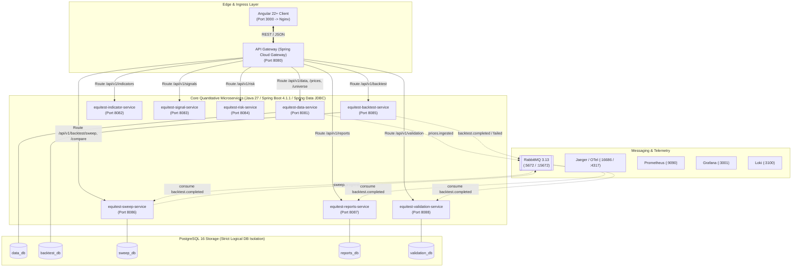

# EquiTest NSE — Container-First Microservices Migration Architecture & Execution Plan

> **Target Stack**: Angular 22+ (Zoneless, Signals-First) + Angular Material | Java 27 + Spring Boot 4.1.1 Microservices | Spring Data JDBC + Flyway Migrations | PostgreSQL 16 (isolated logical DBs per service) | RabbitMQ 3.13 (AMQP / Management UI) | Spring Cloud Gateway | OpenTelemetry + Jaeger + Prometheus + Grafana + Loki | Docker & Docker Compose Local-First  
> **Status**: **Phase 0/1 Architecture Plan (Updated with User Directives — Awaiting Final Sign-Off)**

---

## 1. Executive Summary & Locked Architecture Directives

Following user review and architectural alignment, the migration of **EquiTest NSE** from its Next.js 14 / FastAPI / SQLite monolith to an institutional-grade microservices platform is locked with the following core technology directives:

1. **Backend Runtime & Framework**: **Java 27** + **Spring Boot 4.1.1** enforced across all microservices and container builds.
2. **Persistence & Data Access**: **Spring Data JDBC** (`spring-boot-starter-data-jdbc`) + **Flyway** migrations. Spring Data JDBC eliminates the overhead, session state, and lazy-loading anomalies of Hibernate/JPA, delivering lightweight, immutable record mappings and deterministic SQL execution essential for high-throughput quantitative finance.
3. **Build Tooling**: **Maven Multi-Module** (`pom.xml` with `equitest-parent`, `equitest-common`, and individual service modules) utilizing containerized Maven Wrapper (`./mvnw`).
4. **Message Broker**: **RabbitMQ 3.13-management-alpine** with AMQP 0-9-1 exchange/queue topologies and dead-letter exchanges (DLX) for reliable asynchronous event publication and PDF background job fanout.
5. **Frontend Framework**: **Angular 22+** (Zoneless change detection, Signals-first architecture, Standalone Components, Router, `@angular/material`, Chart.js).
6. **Container-First, Local-First Infrastructure**: Zero host runtime dependencies. Running `docker compose up` brings up all 8 microservices, Spring Cloud Gateway, Angular frontend, PostgreSQL, RabbitMQ, Jaeger, Prometheus, Grafana, Loki, and an automated Fixture Seeder.

---

## 2. Microservice Decomposition & Bounded Contexts



### 2.1 Service Responsibility & Data Access Architecture

| Service Name | Bounded Context & Responsibility | Data Ownership (Postgres DB) | Spring Data JDBC Repositories | Sync vs Async Interfaces |
| :--- | :--- | :--- | :--- | :--- |
| **API Gateway** | Single entry point, routing, rate limiting, OpenAPI 3.1 aggregation, CORS | None (stateless) | None | Sync HTTP reverse proxy to downstream |
| **Data Service** | Historical OHLCV market data ingestion, Yahoo Finance integration, corporate actions (`adj_close`), point-in-time universe, parquet fixture loader | `data_db` | `PriceRepository`, `IndexPriceRepository`, `UniverseMembershipRepository`, `ConstituentRepository` | **Sync**: `/api/v1/data/*`, `/api/v1/prices/*`, `/api/v1/universe`<br/>**Async Pub**: `prices.ingested`, `universe.updated` |
| **Indicator Service** | Vectorized EMA calculations (20, 50, 150, 200), lookahead-free 52W rolling high, on-the-fly indicator preview | In-memory cache / optional Redis | None (compute-only) | **Sync**: `/api/v1/indicators/{symbol}`, `/preview`<br/>**Internal**: Bulk indicator computation for backtests |
| **Signal Service** | 4-EMA stack filter, NIFTY 50 market regime filter, 52W proximity filter, EMA-20 crossover trigger, universe screener | In-memory cache | None (compute-only) | **Sync**: `/api/v1/signals/{symbol}`, `/screen`<br/>**Internal**: Bulk signal evaluation |
| **Risk Service** | 7% stop-loss calculation, 2% capital risk allocation, discrete lot sizing (`floor`), overnight gap-down exit price resolution, 10 bps slippage modeling | Stateless pure domain logic | None (stateless) | **Sync**: `/api/v1/risk/size`, `/api/v1/risk/config` |
| **Backtest Service** | Event-driven chronological simulation engine, session ordering, momentum candidate ranker, capital exposure constraint, trade ledger generation, mark-to-market daily equity curve | `backtest_db` | `BacktestRunRepository`, `BacktestTradeRepository`, `BacktestEquityRepository`, `BacktestRejectionRepository` | **Sync**: `/api/v1/backtest/run`, `GET /backtest/{id}`, `/trades`, `/equity`<br/>**Async Pub**: `backtest.completed`, `backtest.failed` |
| **Sweep Service** | 2D Cartesian parameter grid sweep orchestrator (capped at 50 runs), child run dispatcher, comparative curve aligner | `sweep_db` | `BacktestSweepRepository`, `SweepRunRepository` | **Sync**: `/api/v1/backtest/sweep`, `GET /sweep/{id}`, `GET /compare`<br/>**Async Sub**: Listens to `backtest.completed` |
| **Reports Service** | Quantitative performance metrics (CAGR, Sharpe, Sortino, Calmar, MaxDD, Profit Factor, Expectancy, Avg Days Held), Month $\times$ Year returns matrix, exports (CSV, XLSX, ZIP), deterministic PDF generator with server-side charts | `reports_db` | `PdfJobRepository`, `ExportArtifactRepository` | **Sync**: `/api/v1/reports/{id}/summary`, `/monthly`, `/export`, `/preview.png`<br/>**Async Sub**: Ingests `backtest.completed` to pre-generate metrics |
| **Validation Service** | TradingView visual diff inspection generator, reproducibility provenance auditor (Git SHA, input parquet SHA-256 fingerprint, runtime versions) | `validation_db` | `AuditRecordRepository` | **Sync**: `/api/v1/validation/{id}/{symbol}`, `/api/v1/backtest/{id}/audit`<br/>**Async Sub**: Ingests audit records upon `backtest.completed` |

---

## 3. Data Architecture: Spring Data JDBC & Flyway Migrations

### 3.1 Why Spring Data JDBC for Quantitative Equities?
Unlike Hibernate/JPA:
1. **No Session / Detached Entity Surprises**: Financial entities like `PriceBar`, `TradeRecord`, and `EquityPoint` are modeled as **immutable Java 27 records**.
2. **Zero Lazy-Loading Leaks**: Data is loaded eagerly or via explicit SQL queries without proxy overhead.
3. **High-Throughput Batch Inserts**: Streaming thousands of price bars or backtest trades executes via lightweight JDBC `BatchPreparedStatementSetter` or Spring Data JDBC `saveAll()`, running at near-native database speeds.
4. **Flyway Migrations Live with Owning Service**: Each service contains its own `src/main/resources/db/migration/V1__*.sql` files, guaranteeing modular evolution and independent schema deployments.

### 3.2 Database Isolation Structure
A single containerized PostgreSQL 16 server hosts 5 isolated logical databases:
- `equitest_data` (owned by Data Service)
- `equitest_backtest` (owned by Backtest Service)
- `equitest_sweep` (owned by Sweep Service)
- `equitest_reports` (owned by Reports Service)
- `equitest_validation` (owned by Validation Service)

Each database is granted permissions exclusively to its own service user (`data_user`, `backtest_user`, etc.), guaranteeing that **no cross-database joins can ever occur**.

---

## 4. Asynchronous Messaging Architecture (RabbitMQ)

### 4.1 Topology & Exchanges
- **Exchange**: `equitest.events` (Topic Exchange)
- **Queues**:
  - `reports.backtest.completed.queue` (binding: `backtest.completed`)
  - `validation.backtest.completed.queue` (binding: `backtest.completed`)
  - `sweep.backtest.completed.queue` (binding: `backtest.completed`)
  - `reports.pdf.jobs.queue` (Work Queue for asynchronous PDF generation)
- **Dead-Letter Exchange (DLX)**: `equitest.dlx` with queue `equitest.dead-letters` for failed event processing after 3 retry attempts with exponential backoff.
- **Management UI**: Accessible locally at `http://localhost:15672` (guest/guest).

---

## 5. Containerization Plan (LOCAL-FIRST)

### 5.1 Docker Compose Local Setup
A developer runs a single command:
```bash
docker compose up
```
This automatically boots:
1. `postgres` (with auto-created logical databases)
2. `rabbitmq` (AMQP 5672 + Web UI 15672)
3. `jaeger`, `prometheus`, `grafana`, `loki` (complete observability)
4. `equitest-seeder` (one-shot job copying `data/fixtures/*.parquet` into Data Service)
5. `equitest-data-service`
6. `equitest-indicator-service`
7. `equitest-signal-service`
8. `equitest-risk-service`
9. `equitest-backtest-service`
10. `equitest-sweep-service`
11. `equitest-reports-service`
12. `equitest-validation-service`
13. `equitest-gateway` (Port 8080)
14. `equitest-frontend` (Port 3000)

### 5.2 Multi-Stage Dockerfile Pattern (Java 27)

```dockerfile
# syntax=docker/dockerfile:1.4
# Stage 1: Build & Cache
FROM eclipse-temurin:27-jdk-noble AS builder
WORKDIR /workspace
COPY pom.xml ./
COPY backend/pom.xml backend/pom.xml
COPY backend/common/pom.xml backend/common/pom.xml
COPY backend/services/pom.xml backend/services/pom.xml
# Copy service POMs and download dependencies offline
RUN ./mvnw dependency:go-offline -B
COPY backend backend
RUN ./mvnw clean package -DskipTests

# Stage 2: Local Dev (Hot-Reload with Spring Boot DevTools)
FROM eclipse-temurin:27-jdk-noble AS dev
WORKDIR /app
COPY --from=builder /root/.m2 /root/.m2
COPY --from=builder /workspace ./
EXPOSE 8080 5005
CMD ["./mvnw", "spring-boot:run"]

# Stage 3: Production Runtime
FROM eclipse-temurin:27-jre-noble AS prod
WORKDIR /app
RUN groupadd -g 1001 appgroup && useradd -u 1001 -g appgroup -s /bin/bash appuser
COPY --from=builder /workspace/target/*.jar app.jar
USER appuser:appgroup
EXPOSE 8080
ENTRYPOINT ["java", "-jar", "app.jar"]
```

---

## 6. Frontend Architecture: Angular 22+ & Angular Material

### 6.1 Modern Angular 22+ Directives
- **Zoneless Change Detection**: Enforces `provideExperimentalZonelessChangeDetection()` or native signals-based reactivity for maximum rendering performance.
- **Signals-First State Management**: Component state powered by `signal()`, `computed()`, and `effect()`, with RxJS reserved for streaming API events.
- **Angular Material Components**:
  - Tables: `mat-table`, `mat-sort`, `mat-paginator` with sorting and responsive horizontal overflow wrapping.
  - Interactive Forms: `mat-form-field`, `mat-select`, `mat-slider`, `mat-checkbox`.
  - Notifications: `MatSnackBar` for toast feedback.
  - Dialogs: `MatDialog` for multi-run comparison drawers.
- **Chart.js**: Render equity curves, underwater drawdown charts, and 2D parameter heatmaps.
- **Generated API Client**: TypeScript client generated from aggregated Gateway OpenAPI 3.1 schema.

---

## 7. Phased Execution Roadmap

### Phase 0: Planning & Approval (Current Phase)
- Approval of architecture plan with Java 27, Spring Boot 4.1.1, Spring Data JDBC, Maven Multi-Module, RabbitMQ, and Angular 22+.

### Phase 1: Containerized Local Dev Skeleton
- Root Maven `pom.xml` (`equitest-parent`), `equitest-common` module (records, error envelopes, Flyway setup, OTel config).
- Stubs for all 8 microservices and Spring Cloud Gateway.
- `docker-compose.yml` operational: `docker compose up` brings up Gateway on `:8080`, frontend stub on `:3000`, PostgreSQL, RabbitMQ, and Jaeger.
- `depends_on` with `condition: service_healthy` configured.

### Phase 2: Data Service
- `equitest-data-service`: PostgreSQL + Flyway migrations for `prices`, `index_prices`, `universe_membership`, `constituents`.
- Spring Data JDBC repositories.
- Yahoo Finance client, split/bonus normalization (`adj_close`), point-in-time universe resolver.
- Fixture seeder loading `/data/fixtures/*.parquet`.
- Parquet SHA-256 fingerprinting matching Python `compute_data_snapshot_hash`.

### Phase 3: Indicator Service
- `equitest-indicator-service`: Vectorized EMAs (20, 50, 150, 200) matching TA-Lib within $\pm 10^{-6}$.
- Lookahead-free 52W high: strictly shifted by 1 bar (`high.shift(1).rolling(252)`).
- Endpoints: `GET /api/v1/indicators/{symbol}`, `GET /api/v1/indicators/nifty`, `POST /api/v1/indicators/preview`.

### Phase 4: Signal Service
- `equitest-signal-service`: NIFTY 50 market regime filter, 4-EMA stock trend filter, 52W proximity filter, EMA-20 crossover trigger.
- Universe screener (`GET /api/v1/signals/screen`).

### Phase 5: Risk Service
- `equitest-risk-service`: 7% hard stop loss, 2% capital risk allocation, discrete lot sizing (`floor`), overnight gap-down exit price resolution (`Open * 0.9990`), 10 bps slippage modeling.
- Endpoints: `POST /api/v1/risk/size`, `GET /api/v1/risk/config`.

### Phase 6: Backtest Service & Golden Determinism Gate
- `equitest-backtest-service`: Event-driven chronological simulation loop.
- Exits at session $T$ open $\to$ free cash calculation $\to$ candidate entry ranking by momentum $\to$ position sizing & capital allocation constraint $\to$ session $T$ close mark-to-market.
- **CRITICAL GATE**: Deterministic golden backtest on tiny universe (`ALPHA`, `BETA`, `GAMMA`, `NIFTY_TINY`) **must yield exactly ₹482,707.20** final capital to the paisa.

### Phase 7: Sweep Service
- `equitest-sweep-service`: 2D Cartesian parameter grid generator (capped at 50 runs).
- Child run dispatcher via Backtest Service, asynchronous progress tracking via RabbitMQ.
- Comparison endpoint (`GET /api/v1/backtest/compare`).

### Phase 8: Reports Service
- `equitest-reports-service`: CAGR, Sharpe, Sortino, Calmar, MaxDD, Profit Factor, Expectancy, Avg Days Held matching `empyrical` within $\pm 10^{-6}$.
- Month $\times$ Year compounded returns matrix.
- Exports: CSV, XLSX (Apache POI), ZIP, deterministic PDF (OpenPDF / Flying Saucer + JFreeChart).

### Phase 9: Validation & Audit Service
- `equitest-validation-service`: TradingView cross-check table and CSV generator.
- Provenance audit endpoint (`GET /api/v1/backtest/{run_id}/audit`) returning Git SHA, strategy config, and Parquet SHA-256 fingerprint.

### Phase 10: Gateway Wiring & OpenAPI Aggregation
- Spring Cloud Gateway routing for all `/api/v1/*` routes.
- Aggregated OpenAPI 3.1 schema.
- Angular TypeScript client generation via `openapi-generator-cli`.

### Phase 11: Angular 22+ Frontend
- Standalone components for all routes: `/data`, `/indicators`, `/signals`, `/risk`, `/backtest`, `/sweep`, `/reports/:runId`, `/validation`, `/docs`.
- Angular Material layout, responsive sidenav, zero horizontal overflow at 375px & 768px.
- Chart.js equity curve, drawdown chart, and parameter heatmap.

### Phase 12: Observability Stack Integration
- OpenTelemetry SDK trace propagation (Gateway $\to$ Backtest $\to$ Reports $\to$ RabbitMQ).
- Jaeger trace verification.
- Prometheus scraping Actuator metrics, Grafana dashboards pre-provisioned, Loki structured logging.

### Phase 13: E2E, Performance, & Resilience Testing
- Playwright E2E test suite running against containerized stack.
- Testcontainers integration test suite across PostgreSQL and RabbitMQ.
- Resilience4j circuit breaker verification (graceful degradation on downstream outage).

### Phase 14: Documentation, Verification, & Handoff
- Updated `README.md`, `ARCHITECTURE.md`, `RUNBOOK.md` (container-only instructions), and new `MIGRATION.md`.

---

## 8. Quantitative Invariants & Validation Matrix

| Invariant | Specification | Acceptance Criteria |
| :--- | :--- | :--- |
| **INV-1: Zero Look-Ahead** | Indicators on session $T$ close; trades fill on session $T+1$ Market Open. Rolling 52W high shifted by 1 bar. | Golden test asserts bar $N$ strictly excludes bar $N$'s own high. |
| **INV-2: Survivorship Bias Prevention** | Point-in-time constituent records; fallback tagged with `survivorship_bias: true`. | Verified against `constituents.parquet`. |
| **INV-3: Top 100 Exclusion** | Ranks 101–750 eligible; NIFTY 50 only as regime filter. | Zero trades allocated to stocks ranked $\le 100$. |
| **INV-4: Overnight Gap-Down Realism** | If $\text{Open}_T \le \text{SL Price}$, exit executes at $\text{Open}_T \times 0.9990$, recording true loss. | Realized loss exceeds 7% on gap events. |
| **INV-5: Momentum Candidate Ranking** | $(Close_T - EMA20_T) / EMA20_T$ descending under capital constraints; alphabetical tie-breaker. | Highest momentum candidate executed first. |
| **INV-6: Risk Allocation & Lot Sizing** | 2% corpus risk; 7% hard stop; integer shares floored. | $\text{qty} \times \text{entry} \times \text{sl\_pct} \le \text{risk\_amount}$. |
| **INV-7: Transaction Frictions** | 10 bps per side: Buy at $\text{Price} \times 1.0010$, Sell at $\text{Price} \times 0.9990$. | Rupee costs deducted accurately. |
| **INV-8: Corporate Action Normalization** | Indicators and signals execute on `adj_close`. 52W high normalized by $(adj\_close / close)$. | Historical splits do not cause false exits. |
| **INV-9: Cryptographic Run Provenance** | Every backtest stores Git SHA, config JSON, and Parquet SHA-256 fingerprint. | Retrievable via `GET /api/v1/backtest/{id}/audit`. |
| **INV-10: Paisa-Level Determinism** | Golden backtest on tiny universe yields **₹482,707.20** final capital to the paisa. | JUnit 5 test asserts `final_capital == 482707.20` exactly. |
