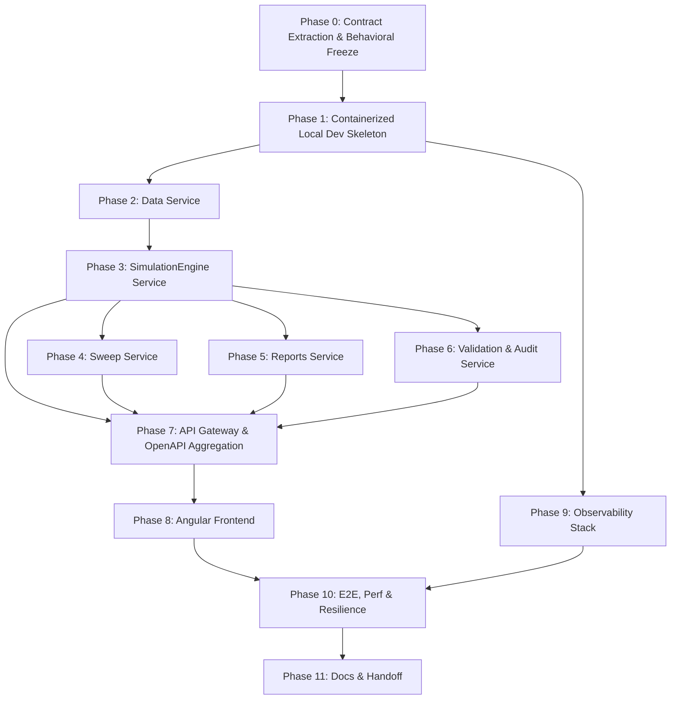

# Phase Index — EquiTest NSE Microservices Migration

> **Produced by**: Migration Planner (Model B), updated with resolved decisions
> **Date**: 2026-09-26 (updated)

---

## Resolved Questions

### ✅ Question 1: Synchronous vs. Asynchronous API Latency Boundaries

**Decision**: The frontend does **NOT** expect PDF, validation, or report data inline in the `/api/v1/backtest/run` response. The synchronous endpoint returns `run_id` and simulation results only. An explicit **"Reports Not Ready" protocol** is defined in Phase 0: downstream endpoints (`/reports/*`, `/validation/*`, `/audit`) return HTTP 404 or `{"status": "processing"}` until async consumers finish. The Angular UI must poll or use notification. See [`phase-00-contract-extraction.md`](phase-00-contract-extraction.md) for the full protocol specification.

### ✅ Question 2: Trace Context & Provenance Propagation

**Decision**: The `backtest.completed` RabbitMQ message carries a **versioned schema (v1)** with full provenance embedded in the payload:
- `event_version`: `"1.0"`
- `idempotency_key`: UUID v4 for consumer deduplication
- `data_snapshot_id`: SHA-256 of input Parquet files
- `provenance.engine_git_sha`: Git SHA of engine at build time
- `provenance.config_json_canonical`: Deterministic JSON (keys sorted, compact, nulls explicit)
- `provenance.engine_version`: Maven artifact version

All queues are **durable**. All consumers are **idempotent** (dedup on `idempotency_key`). DLX with 3-retry exponential backoff. See [`phase-00-contract-extraction.md`](phase-00-contract-extraction.md) for the full schema and messaging contract.

---

## Dependency Diagram

## Phase Table

| Phase ID | Name | Depends On | Produces | Consumed By |
| --- | --- | --- | --- | --- |
| 0 | Contract Extraction & Behavioral Freeze | None | Golden contract fixtures, `backtest.completed` v1 schema, "reports not ready" protocol | Phases 1-11 |
| 1 | Containerized Local Dev Skeleton | Phase 0 | Docker Compose, Service Skeletons, DB Setup, RabbitMQ (durable queues + DLX) | Phases 2-11 |
| 2 | Data Service | Phase 1 | `equitest-data-service`, `equitest_data` DB, Parquet Ingestion, `data_snapshot_id` | Phase 3 |
| 3 | SimulationEngine Service | Phase 2 | `equitest-engine-service`, Simulation logic, `backtest.completed` v1 event | Phases 4, 5, 6, 7 |
| 4 | Sweep Service | Phase 3 | `equitest-sweep-service`, Sweep logic, idempotent consumer | Phase 7 |
| 5 | Reports Service | Phase 3 | `equitest-reports-service`, Metrics, Async PDFs, "reports not ready" protocol | Phase 7 |
| 6 | Validation & Audit Service | Phase 3 | `equitest-validation-service`, Provenance logic, idempotent consumer | Phase 7 |
| 7 | API Gateway & OpenAPI Aggregation | Phases 3,4,5,6 | Spring Cloud Gateway config, Unified OpenAPI spec | Phase 8, 10 |
| 8 | Angular Frontend | Phase 7 | Angular 22+ Application (polls for async reports) | Phase 10 |
| 9 | Observability Stack | Phase 1 | OTel, Jaeger, Prometheus, Grafana, Loki | Phase 10 |
| 10 | E2E, Performance & Resilience | Phases 8, 9 | Golden tests, performance metrics, resilience validation | Phase 11 |
| 11 | Documentation, Verification & Handoff | Phase 10 | Final verified repository, deployment manuals | None |

---

## Cross-Phase Invariants

These ten invariants are **inviolable** throughout the entire migration. Each phase document restates the subset relevant to that phase.

1. **INV-1: Zero Look-Ahead** — Indicators on session T close; trades fill on session T+1 Market Open. Rolling 52W high shifted by 1 bar.
2. **INV-2: Survivorship Bias Prevention** — Point-in-time constituent records; fallback tagged `survivorship_bias: true`.
3. **INV-3: Top 100 Exclusion** — Ranks 101–750 eligible; NIFTY 50 only as regime filter.
4. **INV-4: Overnight Gap-Down Realism** — If Open_T <= SL Price, exit at Open_T × 0.9990.
5. **INV-5: Momentum Candidate Ranking** — (Close_T - EMA20_T) / EMA20_T descending; alphabetical tie-breaker.
6. **INV-6: Risk Allocation & Lot Sizing** — 2% corpus risk; 7% hard stop; integer shares floored.
7. **INV-7: Transaction Frictions** — 10 bps per side.
8. **INV-8: Corporate Action Normalization** — Indicators on `adj_close`; 52W high normalized.
9. **INV-9: Cryptographic Run Provenance** — Git SHA, config JSON (canonicalized), Parquet SHA-256 (`data_snapshot_id`).
10. **INV-10: Paisa-Level Determinism** — Golden backtest yields ₹482,707.20 exactly.

---

## Cross-Phase Contract

The complete frozen `/api/v1/*` API surface. No endpoint may be added, removed, or modified during migration.

| Method | Endpoint | Description |
|---|---|---|
| GET | `/health` | Service health |
| GET | `/api/v1/health` | API v1 health |
| POST | `/api/v1/data/ingest` | Data ingestion |
| GET | `/api/v1/data/coverage` | Coverage intervals |
| GET | `/api/v1/universe` | Point-in-time universe |
| GET | `/api/v1/prices/{symbol}` | OHLCV prices |
| GET | `/api/v1/indicators/{symbol}` | EMAs + 52W high |
| POST | `/api/v1/indicators/preview` | Dynamic indicators |
| GET | `/api/v1/indicators/nifty` | NIFTY benchmark indicators |
| GET | `/api/v1/signals/{symbol}` | Trading signals |
| GET | `/api/v1/signals/screen` | Universe screening |
| POST | `/api/v1/risk/size` | Position sizing |
| GET | `/api/v1/risk/config` | Risk config |
| POST | `/api/v1/backtest/run` | Execute backtest (sync — returns run_id + results, no inline reports) |
| GET | `/api/v1/backtest/{run_id}` | Backtest results |
| GET | `/api/v1/backtest/{run_id}/trades` | Trade ledger |
| GET | `/api/v1/backtest/{run_id}/equity` | Equity curve |
| GET | `/api/v1/backtest` | List backtests |
| GET | `/api/v1/backtest/{run_id}/audit` | Provenance audit (async — may 404 until processed) |
| POST | `/api/v1/backtest/sweep` | Parameter sweep |
| GET | `/api/v1/backtest/sweep/{sweep_id}` | Sweep status |
| GET | `/api/v1/backtest/compare` | Compare runs |
| GET | `/api/v1/reports/{run_id}/summary` | Performance metrics (async — may 404 until processed) |
| GET | `/api/v1/reports/{run_id}/monthly` | Monthly returns (async — may 404 until processed) |
| GET | `/api/v1/reports/{run_id}/export` | Multi-format export (async — may 404 until processed) |
| POST | `/api/v1/reports/{run_id}/export/pdf/async` | Async PDF (returns 202 + job_id) |
| GET | `/api/v1/reports/jobs/{job_id}` | PDF job status |
| GET | `/api/v1/reports/jobs/{job_id}/download` | PDF download |
| GET | `/api/v1/reports/{run_id}/preview.png` | PDF preview (async — may 404 until processed) |
| GET | `/api/v1/validation/{run_id}/{symbol}` | TradingView cross-check (async — may 404 until processed) |

