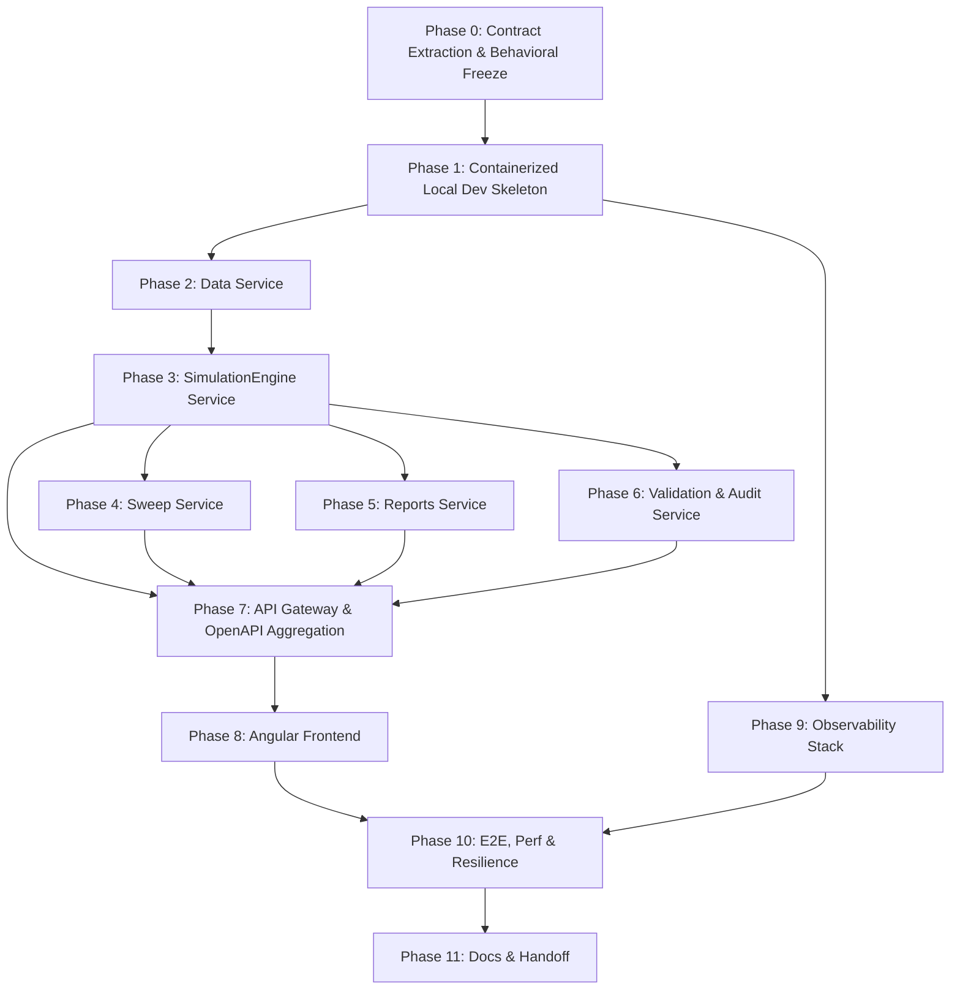

# EquiTest NSE — Microservices Migration Plan Index

> **Status**: ✅ **READY — All blocking questions resolved. Implementation may begin with Phase 0.**

This directory contains the complete phase-by-phase migration plan for moving EquiTest NSE from its Next.js 14 / FastAPI / SQLite monolith to an Angular 22+ / Java 27 / Spring Boot 4.1.1 microservices architecture with container-first local development.

---

## Resolved Questions

1. **Synchronous vs. Asynchronous API Latency Boundaries**: ✅ Confirmed — the frontend does **not** expect PDF/validation data inline in the `/api/v1/backtest/run` response. An explicit **"Reports Not Ready" protocol** has been defined in Phase 0 (contract extraction). Downstream endpoints return HTTP 404 or `{"status": "processing"}` until async consumers complete.

2. **Trace Context & Provenance Propagation**: ✅ Resolved — the `backtest.completed` event carries a **versioned schema (v1)** with `event_version`, `idempotency_key`, `data_snapshot_id`, full provenance, and canonical config JSON. All queues are durable. All consumers are idempotent (dedup on `idempotency_key`). DLX with 3-retry exponential backoff. Full schema in Phase 0.

---

## File Layout

| File | Description |
| :--- | :--- |
| [`00-migration-plan.md`](00-migration-plan.md) | The original migration plan (unchanged, for reference) |
| [`01-review.md`](01-review.md) | Model A (Reviewer) — Critical review + Instructions to Planner |
| [`02-phase-index.md`](02-phase-index.md) | Phase Index, dependency diagram, Cross-Phase Invariants, Cross-Phase Contract |
| [`phase-00-contract-extraction.md`](phase-00-contract-extraction.md) | **Phase 0**: Legacy contract extraction, `backtest.completed` v1 schema, "reports not ready" protocol |
| [`phase-01-containerized-local-dev-skeleton.md`](phase-01-containerized-local-dev-skeleton.md) | Phase 1: Docker Compose, Maven multi-module, DB & broker setup |
| [`phase-02-data-service.md`](phase-02-data-service.md) | Phase 2: OHLCV ingestion, universe, corporate actions |
| [`phase-03-simulation-engine-service.md`](phase-03-simulation-engine-service.md) | Phase 3: Indicators + Signals + Risk + Backtest (merged per review) |
| [`phase-04-sweep-service.md`](phase-04-sweep-service.md) | Phase 4: Parameter grid sweep orchestrator |
| [`phase-05-reports-service.md`](phase-05-reports-service.md) | Phase 5: Metrics, exports, async PDF |
| [`phase-06-validation-audit-service.md`](phase-06-validation-audit-service.md) | Phase 6: TradingView cross-check, provenance audit |
| [`phase-07-api-gateway-openapi-aggregation.md`](phase-07-api-gateway-openapi-aggregation.md) | Phase 7: Spring Cloud Gateway, unified OpenAPI |
| [`phase-08-angular-frontend.md`](phase-08-angular-frontend.md) | Phase 8: Angular 22+ SPA with Material + Chart.js |
| [`phase-09-observability-stack.md`](phase-09-observability-stack.md) | Phase 9: OpenTelemetry, Jaeger, Prometheus, Grafana, Loki |
| [`phase-10-e2e-performance-resilience.md`](phase-10-e2e-performance-resilience.md) | Phase 10: Golden tests, load tests, chaos engineering |
| [`phase-11-documentation-verification-handoff.md`](phase-11-documentation-verification-handoff.md) | Phase 11: Final docs, traceability audit, handoff |

---

## How to Use These Documents

### Workflow Overview

Each `phase-NN-*.md` file is intended to be pasted into a **new, fresh conversation** with an implementation model. The implementer must first read `02-phase-index.md` for cross-phase context, then the specific phase file, then begin work.

### How to Run a Phase

1. **Load context**: Open a new implementation conversation. Paste the contents of `02-phase-index.md` (for cross-phase invariants and contract reference) followed by the specific `phase-NN-*.md` file.
2. **Confirm prerequisites**: The implementer must verify every item in the phase's **Prerequisites** section before starting. If a prior phase's hand-off checklist has unverified items, stop and resolve them first.
3. **Execute**: Implement the phase according to its **In-Scope Items**, respecting the **Out-of-Scope** boundaries and the **Invariant Checklist**.
4. **Verify acceptance gates**: Every item in the **Acceptance Gates** section must pass before the phase is considered complete.
5. **Produce hand-off checklist**: Complete the **Hand-off to Next Phase** section's checklist, documenting verified states and artifacts.
6. **Move to next phase**: Open a new conversation for the next phase, loading fresh context.

### Key Principles

- **No code in these documents**: These are planning and instruction artifacts, not implementation.
- **Self-contained phases**: Each phase document restates the invariants, contracts, and definitions relevant to that phase. The implementer does not need to have read the full repository.
- **Frozen contract**: The `/api/v1/*` API surface is frozen and must not be modified. See `02-phase-index.md` for the complete contract.
- **Ten critical invariants**: Must never be violated. See `02-phase-index.md` for the full list.
- **"Reports Not Ready" protocol**: Async endpoints (reports, validation, audit) may return 404 until processing completes. Defined in Phase 0.
- **Idempotent consumers**: All RabbitMQ consumers dedup on `idempotency_key`. Defined in Phase 0.

---

## Phase Dependency Order

---

## Recommended Next Action

Open a fresh conversation and load [`phase-00-contract-extraction.md`](phase-00-contract-extraction.md) to begin the migration.

