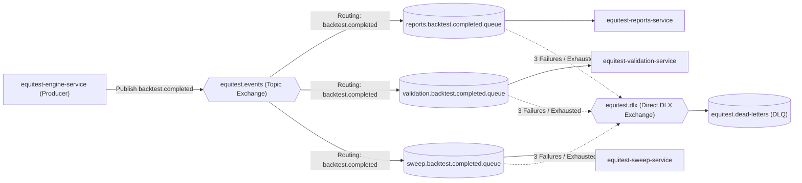

# Messaging Infrastructure & Canonical Serialization Contract

> **Status**: Frozen Contract  
> **Applicability**: Phase 0 through Phase 11  
> **Producers**: `equitest-engine-service`  
> **Consumers**: `equitest-reports-service`, `equitest-validation-service`, `equitest-sweep-service`  

---

## 1. Broker Topology & AMQP Architecture

All inter-service asynchronous communication across the microservices ecosystem is mediated via RabbitMQ 3.13+.



---

## 2. Broker Specification Table

| Property | Value / Specification | Rationale |
|---|---|---|
| **Exchange Name** | `equitest.events` | Primary event bus for domain events |
| **Exchange Type** | `topic` | Allows flexible wildcard routing (`backtest.*`) |
| **Exchange Durability** | `true` | Survives broker restart |
| **Dead-Letter Exchange (DLX)** | `equitest.dlx` | Direct exchange capturing failed poison-pill messages |
| **DLX Durability** | `true` | Persistent DLX |
| **Dead-Letter Queue (DLQ)** | `equitest.dead-letters` | Destination queue for failed messages after retries |
| **Delivery Mode** | `2` (Persistent) | Writes message to disk immediately |
| **Content-Type** | `application/json` | All payloads encoded in UTF-8 JSON |

---

## 3. Queue Bindings & Routing

| Queue Name | Durable | Bound Exchange | Routing Key | Arguments / Dead-Letter Config |
|---|---|---|---|---|
| `reports.backtest.completed.queue` | `true` | `equitest.events` | `backtest.completed` | `x-dead-letter-exchange: "equitest.dlx"`, `x-dead-letter-routing-key: "dead-letter"` |
| `validation.backtest.completed.queue` | `true` | `equitest.events` | `backtest.completed` | `x-dead-letter-exchange: "equitest.dlx"`, `x-dead-letter-routing-key: "dead-letter"` |
| `sweep.backtest.completed.queue` | `true` | `equitest.events` | `backtest.completed` | `x-dead-letter-exchange: "equitest.dlx"`, `x-dead-letter-routing-key: "dead-letter"` |
| `reports.pdf.jobs.queue` | `true` | `equitest.events` | `reports.pdf.render` | `x-dead-letter-exchange: "equitest.dlx"`, `x-dead-letter-routing-key: "dead-letter"` |
| `equitest.dead-letters` | `true` | `equitest.dlx` | `dead-letter` | Retention: 14 days |

---

## 4. Retry and Poison-Pill Policy

1. **Consumer Retry Mechanism**:
   - Consumers attempt processing up to **3 times** upon encountering transient failures (DB connection drop, network blip).
   - Exponential backoff intervals:
     - Retry 1: 1,000 ms (1 second)
     - Retry 2: 5,000 ms (5 seconds)
     - Retry 3: 25,000 ms (25 seconds)
2. **Exhaustion & Dead-Lettering**:
   - If processing fails after 3 retries, the consumer rejects the message with `basic.reject(requeue=false)`.
   - RabbitMQ dead-letters the message into `equitest.dead-letters` queue via `equitest.dlx`.
   - An alert log is emitted with `traceparent`, `idempotency_key`, and exception stack trace.

---

## 5. Consumer Idempotency Contract

All consumers (`Reports`, `Validation`, `Sweep`) MUST implement strict deduplication:

1. Every incoming event contains an `idempotency_key` (UUID v4) generated once by the emitter.
2. The consumer checks its local database table (`processed_events`) for the presence of `idempotency_key`:
   ```sql
   CREATE TABLE processed_events (
       idempotency_key VARCHAR(36) PRIMARY KEY,
       event_type VARCHAR(64) NOT NULL,
       processed_at TIMESTAMP WITH TIME ZONE DEFAULT CURRENT_TIMESTAMP
   );
   ```
3. If `idempotency_key` exists:
   - Consumer logs an idempotency hit (`logger.info("Dropping duplicate event %s", idempotency_key)`).
   - Consumer executes `basic.ack` to acknowledge and remove the duplicate from RabbitMQ without re-executing any business logic.
4. If `idempotency_key` is new:
   - Consumer inserts `idempotency_key` into `processed_events` within the same database transaction that persists the computed domain entities.
   - Upon successful commit, consumer executes `basic.ack`.

---

## 6. Distributed Tracing & Correlation

To ensure end-to-end traceability across distributed asynchronous boundaries (REQ-9.1):

1. **W3C Trace Context Propagation**:
   - Emitters inject the current OpenTelemetry trace context into the AMQP message properties:
     - `headers["traceparent"]`: e.g. `00-4bf92f3577b34da6a3ce929d0e0e4736-00f067aa0ba902b7-01`
     - `headers["tracestate"]`: vendor-specific routing state (if present)
2. **Consumer Span Context**:
   - Consumers extract `traceparent` from AMQP header properties and start a new child span linked to the parent trace.

---

## 7. Config JSON Canonicalization Rule (INV-9)

To guarantee that identical configurations produce identical cryptographic fingerprints regardless of language (Python vs Java), the `provenance.config_json_canonical` string in `backtest.completed` must be generated according to the following strict serialization rules:

1. **Recursive Alphabetical Key Sorting**: All JSON object keys at all nested levels must be sorted in lexicographical order (ASCII order).
2. **Compact Spacing**: No spaces around separators (`:` has no trailing space, `,` has no trailing space). E.g., `{"a":1,"b":2}`.
3. **Explicit Nulls**: Fields with `null` values must be serialized explicitly as `null`, never omitted or omitted as undefined.
4. **Number Formatting**:
   - Floating point numbers must not contain trailing zeros or trailing decimal points (e.g. `500000.0` is serialized as `500000.0` or standard decimal representation matching IEEE 754 float/double string without extra formatting).
   - Exact integer values must be serialized as integers (e.g. `1`, not `1.0`).
5. **Character Encoding**: UTF-8 without Byte Order Mark (BOM).
