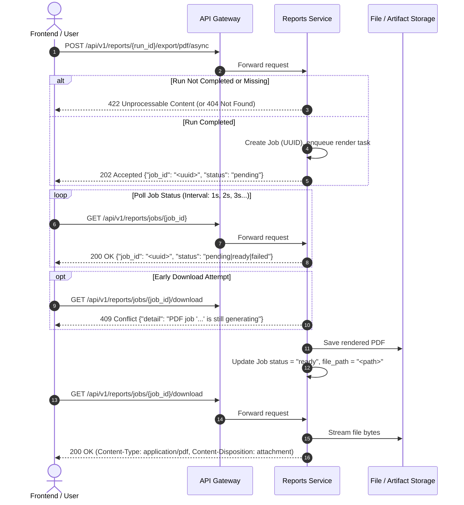

# "Reports Not Ready" Protocol Specification

> **Status**: Frozen Contract  
> **Applicability**: Phase 0 through Phase 11  
> **Consumers**: `equitest-engine-service`, `equitest-reports-service`, `equitest-validation-service`, `equitest-gateway`, `frontend` (Angular 22+)  

---

## 1. Context and Rationale

In EquiTest NSE, backtest simulation execution and analytics/reporting operate across distinct operational boundaries:

1. **`POST /api/v1/backtest/run`** launches or computes the simulation engine run. In the target microservices architecture (and FastAPI background tasks), simulation execution is decoupled from downstream analytics.
2. Downstream artifacts—such as full tear sheets, monthly return matrices, multi-format bundles (XLSX, ZIP), print-ready PDFs, first-page PNG previews, and TradingView cross-check validation tables—are generated asynchronously by specialized services (`equitest-reports-service` and `equitest-validation-service`).
3. The frontend must **never** assume reports, exports, or validation data are immediately available following the trigger or return of `/api/v1/backtest/run`.

This document formalizes the exact async protocol and state machine for all downstream endpoints.

---

## 2. Endpoint Behavior Matrix

The table below contrasts the actual observed legacy Python/FastAPI monolith behavior against the target microservices API contract. All downstream microservices and the API Gateway must preserve behavioral equivalence.

| Endpoint | Method | State: Unknown `run_id` | State: Run Incomplete (`pending` / `running`) | State: Run Completed |
|---|---|---|---|---|
| `/api/v1/backtest/{run_id}` | GET | `404 Not Found` | `200 OK` (`status: "pending"` or `"running"`) | `200 OK` (`status: "completed"`) |
| `/api/v1/backtest/{run_id}/trades` | GET | `404 Not Found` | `200 OK` (`count: 0, trades: []`) | `200 OK` (`trades: [...]`) |
| `/api/v1/backtest/{run_id}/equity` | GET | `404 Not Found` | `200 OK` (`count: 0, equity_curve: []`) | `200 OK` (`equity_curve: [...]`) |
| `/api/v1/backtest/{run_id}/audit` | GET | `404 Not Found` | `404 Not Found` (until validation service processes event) | `200 OK` (`git_sha, data_hash, ...`) |
| `/api/v1/reports/{run_id}/summary` | GET | `404 Not Found` | `400 Bad Request` (Legacy) / `404 Not Found` or `202 {"status": "processing"}` (Microservices) | `200 OK` (Performance metrics) |
| `/api/v1/reports/{run_id}/monthly` | GET | `404 Not Found` | `400 Bad Request` (Legacy) / `404 Not Found` or `202 {"status": "processing"}` (Microservices) | `200 OK` (Month x Year matrix) |
| `/api/v1/reports/{run_id}/export?format=csv` | GET | `404 Not Found` | `400 Bad Request` (Legacy) | `200 OK` (`text/csv`) |
| `/api/v1/reports/{run_id}/export?format=xlsx` | GET | `404 Not Found` | `400 Bad Request` (Legacy) | `200 OK` (`application/vnd.openxmlformats-...`) |
| `/api/v1/reports/{run_id}/export?format=zip` | GET | `404 Not Found` | `400 Bad Request` (Legacy) | `200 OK` (`application/zip`) |
| `/api/v1/reports/{run_id}/export?format=pdf` | GET | `404 Not Found` | `422 Unprocessable Content` (Legacy) | `200 OK` (`application/pdf` if <=2000 trades) or `202 Accepted` (`{"job_id": "..."}`) |
| `/api/v1/reports/{run_id}/export/pdf/async` | POST | `404 Not Found` | `422 Unprocessable Content` (Legacy) | `202 Accepted` (`{"job_id": "...", "status": "pending"}`) |
| `/api/v1/reports/jobs/{job_id}` | GET | `404 Not Found` | `200 OK` (`{"status": "pending"}`) | `200 OK` (`{"status": "ready"}` or `"failed"`) |
| `/api/v1/reports/jobs/{job_id}/download` | GET | `404 Not Found` | `409 Conflict` (`"PDF job '...' is still generating"`) | `200 OK` (`application/pdf`) |
| `/api/v1/reports/{run_id}/preview.png` | GET | `404 Not Found` | `422 Unprocessable Content` (Legacy) / `404 Not Found` | `200 OK` (`image/png`) |
| `/api/v1/validation/{run_id}/{symbol}` | GET | `404 Not Found` | `404 Not Found` (until validation service processes event) | `200 OK` (`CrossCheckResponse`) |

---

## 3. Async PDF Job Lifecycle

---

## 4. Angular Frontend Polling & Resilience Rules

The frontend client must observe the following constraints when managing async runs and downstream reports:

1. **Simulation Status Polling**:
   - Upon receiving `202 Accepted` from `POST /api/v1/backtest/run`, extract `run_id`.
   - Poll `GET /api/v1/backtest/{run_id}` with an interval of 1 second for the first 5 seconds, expanding to 2-second intervals thereafter.
   - Timeout: 120 seconds. If `status` is still not terminal (`completed` or `failed`), surface a timeout notification to the user.
2. **Downstream Artifact Retrieval**:
   - The UI must **not** request `/reports/{run_id}/summary`, `/reports/{run_id}/monthly`, `/export`, or `/validation/{run_id}/{symbol}` until `GET /api/v1/backtest/{run_id}` has returned `status == "completed"`.
   - If an endpoint returns `400 Bad Request`, `404 Not Found`, or `422 Unprocessable Content` while the simulation just completed (due to asynchronous consumer latency), the UI must retry up to 5 times with a 1-second delay.
3. **Async PDF Handling**:
   - If `GET /api/v1/reports/{run_id}/export?format=pdf` returns `202 Accepted` (for large runs > 2,000 trades) or if `POST .../export/pdf/async` is invoked directly:
     - Record `job_id` from response payload.
     - Poll `GET /api/v1/reports/jobs/{job_id}` at 1-second intervals.
     - Do not call `/jobs/{job_id}/download` while status is `"pending"`.
     - When status transitions to `"ready"`, trigger browser download from `/api/v1/reports/jobs/{job_id}/download`.
     - If status transitions to `"failed"`, display the error detail to the user.
4. **Idempotency and Dedup**:
   - Avoid duplicate poll loops by managing lifecycle in reactive Angular state / signals with `takeUntilDestroyed()`.
