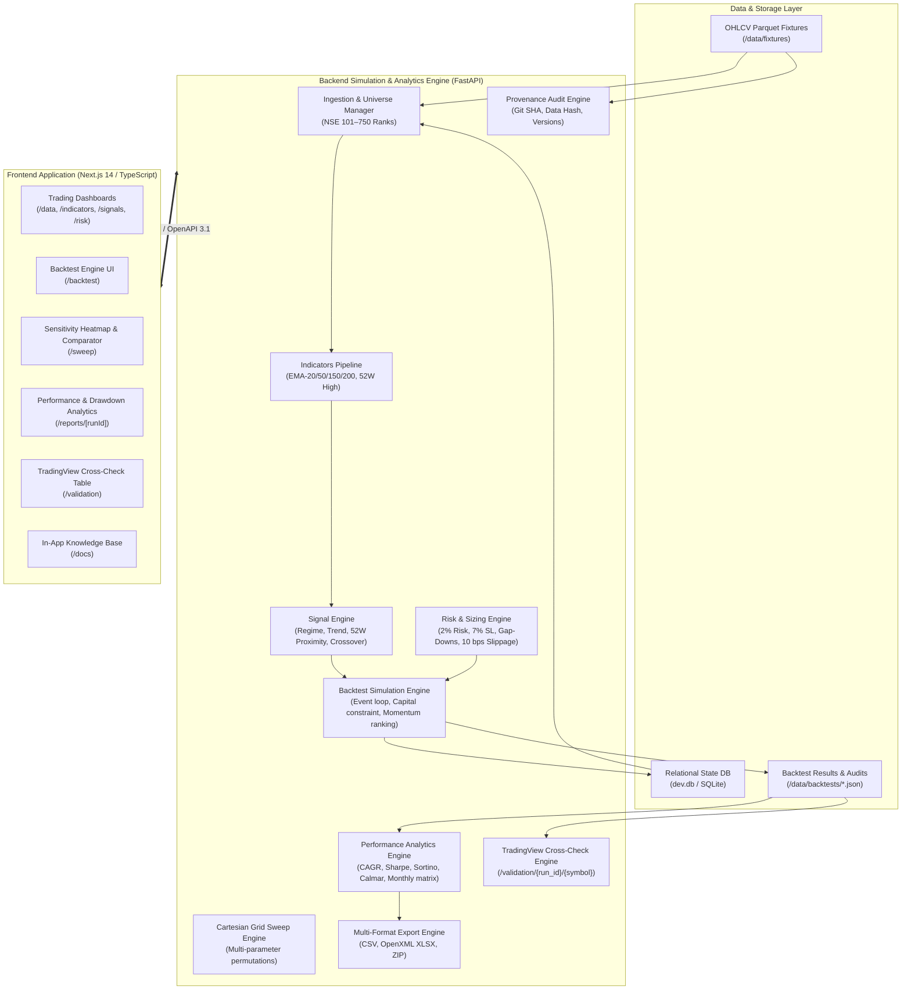

# EquiTest NSE — System Architecture

EquiTest NSE is a production-grade, event-driven quantitative backtesting and analytics framework engineered specifically for Indian equities (NSE 101–750 constituents).

---

## 1. High-Level Architecture Diagram



---

## 2. Monorepo Directory Organization

```
equitest-nse/
├── backend/                  # FastAPI Quantitative Backend
│   ├── app/
│   │   ├── api/v1/           # Versioned REST endpoints & Pydantic schemas
│   │   ├── core/             # Config, logging middleware
│   │   ├── data/             # Sources (CSV/Parquet), ingestion, universe
│   │   ├── db/               # SQLModel schema models & session
│   │   ├── engine/           # Event-driven backtest simulation & ranking
│   │   ├── indicators/       # Vectorized EMAs & rolling 52W high
│   │   ├── reports/          # Empyrical metrics, monthly matrix, XLSX/ZIP exports
│   │   ├── risk/             # Position sizing, overnight gap-down, slippage
│   │   ├── strategy/         # Signal filters, regime, trend, crossover
│   │   ├── validation/       # TradingView cross-check & provenance audit
│   │   └── main.py           # Application entrypoint & OpenAPI generator
│   └── tests/                # Pytest unit & integration test suite (coverage >= 80%)
├── frontend/                 # Next.js 14 App Router Frontend (TypeScript strict)
│   ├── app/
│   │   ├── data/             # Data coverage & prices inspection
│   │   ├── indicators/       # Technical indicators interactive chart
│   │   ├── signals/          # Universe screening & strategy signals
│   │   ├── risk/             # Interactive position sizing calculator
│   │   ├── backtest/         # Simulation runner & trade ledger
│   │   ├── sweep/            # 2D Parameter sensitivity heatmap & drawer
│   │   ├── reports/[runId]/  # KPI summary, underwater drawdown, monthly matrix
│   │   ├── validation/       # TradingView cross-check table & CSV export
│   │   └── docs/             # In-app architecture, strategy, & runbook docs
│   ├── components/           # Reusable UI & AuditPanel components
│   ├── lib/                  # Type-safe API client (Zod validation) & OpenAPI schema
│   └── tests/                # Vitest component test suites with MSW
├── data/
│   ├── fixtures/             # Parquet datasets & golden test reference CSVs
│   └── backtests/            # Persisted simulation JSON result blobs & audits
├── docs/                     # Engineering design documents & specs
├── e2e/                      # Playwright end-to-end integration acceptance suite
├── Makefile                  # Monorepo build, dev, test, and lint automation
├── docker-compose.yml        # Development container orchestration
├── docker-compose.prod.yml   # Production container orchestration
└── TRACEABILITY.md           # Requirements traceability matrix (REQ-0.1 ... REQ-8.5)
```

---

## 3. Subsystem Boundaries & Invariants

### 3.1 Data Ingestion & Bias Prevention
- **Top 100 Exclusion**: Strategies strictly evaluate stocks ranked 101 to 750 by market capitalization. NIFTY 50 (`^NSEI`) is maintained strictly as an external regime filter.
- **Survivorship Bias**: Resolved via point-in-time constituent records (`constituents.parquet`). Fallbacks are tagged with `survivorship_bias: true`.
- **Adjusted Prices**: All equity indicators and signals execute on corporate action adjusted prices (`adj_close`).

### 3.2 Technical Indicators Pipeline
- **Vectorized EMAs**: Calculated via pandas `.ewm(span=span, adjust=False, min_periods=span).mean()`, matching TA-Lib within $10^{-6}$.
- **Lookahead-Free 52W High**: `high.shift(1).rolling(window=252, min_periods=252).max()`, strictly excluding bar $N$'s own high.

### 3.3 Event-Driven Simulation Engine
- **Session Ordering**:
  1. Exits are evaluated and executed first at Market Open (Stop-Loss, Overnight Gap-Down, or Exit Signal from session $T-1$).
  2. Available cash is updated.
  3. Entry candidates triggered on session $T-1$ are prioritized via pluggable `Ranker` (defaulting to momentum breakout `(Close - EMA20) / EMA20` descending).
  4. Executions apply 10 bps slippage per side ($Price \times 1.0010$ on entry, $Price \times 0.9990$ on exit).
  5. Daily portfolio equity is marked to market using session $T$ closing prices.
- **Capital Constraints**: Exposure is strictly constrained to portfolio corpus. New positions are rejected with `reason: "insufficient_capital"` when cash is depleted.

### 3.4 Provenance Audit & Reproducibility
- Every backtest execution saves an audit record storing:
  - Exact Git commit SHA (`git rev-parse HEAD` / `GIT_SHA`)
  - Complete strategy configuration JSON
  - Deterministic SHA-256 fingerprint across all input market data parquet files
  - Runtime environment and library versions (`python`, `fastapi`, `pandas`, `numpy`, `pydantic`, `sqlmodel`)
- Exposed via REST at `GET /api/v1/backtest/{run_id}/audit` and rendered in the frontend `AuditPanel`.
